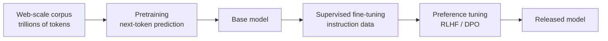

# Purpose of this repo

To document how to build your own agent from scratch, which you can do by building a harness around a model because `Agent = Model + Harness`. Additionally this repo makes clear the differences between: model development, harness engineering, and agentic engineering.

## Why I made this

I am Chase Dovey, and I conduct research on agentic systems. Most of that work is building harnesses around models. This is a focus of mine because building your own harness is a valuable skill to have given that the industry currently is in a race to see who has *the best harness*. If you go to any agent/AI conference, meetup, or any other industry event you will likely see vendors pitching their harness, which typically includes their control flow, memory layer, and tool execution layer, etc. To me the best harness is the one you build yourself because you understand the internals, and can change them to fit your needs. In this repo I document how to build your own agent from scratch by building the harness around a model.

## The three disciplines

- **Model development.** Training foundational models. The work that produces GPT, Claude, Gemini, Llama. A small number of labs with capital, GPUs, and data pipelines. Output: a model you call by API.
- **Harness engineering.** Wrapping that model in code, state, tools, sandboxing, guardrails, observability, and a loop. *Agent = Model + Harness.* This layer produced Claude Code, Cursor, Devin, Aider.
- **Agentic engineering.** Using an agent to build software, products, infrastructure, or more agents. The agent becomes the tool.

The middle layer is where I go deep. Building a foundational model from scratch takes capital, GPUs, and data pipelines most of us don't have, so it's out of reach. Agentic engineering most engineers are already doing — they use Claude Code, Cursor, or Devin day to day. What's missing is how to build something like Claude Code yourself.

> [!NOTE]
> For the precise definition of "agentic system" — workflows vs. agents, the multi-agent composition debate, the purist stance this curriculum takes — see [Module 1](./modules/01-what-is-an-agent/).

Here's how you get from nothing to an agent, layer by layer.

## 1. Model development → a callable model

I don't teach this here; the harness consumes the model as a callable API. What's inside it:

### What a modern LLM is made of

A probabilistic next-token predictor built from a small set of primitives:

- **Tokenizer** — chops raw text into sub-word tokens via byte-pair encoding (BPE) or similar. Vocabularies are typically 30k–200k entries.
- **Token embeddings** — each token ID maps to a learned vector, often 2,048–16,384 dimensions in modern models.
- **Positional information** — added to embeddings so the model knows token order (RoPE, ALiBi, or learned position vectors).
- **Transformer block** — multi-head self-attention (every token attends to every other), feed-forward network (per-token nonlinear, often SwiGLU), residual connections, layer normalization (RMSNorm is common). Frontier models stack 60–120 of these.
- **Output head** — projects the final hidden state to a distribution over the vocabulary; the next token is sampled.

### Training

1. **Pretraining.** Predict the next token over trillions of tokens of web-scale data. Acquires syntax, facts, reasoning patterns. Thousands of GPUs, months of wall-clock time.
2. **Supervised fine-tuning (SFT).** Curated instruction/response pairs — learn to follow instructions rather than continue arbitrary text.
3. **Preference tuning (RLHF or DPO).** Human-rated comparisons — learn what counts as a good response. Helpfulness, honesty, safety instilled here.
4. **(Optional) Specialty fine-tuning.** Domain-specific data: code, math, tool use.

### Inference

A forward pass produces a distribution over the vocabulary. A token is sampled — modulated by **temperature** (randomness), **top-k** (only the k highest-probability tokens), **top-p / nucleus** (smallest set whose probabilities sum to p). Repeat until end-of-sequence or max length.

A callable model can complete text. It can't read files, run commands, remember across sessions, or stop when done. To get any of that, you wrap it in a harness.

## 2. Harness engineering → an agent

This is the layer I teach in this repo. A harness is every piece of code, configuration, and execution logic that isn't the model itself — state, tools, execution, feedback loops, constraints, observability. Wrap a model in one and you have an agent.

The discipline covers:

- **Selecting the model** — which model the harness wraps.
- **Control flow** — the loop that drives the model continuously.
- **Memory** — what's remembered, when, how it's retrieved.
- **Context management** — the context window is a token budget; what goes in, what gets evicted.
- **Tools** — what capabilities the harness exposes, at what granularity, with what error semantics.
- **Safety / guardrails** — sandboxing, approval gates, loop bounds, input/output detection.
- **Observability** — structured traces of every LLM call, tool call, and state transition.
- **Evaluation** — benchmarking harness behaviour, catching regressions.
- **Optimization** — prompt caching, tool caching, threading, structured prompts.

One module per component. Every checkpoint in [`examples/`](./examples/) is a runnable harness at a different stage. Stack the components around a model and you have an agent.

> [!NOTE]
> The term *harness* in this sense was consolidated through 2025–2026 by Anthropic ([effective harnesses for long-running agents](https://www.anthropic.com/engineering/effective-harnesses-for-long-running-agents); [harness design for long-running application development](https://www.anthropic.com/engineering/harness-design-long-running-apps)), LangChain ([*The Anatomy of an Agent Harness*](https://www.langchain.com/blog/the-anatomy-of-an-agent-harness)), Martin Fowler ([Birgitta Böckeler, *Harness engineering for coding agent users*](https://martinfowler.com/articles/harness-engineering.html)), [Addy Osmani](https://addyosmani.com/blog/agent-harness-engineering/), and [O'Reilly Radar](https://www.oreilly.com/radar/agent-harness-engineering/).

## 3. Agentic engineering — what you do with the agent

Two things.

### Develop other products

Point the agent at the next codebase. Peter Steinberg built [openclaw](#) by directing existing coding agents to produce most of its implementation, and embedded an agent harness inside openclaw itself, so the product ships with an agent of its own. Agents produced the artifact; the artifact ships with an agent.

### Develop the agent itself

Point the agent at its own curriculum. Have it write a new module, refactor a harness component, improve its tracing, tighten its evals, raise its performance.

This repo is built that way. Claude Code (a coding-agent harness) running on Claude, driven by me to write modules and ship commits. Every layer is visible:

1. Anthropic does **model development** → Claude.
2. The Claude Code team does **harness engineering** → Claude Code.
3. I do **agentic engineering** → this curriculum.

This curriculum teaches step 2.

"Vibe coding" (Karpathy) is the casual end of this — accept what the model produces. Agentic engineering is the disciplined version: thought about what to ask, what tools to provide, how to verify, how to fit into a delivery process you trust.

---

## Curriculum

| # | Module | Harness component | Checkpoint |
|---|---|---|---|
| 1 | [What is an agent?](./modules/01-what-is-an-agent/) | (concept — Model + Harness) | *(no code)* |
| 2 | [An LLM call](./modules/02-an-llm-call/) | **Model interface** | [`llm_call_sync.py`](./examples/llm_call_sync.py), [`llm_call_async.py`](./examples/llm_call_async.py) |
| 3 | [Add a loop](./modules/03-add-a-loop/) | **Control flow** | [`stateless_chatbot.py`](./examples/stateless_chatbot.py) |
| 4 | [Add memory](./modules/04-add-memory/) | **Memory + context management** | [`stateful_chatbot.py`](./examples/stateful_chatbot.py) |
| 5 | [Add tools](./modules/05-add-tools/) | **Tool / action layer** | [`agent.py`](./examples/agent.py) |
| 6 | [Add sandboxing](./modules/06-add-sandboxing/) | **Execution environment** *(stubbed)* | [`sandbox_agent.py`](./examples/sandbox_agent.py) |
| 7 | [Add guardrails](./modules/07-add-guardrails/) | **Safety constraints** *(stubbed)* | [`safe_agent.py`](./examples/safe_agent.py) |
| 8 | [Add observability](./modules/08-add-observability/) | **Structured tracing** *(stubbed)* | [`traced_agent.py`](./examples/traced_agent.py) |
| 9 | [Add evaluation](./modules/09-add-evaluation/) | **Test infrastructure** *(stubbed)* | [`evals/`](./evals/) |
| 10 | [Add performance](./modules/10-add-performance/) | **Production hardening** *(stubbed)* | [`production_agent.py`](./examples/production_agent.py) |

Modules 1–5 are written end-to-end. Modules 6–10 are stubbed; their checkpoints in [`examples/`](./examples/) already implement what each will describe.

## Scope

| | |
|---|---|
| ✓ | Harness around a model accessed via API |
| ✓ | All 10 harness components, one runnable checkpoint each |
| ✓ | Orientation on model development (below) and agentic engineering (above) |
| ✗ | Training or fine-tuning the model itself |
| ✗ | A practical course on using a finished agent to ship product features |
| ✗ | Multi-agent orchestration as a primary focus |

## Setup

- Python 3.13 or newer
- [uv](https://docs.astral.sh/uv/) for dependency management
- An [Anthropic API key](https://console.anthropic.com)

## License

MIT
