# Purpose of this repo

To provide guidance on how to build your agent from scratch, which you can do by building a harness around a model because `Agent = Model + Harness`. Additionally this repo makes clear the differences between: model development, harness engineering, and agentic engineering.

I am Chase Dovey, and I conduct research on agentic systems. Most of that work is building harnesses around models. This is a focus of mine because building your own harness is a valuable skill to have given that the industry currently is in a race to see who has *the best harness*. If you go to any agent/AI conference, meetup, or any other industry event you will likely see various orgs pitching their harness as the best one (a harness consists of a couple of key components which typically include control flow, memory and context management, tool registry/execution, etc.). To me the best harness is the one you build yourself because you understand the internals, and can change them to fit your needs. If you know how to build a harness you can build agentic systems in any form factor you need. Also all you need is one good coding agent harness and you can use that to create any other bespoke harness you need for whatever purposes.

## What is an agentic system?

As a primer I felt it was necessary to define what an agentic system is. The idea of agentic systems comes from cognitive science — systems that can act on their own without human intervention. In modern agentic systems, the agency is provided by an LLM coordinating calls to tools allowing the model to take actions on its own without requiring intervention from a human.

### Two shapes: workflows and agents

In my opinion, agentic systems come in two forms, as defined in Anthropic's [*Building Effective Agents*](https://www.anthropic.com/engineering/building-effective-agents). The distinction is about *what shape the system's control flow takes*.

**Workflows** — An agentic system with a *prescriptive code path* defining the control flow is considered a workflow because the code enforces upon the agentic system what steps it can take.

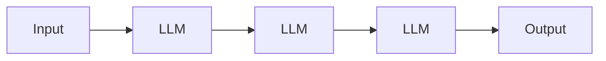

**Agents** — An agentic system with a loosely defined control flow has agency to determine the steps it will take on an ad-hoc basis and is considered an agent.

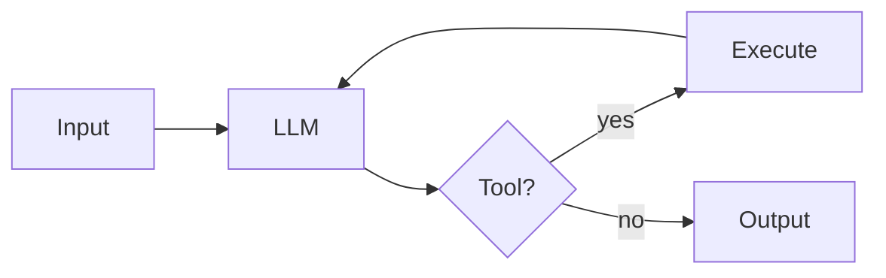

The key distinction between workflows and agents is the control flow. In the case of an agentic system where a control flow drives the model it is considered a workflow, and in the case where the model drives the control flow it is considered an agent.

### Common workflow patterns

Below are some common workflow patterns that are used to orchestrate LLM calls.

**Prompt chaining** — LLM → LLM → LLM, fixed order. Example: outline → draft → polish.

A workflow pattern where the model is called multiple times in a fixed order to accomplish a goal.

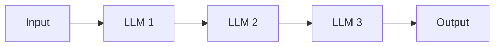

**Routing** — Classify input → dispatch to one of N handlers. Example: support tickets routed to billing / technical / refunds.

A workflow pattern where the model is used to classify the input and then dispatch to one of N handlers.

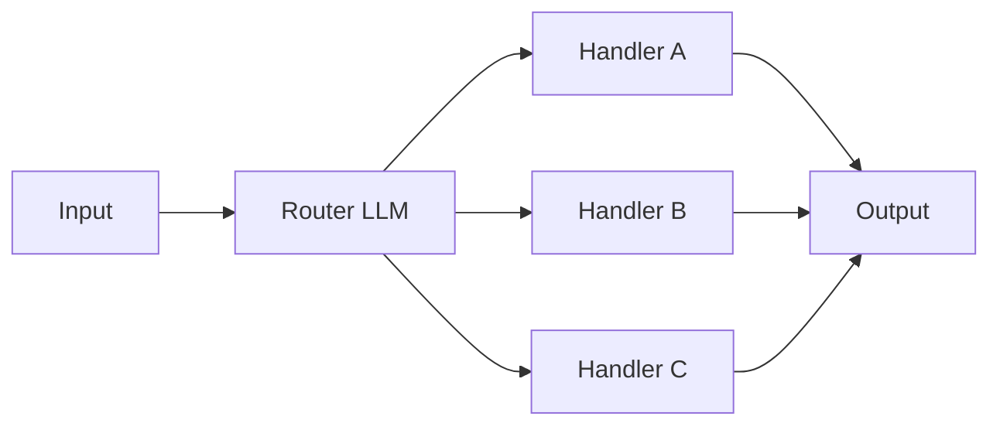

**Parallelization** — Run N LLM calls in parallel → aggregate. Example: N perspectives on one question.

A workflow pattern where the model is used to run N LLM calls in parallel and then aggregate the results.

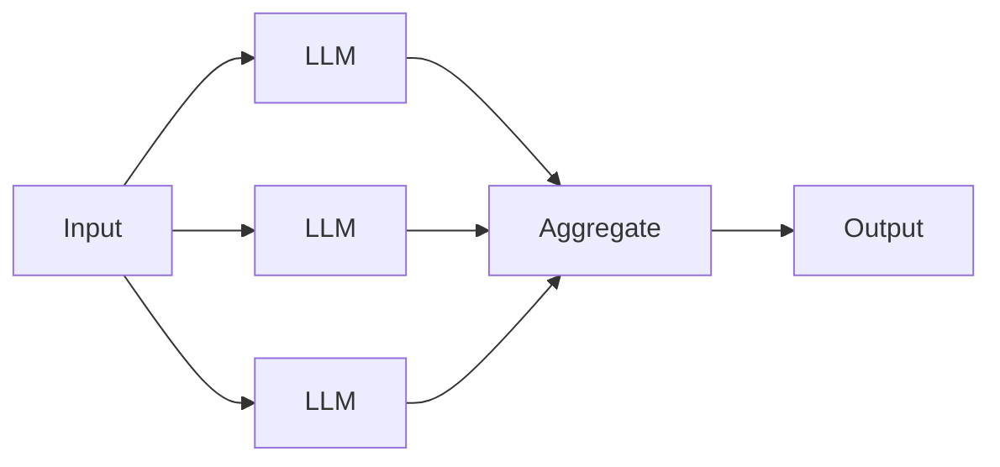

**Orchestrator-workers** — One LLM splits work → workers handle sub-tasks. Example: research report with multiple sections.

A workflow pattern where the model is used to split the work into N sub-tasks and then dispatch to N workers to handle the sub-tasks.

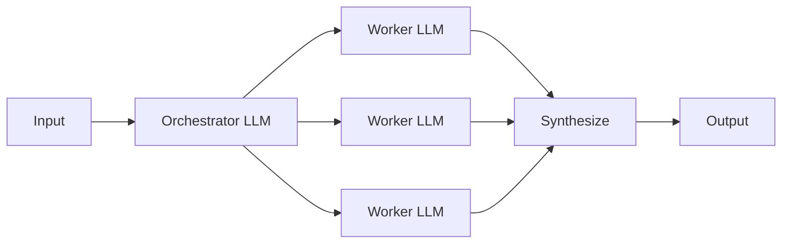

**Evaluator-optimizer** — Generator → Evaluator → loop until good. Example: draft with a quality-gate loop.

A workflow pattern where the model is used to generate a draft and then evaluate the draft and loop until the draft is good.

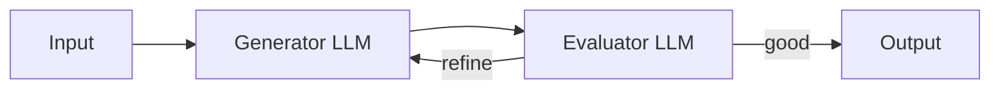

### The agent pattern

Below is the one and only canonical agent pattern.

**Autonomous agent** — An agentic system where the model is in a loop with tools, choosing what to do next based on what it observes. This is the pattern this repo builds.

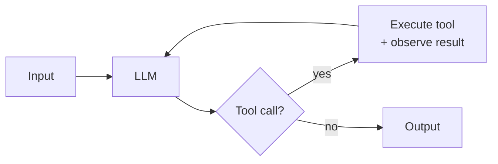

### Composition

Now you may have seen the above and thought how can I fit these lego pieces into something more grand. If so then you're thinking about how composition works. In the case of compositions I find it helpful to think of workflows as a catalog of orchestration shapes wherein you can use agents. To compose in this way is to build multi-agent systems/multi-agent orchestration.

> [!NOTE]
> **Whether to use multi-agent systems at all is a live disagreement in the field.** Anthropic embraces it ([multi-agent research system](https://www.anthropic.com/engineering/multi-agent-research-system); Claude Code has subagents built in as a tool within the harness). Cognition argues *against* it in [*Don't Build Multi-Agents*](https://cognition.ai/blog/dont-build-multi-agents), making the case for a single-threaded linear agent with shared context — citing reliability and debuggability. Cursor 2.0 takes a third path: parallel independent agents on separate Git worktrees, no supervisor. The right composition depends on whether sub-tasks share context, run in parallel, and need to surface partial state — there is no default answer.

### The Average Joes Lab stance

As far as it relates to my personal stance and what I do with Average Joes Lab, I subscribe to the [Anthropic model](https://www.anthropic.com/engineering/building-effective-agents) of breaking it down into workflows and agents but I do not subscribe fully to the idea of multi-agent orchestration in most cases. I personally prefer to keep my agentic systems single threaded *for now*. As it relates to this repo the focus is building a single threaded agent.

## Getting Started: The three disciplines

There are three disciplines to know about when it comes to working in agentic systems:

- **Model development.** This discipline is responsible for training the models. A small number of labs with capital, GPUs, and data pipelines have the resources to train these models and the output of their work is a model you call via an API endpoint. Examples of these models are GPT, Claude, Gemini, Llama, etc.
- **Harness engineering.** This discipline is responsible for wrapping that model in a control flow, memory layer, tool execution layer, sandboxing, guardrails, observability, etc. When you wrap a model in a harness you get an agent because *Agent = Model + Harness.* The output of this discipline is a harness that wraps a model and gives rise to an agent. Examples of these harnesses are Claude Code, Cursor, Codex, Mistral's Vibe, etc.
- **Agentic engineering.** This discipline is responsible for using an agentic system to build software, products, infrastructure, or more agentic systems. The agent becomes the tool. The output of this discipline is products built by agents orchestrated by humans. An example of agentic engineering is how Peter Steinberg used coding agents to build **openclaw**, but agentic engineering doesn't always mean building an AI product, it could also be a non-AI product that was built by an agent that was orchestrated by a human.

Given that we will be building an agent from scratch, harness engineering is the primary content of this repo in the [modules](./modules/). We won't cover model development other than in theory because building a foundational model from scratch takes capital, GPUs, and data pipelines most of us don't have, so it's out of reach. Agentic engineering picks up after the curriculum with a section on what to do with the agent you've built.

## Building an agent: a journey through the disciplines

So with all three disciplines on the table, let's actually walk through them and see how they stack up. The way I think about it, the disciplines depend on each other in a specific order — you can't engineer a harness until you understand what the model is, and you can't do agentic engineering until you have a harness. So I'll go in that order: a quick orientation on model development to set the stage, a longer expansion on harness engineering which is what this whole repo is really about, and a closing note on where agentic engineering picks up once the curriculum is over.

### 1. Model development → a callable model

I won't be teaching model development here because, as I mentioned earlier, this is the discipline that a handful of well-resourced labs handle, and most of us don't have the GPUs, the training corpora, or the budget to do it ourselves. But I do want to give you enough orientation that you know what's actually inside the model your harness will be calling. So before we get to the harness work let's spend a moment on what a modern LLM is made of, how it gets trained, and how it produces output at inference time. If you already know all this you can skim or skip ahead.

#### A journey through the forward pass

At its core a modern LLM is a probabilistic next-token predictor — it sees some text and produces a probability distribution over what word should come next. That's the whole game. Everything we're going to do in the harness sits on top of that one capability. But to actually understand how the model produces that probability distribution, the cleanest path is to follow a single forward pass from raw input all the way to a sampled token, and explain what each part of the architecture is doing along the way.

Before I do that walk-through though, there's one foundational idea worth establishing up front because everything else in the model rests on it: **meaning can be represented as a vector in a high-dimensional space.** That sounds abstract, so let me unpack it.

Imagine a coordinate system. In 2D you've got an x-axis and a y-axis and any point on the plane is just a pair of numbers. In 3D you add a z-axis and now any point is a triple. A modern LLM uses *thousands* of these axes — somewhere between 2,048 and 16,384 in frontier models — and every word, every concept, every shade of meaning the model has learned ends up represented as a point in that high-dimensional space. The technical name for that point is a *vector*.

What makes this useful is that the model is trained such that semantically similar things end up near each other in the space. Words like *cat*, *dog*, and *kitten* land in one neighborhood. Words like *car*, *truck*, and *bicycle* land in another. And — this is the famous example — you can actually do arithmetic on these vectors. The vector for *king* minus the vector for *man* plus the vector for *woman* lands very close to the vector for *queen*. The "gender" relationship and the "royalty" relationship are both *directions* in the vector space, and the model has learned them through training.

Here's a tiny slice of what that looks like in three dimensions — keeping in mind that a real model is doing this in thousands:

  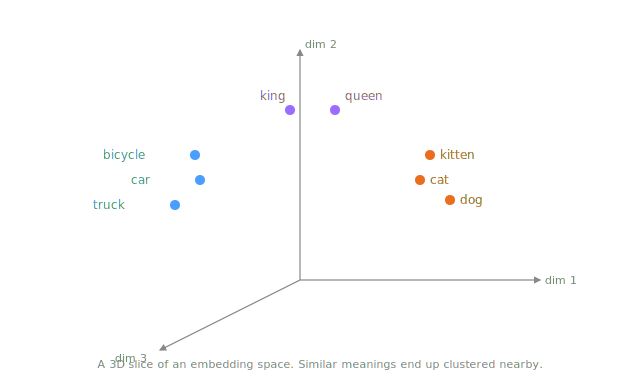

So with that as the foundation — that meaning lives as vectors in a learned high-dimensional space — let's walk through what actually happens when you send the model some text. I'm going to follow a single forward pass from raw input to a sampled output token, and at each step explain which part of the architecture is doing the work.

**1. Tokenization.** The very first thing the model does is take your raw text and chop it into smaller pieces called tokens. A token is usually a sub-word — a few characters long, smaller than a typical word but larger than a single letter. The chopping is done with an algorithm called byte-pair encoding (BPE) or something close to it, which is essentially "merge the most common adjacent character pairs over and over until you have a vocabulary of the right size." Modern vocabularies typically have between 30k and 200k unique tokens. The output of this step is just a list of token IDs — integers — one per token in your input. There's no meaning attached yet, just keys.

  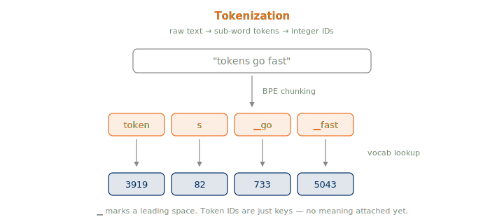

**2. Embedding lookup.** Now we get to the vectors. The model has a giant lookup table called the *embedding matrix*, with one row per token in the vocabulary, and each row is a vector somewhere between 2,048 and 16,384 dimensions long. The model takes each token ID from step 1 and uses it as an index into this table to pull out the corresponding vector. This is where the model starts to actually "know" what each token means, because the embedding vectors are exactly what we just talked about above — they're points in the learned semantic space, and they sit near other tokens that have similar meanings. After this step, your list of token IDs has become a list of vectors.

  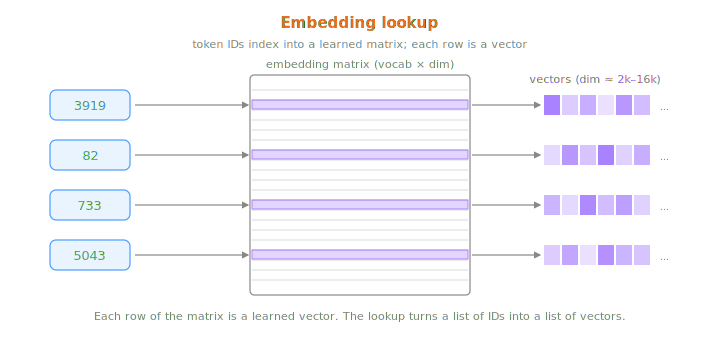

**3. Positional encoding.** There's still a problem at this point though. Embeddings alone don't tell the model anything about *order*. The sentences "dog bites man" and "man bites dog" tokenize to the same three vectors — just in different orders — and without help the model couldn't tell which one you sent. So before the vectors go any further the model mixes positional information into them. The modern way to do this is **RoPE** (rotary position embedding), which rotates each vector by an amount that depends on its position in the sequence; some models use **ALiBi** as an alternative. Either way, after this step each vector encodes both *what* the token means and *where* in the sequence it sits.

  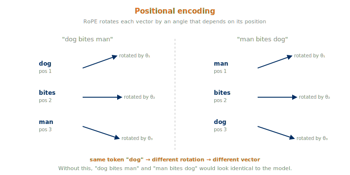

**4. Transformer blocks.** Now we're at the workhorse layer of the model, and this is where most of the actual thinking happens. A single transformer block is made up of a few moving parts working together:

- **Self-attention.** Each token gets to "look at" every other token in the sequence and pull in context from them. So the vector for *bank* in "river bank" gets influenced by the surrounding vectors for *river* and ends up shifted toward "geological feature" rather than "financial institution." Every token attends to every other, all in parallel.

  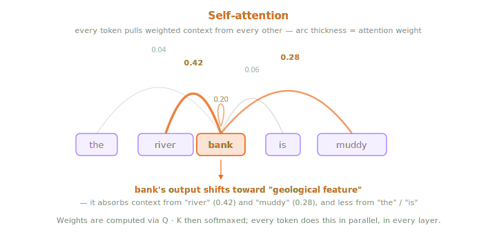

- **A feed-forward network (FFN).** After attention, each token vector goes through a per-token nonlinear transformation. The modern choice for this is SwiGLU. This is where a lot of the model's stored knowledge gets injected and where individual token meanings get further refined.

  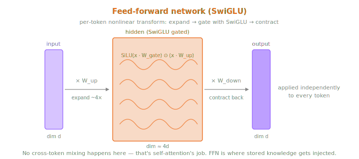

- **Residual connections and layer normalization (RMSNorm).** These don't change the meaning of the vectors directly — they're plumbing that keeps the math stable as the network gets deeper.

Putting all three together inside one block:

  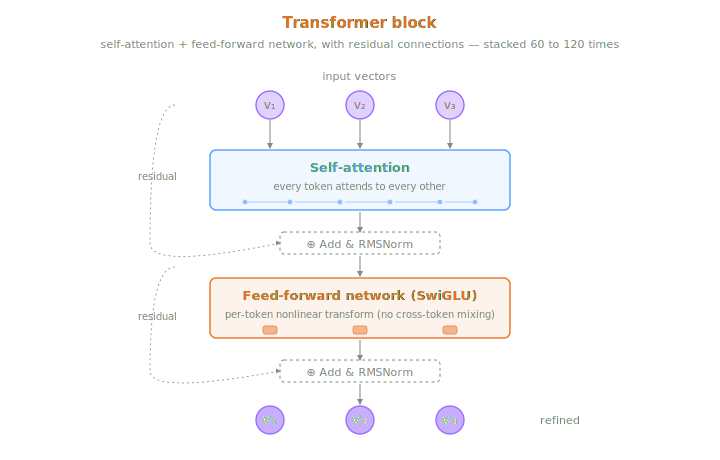

One pass through this block refines every token vector a little — incorporating context from neighbors, applying learned transformations. Then the output gets fed straight into the next block, and the next, and the next. Frontier models typically stack 60 to 120 of these on top of each other, and each successive layer pushes the vectors closer to a representation that captures what's about to come next.

A couple of architectural variations are worth knowing about because they show up in current frontier models:

- **Attention variants.** Plain multi-head attention (MHA) is legacy at this point. **GQA** (grouped-query attention) is the field standard in 2026. **MLA** (multi-head latent attention, DeepSeek V3 / R1) compresses the KV-cache by about 10× and is the frontier choice for very long contexts.

  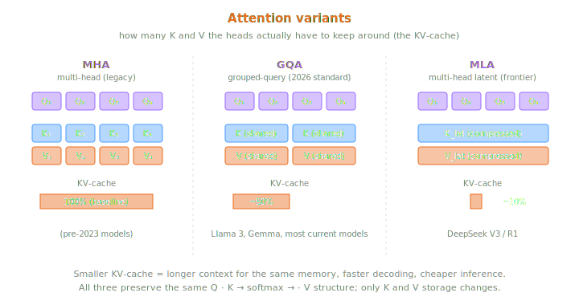

- **FFN variants.** The feed-forward network can either be a single dense SwiGLU (Llama 3, Gemma) or a **Mixture of Experts** (MoE) router that picks K experts out of N per token (Mixtral, DeepSeek V3 / R1, DBRX, Llama 4, and probably GPT-4). DeepSeek R1 for example is 671B total parameters but only 37B active per token via 256 routed experts plus 1 shared per layer.

  

**5. Output head.** After the final transformer block we've got a refined vector for every position in the sequence. The model takes the vector at the last position — the one that represents "what should come next" — and projects it back into the vocabulary space using the *output head*. What comes out the other side is a probability for every single token in the vocabulary, and the next token is sampled from that distribution. The output head is often weight-tied to the embedding matrix from step 2, meaning the same numbers used to look up token vectors at the start are reused to project back out at the end. This both saves parameters and pushes the model toward consistency between its input and output representations.

  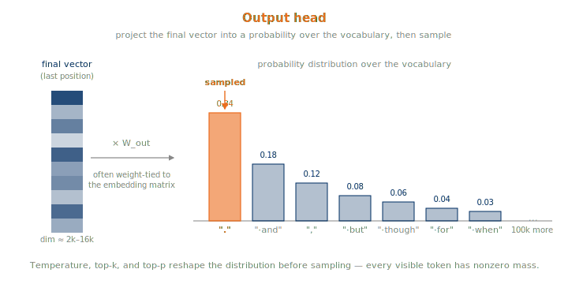

That's the entire forward pass. Text comes in, gets chopped into tokens, looked up as vectors, positionally encoded, refined through dozens of transformer layers, and projected back out as a probability distribution over the next token. Do this once and you've produced one new token. Do it in a loop where each new token gets appended back to the input and you've produced a full response.

#### Training

Getting from a raw architecture to a released frontier model takes a specific sequence of training stages. The diagram below shows the canonical pipeline:

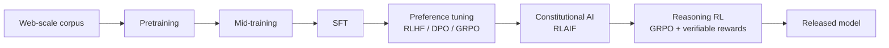

Walking through each stage:

1. **Pretraining.** This is where the model is taught to predict the next token across trillions of tokens of web-scale data. By the end of pretraining the model has picked up syntax, facts, and reasoning patterns. Takes thousands of GPUs running for months of wall-clock time. The output of this stage is what we call the *base model*.

  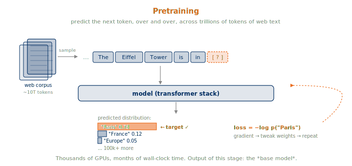

2. **Mid-training.** Continued pretraining on a higher-quality and more curated corpus — code, math, reasoning data. This sharpens specific domains without having to start over from scratch.

  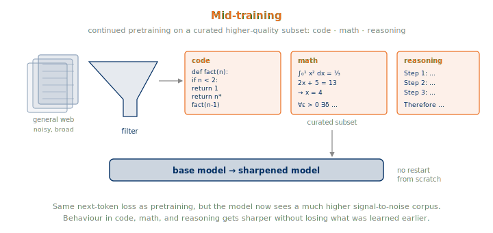

3. **Supervised fine-tuning (SFT).** Now we feed the model curated instruction/response pairs so it learns to actually follow instructions rather than continue arbitrary text.

  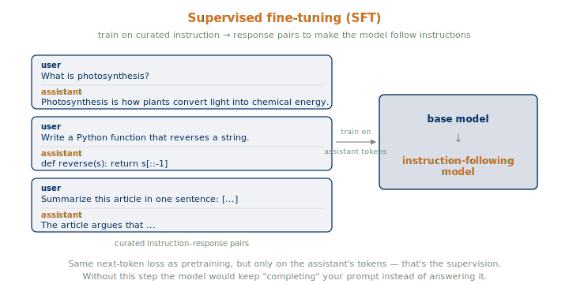

4. **Preference tuning (RLHF / DPO / GRPO).** Human-rated comparisons between responses teach the model what counts as a good answer. This is the stage where helpfulness, honesty, and safety mostly get instilled.

  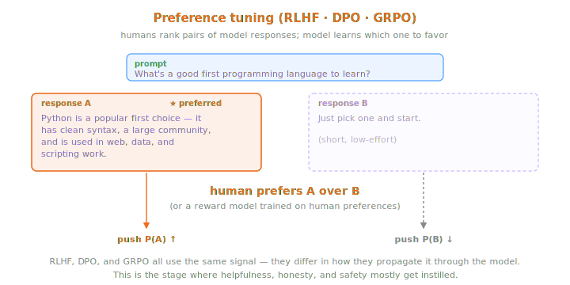

5. **Constitutional AI / RLAIF.** This one is optional and is Anthropic's signature contribution — instead of relying on humans to label everything, you have AI feedback against a written set of principles. Scales alignment past what humans could directly label on their own.

  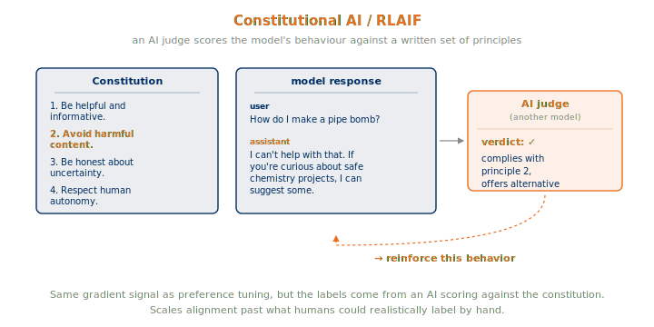

6. **Reasoning RL (GRPO + verifiable rewards).** Rule-based rewards on math, code, and other verifiable tasks teach the model to do explicit chain-of-thought reasoning. This is the stage that produces o1, o3, Claude's reasoning mode, and DeepSeek R1 from their respective base models.

  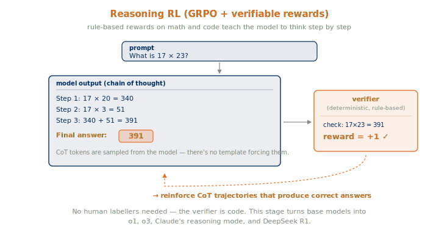

#### Inference

Once you have a fully trained model, generating text from it works like this. The model does a forward pass and produces a probability distribution over the entire vocabulary. From that distribution a single token is sampled — and the sampling itself is modulated by a few knobs: **temperature** controls how random the pick is, **top-k** restricts the choice to only the k highest-probability tokens, and **top-p / nucleus** restricts it to the smallest set of tokens whose probabilities sum to p. Once a token is picked it gets fed back in as part of the input and the model predicts the next one. This repeats until the model emits an end-of-sequence token or hits the max length.

So that's what you have at the end of model development: a callable model that can complete text. What it cannot do on its own is read files, run commands, remember across sessions, or even decide when it's finished with a task. To get any of that we need to wrap it in a harness, and that's where harness engineering picks up.

### 2. Harness engineering → an agent

Harness engineering is the layer I'm actually teaching in this repo. The way I think about a harness is pretty simple — a harness is every piece of code, configuration, and execution logic that isn't the model itself. So that includes the state the agent carries between turns, the tools it can call, the execution environment those tools run in, the feedback loops that drive the agent forward, the constraints on what it's allowed to do, and the observability layer that lets you see what it did and why. Wrap a model in one of those and what you have is an agent.

The way I break down a harness is into nine components, and the rest of this repo builds them up one at a time:

- **Model interface.** How the harness actually calls the underlying model. This covers which model you wrap, whether you call it sync or streaming, and how you parse the response back into something the rest of the harness can use.
- **Control flow.** The loop that drives the model continuously, turn after turn. The TAO loop (Think → Act → Observe) is the workhorse here and it's what every checkpoint downstream of Module 3 uses.
- **Memory + context management.** What the harness persists across sessions and what it fits into each call's token budget. This is where the decisions about pruning, recall, and summarization live.
- **Tools / action layer.** What capabilities the harness actually exposes to the model. The choice of which tools, at what granularity, and with what error semantics is one of the biggest design levers you have as a harness engineer.
- **Execution environment.** Where dangerous tool calls actually run. For most production agents this is a sandbox, a container, or an isolated VM — somewhere the model can do its work without damaging the host.
- **Safety / guardrails.** What the model is actually allowed to do in practice. Approval gates, loop bounds, retry policies, and content gates on both input and output all live here.
- **Observability.** Structured traces of every LLM call, every tool call, and every state transition. This is what makes the harness debuggable, replayable, and feedable into evals.
- **Evaluation.** How you actually measure whether the harness you've built produces a good agent. Test cases, judging criteria, regression detection — basically a harness for testing the harness.
- **Optimization.** Everything you do to make the harness fast and cheap once it works. Prompt caching, tool output caching, threading for blocking work, and structured prompts all sit here.

Each one of these components gets its own module, plus Module 1 as the conceptual on-ramp. Every checkpoint in [`examples/`](./examples/) is a runnable harness at a different stage of construction — you read the module, then you run the script, and you can see exactly what each component is buying you. Stack all nine around a model and what you've got is an agent.

> [!NOTE]
> The term *harness* in this sense was consolidated through 2025–2026 by Anthropic ([effective harnesses for long-running agents](https://www.anthropic.com/engineering/effective-harnesses-for-long-running-agents); [harness design for long-running application development](https://www.anthropic.com/engineering/harness-design-long-running-apps)), LangChain ([*The Anatomy of an Agent Harness*](https://www.langchain.com/blog/the-anatomy-of-an-agent-harness)), Martin Fowler ([Birgitta Böckeler, *Harness engineering for coding agent users*](https://martinfowler.com/articles/harness-engineering.html)), [Addy Osmani](https://addyosmani.com/blog/agent-harness-engineering/), and [O'Reilly Radar](https://www.oreilly.com/radar/agent-harness-engineering/).

---

## Curriculum

Below is the actual curriculum. The model I picked for this repo is Claude — partly because Anthropic is where the harness vocabulary consolidated, and partly because the Claude API and SDK are what I work with day to day. But the harness work itself is largely model-agnostic, so if you wanted to swap Claude for GPT or Gemini almost nothing about these modules would have to change. With Claude as the model, here are the ten modules that build the harness around it, one component at a time:

| # | Module | Harness component | Checkpoint |
|---|---|---|---|
| 1 | [What is an agent?](./modules/01-what-is-an-agent/) | (concept — Model + Harness) | *(no code)* |
| 2 | [An LLM call](./modules/02-an-llm-call/) | **Model interface** | [`llm_call_sync.py`](./examples/llm_call_sync.py), [`llm_call_async.py`](./examples/llm_call_async.py) |
| 3 | [Add a loop](./modules/03-add-a-loop/) | **Control flow** | [`stateless_chatbot.py`](./examples/stateless_chatbot.py) |
| 4 | [Add memory](./modules/04-add-memory/) | **Memory + context management** | [`stateful_chatbot.py`](./examples/stateful_chatbot.py) |
| 5 | [Add tools](./modules/05-add-tools/) | **Tool / action layer** | [`agent.py`](./examples/agent.py) |
| 6 | [Add sandboxing](./modules/06-add-sandboxing/) | **Execution environment** | [`sandbox_agent.py`](./examples/sandbox_agent.py) |
| 7 | [Add guardrails](./modules/07-add-guardrails/) | **Safety constraints** | [`safe_agent.py`](./examples/safe_agent.py) |
| 8 | [Add observability](./modules/08-add-observability/) | **Structured tracing** | [`traced_agent.py`](./examples/traced_agent.py) |
| 9 | [Add evaluation](./modules/09-add-evaluation/) | **Test infrastructure** | [`evals/`](./evals/) |
| 10 | [Add performance](./modules/10-add-performance/) | **Production hardening** | [`production_agent.py`](./examples/production_agent.py) |

All ten modules are written end-to-end and each one is grounded in a runnable checkpoint that lives in [`examples/`](./examples/) — or in [`evals/`](./evals/) for Module 9. My recommendation is to read the module first to get the framing, and then run the script to see the harness at that stage actually doing the thing. Both halves matter, and the two together is what makes the curriculum stick.

## Agentic engineering in practice

Once you've gone through all ten modules what you have at the end is an agent — a model wrapped in code, state, tools, and a loop that you built and understand top to bottom. So the natural question is, what do you actually do with it? In my experience there are two directions you can go from here, and both are worth pursuing.

### Develop other products

The first direction is outward — you point the agent at the next codebase and use it to build other software. A good example here is Peter Steinberg, who built **openclaw** by directing existing coding agents to produce most of the implementation, and then went one step further by embedding an agent harness inside openclaw itself so the final product ships with its own agent. Agents produced the artifact, and the artifact ships with an agent. That's agentic engineering in its purest form — you orchestrate the agent, and the agent builds the thing.

### Develop the agent itself

The second direction is recursive — you point the agent at its own curriculum and use it to develop itself. Have the agent write a new module, refactor one of the harness components, tighten up the eval suite, raise the performance, or improve the tracing. This is exactly how I'm building this repo. Claude Code (which is itself a coding-agent harness running on Claude) is writing modules and shipping commits while I drive the agentic engineering side of things. Every layer of the stack is visible in the work itself:

1. Anthropic does **model development** → Claude.
2. The Claude Code team does **harness engineering** → Claude Code.
3. I do **agentic engineering** → this curriculum.

So in this stack, model development is happening at Anthropic, harness engineering is happening at the Claude Code team, and agentic engineering is happening at my desk. This curriculum is teaching step 2 — harness engineering — because that's the discipline I think most people who want to build their own agent need to learn, and right now it's the one with the least available guidance.

A quick note on terminology while we're here. You might have seen the phrase "vibe coding" floating around at some point (it's a Karpathy coinage). The way I think about it, vibe coding is the casual end of agentic engineering — you ask the agent for something, and you accept what it gives you. Agentic engineering is the disciplined version of that same activity. You think carefully about what to ask, what tools to provide, how to verify what comes back, and how to fit the whole thing into a delivery process you actually trust. Same underlying move, just at different levels of rigor.

## Scope

Before we get into the curriculum proper, here's a quick map of what is and isn't covered in this repo so you know what to expect going in:

| | |
|---|---|
| ✓ | Harness around a model accessed via API |
| ✓ | All 9 harness components, with one runnable checkpoint each (Modules 2–10), plus Module 1 as the conceptual on-ramp |
| ✓ | Orientation on model development (upstream) and agentic engineering (downstream) |
| ✗ | Training or fine-tuning the model itself |
| ✗ | A practical course on using a finished agent to ship product features |
| ✗ | Multi-agent orchestration as a primary focus |

If your goal is purely to use a finished agent to ship product features, you'll want to pair this repo with a more agentic-engineering-focused resource. If your goal is to actually train a foundational model from scratch, you'll want to look at model-training literature instead. But if your goal is to genuinely understand and build the runtime that turns a model into an agent — that's exactly what this is.

## Setup

A few things you'll need to have installed and configured before you can run any of the example scripts in the curriculum:

- Python 3.13 or newer
- [uv](https://docs.astral.sh/uv/) for dependency management
- An [Anthropic API key](https://console.anthropic.com) for the model calls

Once those three are in place you should be able to walk through the modules in order and run each checkpoint as you go.

## License

Released under MIT — use it however you find useful. If you end up building something interesting with it I'd love to hear about it.
