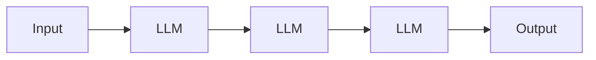
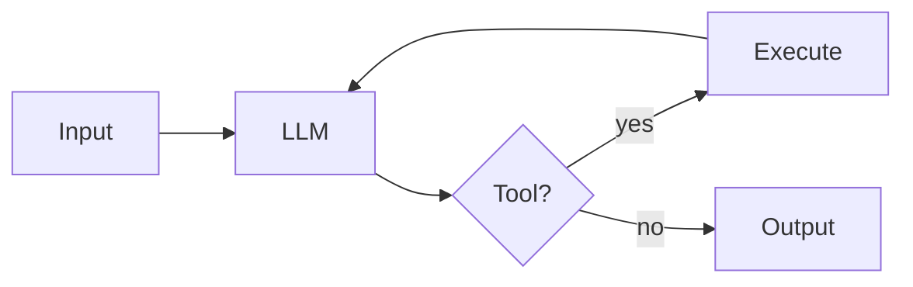
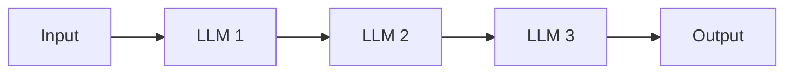
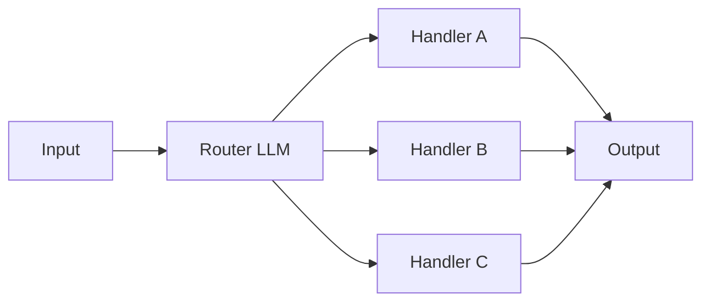
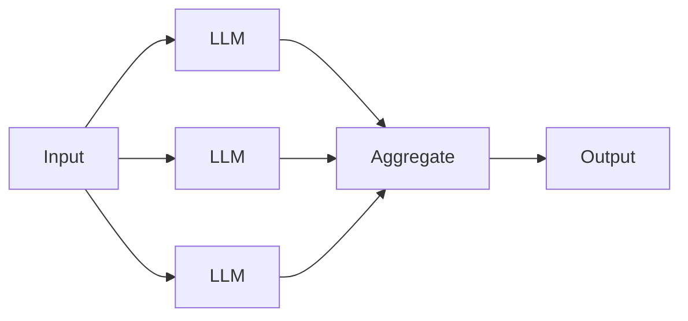
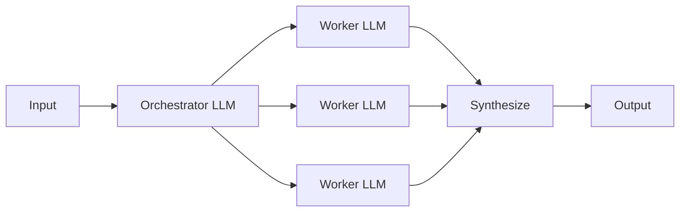
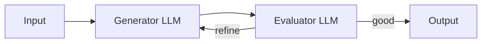
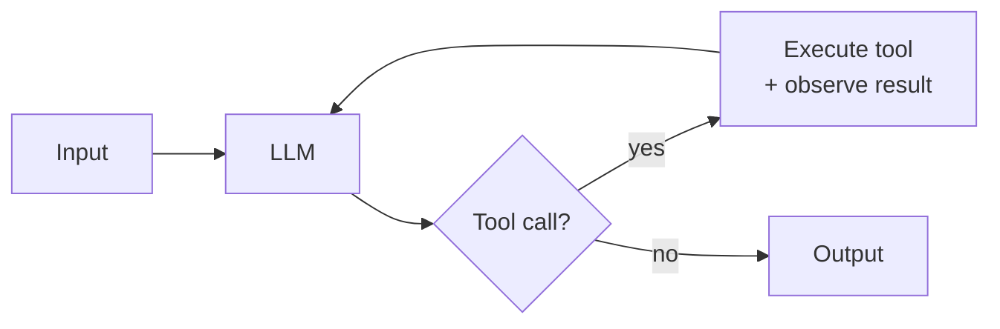
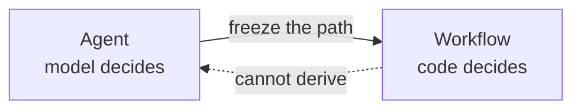

# agenteng

A framework-free, code-first curriculum for building the **harness** of an autonomous coding agent — the runtime around a model that turns it into an agent.

## The three layers

```
┌──────────────────────────────────────────────────────────┐
│  AGENTIC ENGINEERING                                     │
│  The practice of using agents to build software.         │
├──────────────────────────────────────────────────────────┤
│  HARNESS ENGINEERING                  ← this repo        │
│  The runtime around a model that makes it an agent.      │
├──────────────────────────────────────────────────────────┤
│  MODEL DEVELOPMENT                    ← out of scope     │
│  Training and fine-tuning the model itself.              │
└──────────────────────────────────────────────────────────┘
```

> A model is intelligence. A harness is the runtime that turns intelligence into an agent. Agentic engineering is the practice of using those agents to build software.

## What is harness engineering?

**Agent = Model + Harness.** The harness is every piece of code, configuration, and execution logic that isn't the model itself — state, tools, execution, feedback loops, constraints, observability. A raw model is not an agent until a harness gives it those things.

The discipline of harness engineering involves the following items, each of which corresponds to a module in this curriculum:

- **Selecting the model** — which model the harness wraps.
- **Building the control flow** — the loop that drives the model continuously.
- **Architecting memory** — what's remembered, when, and how it's retrieved.
- **Managing context** — the context window is a budget of tokens; what goes in, what gets evicted.
- **Designing tools** — what capabilities the harness exposes, at what granularity, with what error semantics.
- **Handling safety / guardrails** — sandboxing, approval gates, loop bounds, input/output detection.
- **Setting up observability** — structured traces of every LLM call, tool call, and state transition.
- **Building evaluations** — benchmarking the harness's behaviour and catching regressions.
- **Optimizing the system** — prompt caching, tool caching, threading, structured prompts.

> [!NOTE]
> The term *harness* in this sense was consolidated through 2025–2026 by Anthropic ([effective harnesses for long-running agents](https://www.anthropic.com/engineering/effective-harnesses-for-long-running-agents); [harness design for long-running application development](https://www.anthropic.com/engineering/harness-design-long-running-apps)), LangChain ([*The Anatomy of an Agent Harness*](https://www.langchain.com/blog/the-anatomy-of-an-agent-harness)), Martin Fowler ([Birgitta Böckeler, *Harness engineering for coding agent users*](https://martinfowler.com/articles/harness-engineering.html)), [Addy Osmani](https://addyosmani.com/blog/agent-harness-engineering/), and [O'Reilly Radar](https://www.oreilly.com/radar/agent-harness-engineering/). The framing has converged: harness = everything except the model.

## What is agentic engineering?

The broader practice of using agents to build products, software, and workflows. **Harness engineering is the substrate of agentic engineering** — the layer that produces the agents you then use to build things.

When you use Claude Code or Cursor to ship a feature, you're doing agentic engineering. When you build something like Claude Code from scratch, you're doing harness engineering. This repo teaches the latter so you can do the former better.

## Scope

| | |
|---|---|
| ✓ | Building the harness around a model accessed via API |
| ✓ | The full set of harness components — 10 modules, one runnable checkpoint each |
| ✗ | Training or fine-tuning the model itself *(that's model development)* |
| ✗ | Using a coding agent to ship product features *(that's the practice side of agentic engineering)* |
| ✗ | Multi-agent orchestration as a primary focus *(mentioned in context only)* |

## What are agentic systems?

The idea of agentic systems comes from cognitive science and is used to describe systems that can act on their own, without human intervention. In modern agentic systems, this agency is provided by an LLM coordinating calls to accomplish a goal without supervision. A harness is how you build one.

## Types of agentic systems

In my opinion, agentic systems come in two forms — **workflows** and **agents** — as defined in Anthropic's [*Building Effective Agents*](https://www.anthropic.com/engineering/building-effective-agents). The distinction is about *what shape the harness's control flow takes*.

**Workflows** — systems where LLMs and tools are orchestrated through **predefined code paths**. Prescriptive code paths define the sequence of steps that will be taken to accomplish a goal.



**Agents** — systems where **LLMs dynamically direct their own path through the control flow**. The model decides the sequence of steps to take to accomplish a goal; no prescriptive code paths are followed and the model exercises its probability distribution to determine the next step.



Below are more comprehensive diagrams of the two types of agentic systems.

### Common workflow patterns

**Prompt chaining** — LLM → LLM → LLM, fixed order. Example: outline → draft → polish.



**Routing** — Classify input → dispatch to one of N handlers. Example: support tickets routed to billing / technical / refunds.



**Parallelization** — Run N LLM calls in parallel → aggregate. Example: N perspectives on one question.



**Orchestrator-workers** — One LLM splits work → workers handle sub-tasks. Example: research report with multiple sections.



**Evaluator-optimizer** — Generator → Evaluator → loop until good. Example: draft with a quality-gate loop.



### Common agent patterns

Workflows are a catalog of orchestration shapes. Agents are **one pattern** — an autonomous loop — and that's the whole list. What varies between agents in practice is the **harness around the model**: the environment, memory and context management, the toolkit, and whether one of the tools happens to be another agent. Harness engineering is the specialization in agentic engineering that builds these.

**Autonomous agent** — an LLM in a loop with tools, choosing what to do next based on what it observes. This is the pattern this repo builds.



## Composition

By composing the above workflows and agent patterns, you can build multi-agent systems, multi-workflow systems, or systems that mix both.

> [!NOTE]
> **Whether to use multi-agent composition at all is a live disagreement in the field.** Anthropic embraces it ([multi-agent research system](https://www.anthropic.com/engineering/multi-agent-research-system); Claude Code subagents). Cognition argues *against* it in [*Don't Build Multi-Agents*](https://cognition.ai/blog/dont-build-multi-agents), making the case for a single-threaded linear agent with shared context — citing reliability and debuggability. Cursor 2.0 takes a third path: parallel independent agents on separate Git worktrees, no supervisor. The right composition depends on whether sub-tasks share context, run in parallel, and need to surface partial state — there is no default answer.

## The Average Joes Lab stance: purist agents only

We believe in the [Anthropic model](https://www.anthropic.com/engineering/building-effective-agents): **a real agent has autonomy over its own control flow** where the model decides what tool to call, what to do with the result, and when the task is done. Building harnesses for purist agents is the focus of this repository.

Workflows are outside the scope of what follows.



The primitives are the same — LLM calls, tools, context, memory. An agent's control flow is the model making those choices live; a workflow's control flow is you making them in advance. The building blocks transfer; how you orchestrate them into a fixed sequence is its own discipline.

For most production systems a workflow is more reliable, cheaper, and easier to evaluate — build a workflow if you can. But the interesting engineering problems — designing tools the model will use well, managing an open-ended context, making a non-deterministic loop reliable, evaluating a trajectory you can't enumerate — are agent problems. If you want a workflow, compose the primitives from this content into the sequence your problem needs.

## What agents look like

Production examples:

- **Coding agents** — [Claude Code](https://claude.com/claude-code), [Cursor](https://cursor.com), [Devin](https://devin.ai), [Aider](https://aider.chat), [nanoagent](https://github.com/averagejoeslab/nanoagent). The model opens files, edits them, runs tests, iterates.
- **Research agents** — [OpenAI Deep Research](https://openai.com/index/introducing-deep-research/), Claude's research mode. The model searches, synthesizes, digs deeper.
- **Task completion agents** — [SWE-agent](https://swe-agent.com), browser-use agents. The model manipulates a filesystem or GUI to complete a task.

In each case, the next action depends on what the previous action produced. The paths can't be enumerated in advance.

Every one of these is **a harness wrapped around a model**. This curriculum teaches you how to build harnesses just like these, from first principles.

> [!IMPORTANT]
> Most systems marketed as "agents" in 2026 are workflows. That's often the right answer. This content is about the case when it isn't.

## Built using a harness

This repo is being built using **Claude Code** — itself a coding-agent harness wrapped around a Claude model. That's a live illustration of all three layers:

- Anthropic does **model development** to produce Claude.
- Claude Code is the **harness** that wraps it.
- Building this repo (using Claude Code as the agent) is **agentic engineering**.

What this curriculum teaches is how to construct that middle layer — a harness like Claude Code — from first principles for an autonomous coding agent of your own.

## Setup

- Assumed programming experience (I will use Python as the example language)
- [Python 3.13 or newer](https://www.python.org/downloads/)
- [uv](https://docs.astral.sh/uv/) for dependency management
- An [Anthropic API key](https://console.anthropic.com) (or other model provider API key)

## Content

The curriculum is one straight line: start with a single LLM call and build outward, one harness component at a time, until you reach a production-shaped coding-agent harness. Each module pairs a prose explanation with a runnable checkpoint in [`examples/`](./examples/) — the file's name describes what the system has become at that step.

| # | Module | Harness component | Checkpoint |
|---|---|---|---|
| 1 | [What is an agent?](./modules/01-what-is-an-agent/) | (concept — Model + Harness) | *(no code)* |
| 2 | [An LLM call](./modules/02-an-llm-call/) | **Model interface** | [`llm_call_sync.py`](./examples/llm_call_sync.py), [`llm_call_async.py`](./examples/llm_call_async.py) |
| 3 | [Add a loop](./modules/03-add-a-loop/) | **Control flow** | [`stateless_chatbot.py`](./examples/stateless_chatbot.py) |
| 4 | [Add memory](./modules/04-add-memory/) | **Memory + context management** | [`stateful_chatbot.py`](./examples/stateful_chatbot.py) |
| 5 | [Add tools](./modules/05-add-tools/) | **Tool / action layer** | [`agent.py`](./examples/agent.py) |
| 6 | [Add sandboxing](./modules/06-add-sandboxing/) | **Execution environment** *(stubbed)* | [`sandbox_agent.py`](./examples/sandbox_agent.py) |
| 7 | [Add guardrails](./modules/07-add-guardrails/) | **Safety constraints** *(stubbed)* | [`safe_agent.py`](./examples/safe_agent.py) |
| 8 | [Add observability](./modules/08-add-observability/) | **Structured tracing** *(stubbed)* | [`traced_agent.py`](./examples/traced_agent.py) |
| 9 | [Add evaluation](./modules/09-add-evaluation/) | **Test infrastructure** *(stubbed)* | [`evals/`](./evals/) |
| 10 | [Add performance](./modules/10-add-performance/) | **Production hardening** *(stubbed)* | [`production_agent.py`](./examples/production_agent.py) |

Modules 1-5 are written end-to-end. Modules 6-10 are stubbed; their checkpoints in [`examples/`](./examples/) already implement what each one will describe — feel free to run those in the meantime.

## License

MIT
