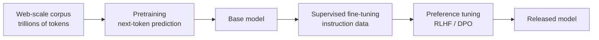

# building-agents

**Build your own agent by building the harness around a foundational model.** Agent = Model + Harness — and this repo teaches you how to construct the *harness* half end-to-end. Along the way it sets the record straight on three disciplines that the current industry hype keeps conflating: model development, harness engineering, and agentic engineering.

## Why I made this

I've spent a long time researching agentic systems, and a large portion of that work has been building harnesses — the runtimes that turn a model into an agent. Right now most of the industry conversation is a race to claim *the best harness*: every vendor, every framework, every newsletter pitching their loop, their memory layer, their tool registry as the one you should adopt.

My view is the opposite: **the best harness is the one you build yourself.** Not because the off-the-shelf ones are bad, but because a harness you constructed from primitives is one you understand — you know which trade-offs were made, you know which knobs exist, you know what to change when the model misbehaves. That understanding is what this repo is for.

It also gives me a chance to put down what I believe is the correct framing for what people mean (and often don't mean) when they say "agentic engineering."

## The three disciplines

The industry uses "agentic engineering" as a catchall for three distinct disciplines stacked on top of each other. They depend on each other, but they aren't the same skill.

- **Model development.** Training the foundational model itself. The work that produces GPT, Claude, Gemini, Llama. Done by a small number of labs with capital, GPUs, and data-pipeline expertise. The output is a model you can call by API.

- **Harness engineering.** Wrapping that model in code, state, tools, sandboxing, guardrails, observability, and a loop — everything required to turn intelligence into an agent. *Agent = Model + Harness.* This is the layer that produced Claude Code, Cursor, Devin, Aider.

- **Agentic engineering.** Using an agent — a model wrapped in a harness — to build software, products, infrastructure, or more agents. The agent stops being the artifact and becomes the tool you ship with.

This repo teaches the middle one. The other two are explained in depth below so you can place them.

> [!NOTE]
> If you've never been given a precise definition of "agentic system" — the workflow-vs-agent distinction, the multi-agent composition debate, the purist stance this curriculum takes — that grounding lives in [Module 1: What is an agent?](./modules/01-what-is-an-agent/). It's the conceptual entry point and naturally introduces the rest of the curriculum.

---

## The journey from nothing to agentic engineering, in depth

The rest of this README walks the three disciplines in order — model development → harness engineering → agentic engineering — so you can see how you actually get from *nothing* to *shipping software with agents you built*.

## 1. Model development (in depth)

The bottom of the stack. This repo doesn't teach model development — the harness assumes the model already exists and is consumed by API — but a one-page orientation grounds what the model layer actually contains.

### What a modern LLM is made of

A large language model is a probabilistic next-token predictor built from a small set of architectural primitives:

- **Tokenizer** — chops raw text into sub-word tokens via byte-pair encoding (BPE) or similar. Vocabularies are typically 30k–200k entries.
- **Token embeddings** — each token ID maps to a learned vector, often 2,048–16,384 dimensions in modern models.
- **Positional information** — added to the embeddings so the model knows token order (rotary position embeddings / RoPE, ALiBi, or learned position vectors).
- **The transformer block** — the workhorse. Each block contains **multi-head self-attention** (every token attends to every other token in the context), a **feed-forward network** (per-token nonlinear transformation, often with SwiGLU), **residual connections**, and **layer normalization** (RMSNorm is common). Modern frontier models stack 60–120 of these blocks.
- **The output head** — projects the final hidden state to a distribution over the vocabulary; the next token is sampled from that distribution.

### How a model is trained

1. **Pretraining.** The expensive step. The model learns to predict the next token over a massive web-scale corpus (trillions of tokens). This is where it acquires syntax, facts, reasoning patterns, and a general sense of how language works. Thousands of GPUs, months of wall-clock time.
2. **Supervised fine-tuning (SFT).** Train on curated instruction/response pairs so the model learns to *follow instructions* rather than just continuing arbitrary text. Much smaller dataset, much smaller compute.
3. **Preference tuning (RLHF or DPO).** Train on human-rated comparisons of model outputs so the model learns what counts as a *good* response. This is where helpfulness, honesty, and safety behaviours are instilled.
4. **(Optional) Specialty fine-tuning.** Additional training on domain-specific data (code, math, tool use) for sharper task performance.

### Inference

Calling the model API runs a forward pass through every layer, producing a probability distribution over the vocabulary. A token is sampled — modulated by **temperature** (randomness), **top-k** (only the k highest-probability tokens), and **top-p / nucleus** (smallest set of tokens whose probabilities sum to p). Repeat until an end-of-sequence token or max length is reached.

### Why it's its own discipline

Model development requires distributed training infrastructure, data curation pipelines, dedicated evaluation suites, and capital that does not pencil out for most projects. Frontier-model training is a multi-billion-dollar effort. The harness layer above assumes that effort has happened upstream and the model is now a callable service.

**What you take away:** the model is a *callable substrate*. It can complete text. It cannot read files, run commands, remember anything across sessions, or stop when it's done. To get any of that, you need the next layer.

## 2. Harness engineering (in depth) — what this repo teaches

The middle layer. **This is what we build in this repo.** And we do it the only way the discipline really sticks: by building one harness end-to-end, from a single LLM call to a production-shaped runtime, one component at a time.

> **Agent = Model + Harness.**
> The harness is every piece of code, configuration, and execution logic that isn't the model itself — state, tools, execution, feedback loops, constraints, observability.

The discipline of harness engineering covers:

- **Selecting the model** — which model the harness wraps.
- **Building the control flow** — the loop that drives the model continuously.
- **Architecting memory** — what's remembered, when, and how it's retrieved.
- **Managing context** — the context window is a budget of tokens; what goes in, what gets evicted.
- **Designing tools** — what capabilities the harness exposes, at what granularity, with what error semantics.
- **Handling safety / guardrails** — sandboxing, approval gates, loop bounds, input/output detection.
- **Setting up observability** — structured traces of every LLM call, tool call, and state transition.
- **Building evaluations** — benchmarking the harness's behaviour and catching regressions.
- **Optimizing the system** — prompt caching, tool caching, threading, structured prompts.

Each of these is one module in this curriculum. The modules build cumulatively — every checkpoint in [`examples/`](./examples/) is a runnable harness at a different stage of construction.

> [!NOTE]
> The term *harness* in this sense was consolidated through 2025–2026 by Anthropic ([effective harnesses for long-running agents](https://www.anthropic.com/engineering/effective-harnesses-for-long-running-agents); [harness design for long-running application development](https://www.anthropic.com/engineering/harness-design-long-running-apps)), LangChain ([*The Anatomy of an Agent Harness*](https://www.langchain.com/blog/the-anatomy-of-an-agent-harness)), Martin Fowler ([Birgitta Böckeler, *Harness engineering for coding agent users*](https://martinfowler.com/articles/harness-engineering.html)), [Addy Osmani](https://addyosmani.com/blog/agent-harness-engineering/), and [O'Reilly Radar](https://www.oreilly.com/radar/agent-harness-engineering/). The framing has converged: harness = everything except the model.

**What you take away:** once you've stacked these nine components around a model, you have an *agent* — something that can run on its own, take actions, recover from mistakes, and stop when it's done. That agent is now a tool. The next discipline is about using it.

## 3. Agentic engineering (in depth)

The top layer. Once you've built an agent — a model wrapped in a harness — what do you do with it? Two things, both called agentic engineering.

### Use the agent to keep developing itself

Point the agent at the curriculum it was built from. Have it write a new module. Have it refactor one of the harness components. Have it improve its own tracing, tighten its own evals, raise its own performance. The harness becomes its own development tool.

The recursive nature is the point: this repo is itself being built using Claude Code — a coding-agent harness — running on Claude. The author drives that agent to write modules, build the deck, ship commits. Every layer of the stack is visible in the act of producing the repo:

1. Anthropic does **model development** to produce Claude.
2. The Claude Code team does **harness engineering** to build Claude Code.
3. The author does **agentic engineering** to build this curriculum *using* that agent.

What this curriculum teaches you is how to do step 2 — so you can do steps 1 and 3 with intent, knowing what each layer contains.

### Use the agent to develop other products

The more visible flavor of agentic engineering: take the agent and point it at the next codebase. Ship features. Build infrastructure. Author tooling.

A concrete example: **Peter Steinberg built [openclaw](#) by directing existing coding agents to produce most of its implementation.** He didn't write every line — he directed agents to write them. And once openclaw was working, he embedded an agent harness *inside* the project itself, so openclaw users get an agent as part of the product. Two halves of agentic engineering captured in one project: agents produced the artifact, and the artifact ships with an agent.

That's the shape of mature agentic engineering: it compounds. Each agent you build with becomes a building block for the next thing. Each thing you ship can itself include an agent.

If "vibe coding" (Karpathy's term) is the casual end of this — *give in to the vibes, accept what the model produces* — agentic engineering is the disciplined version. Same essential move (have AI write the code), but with thought about what to ask, what tools to provide, how to verify the result, and how to fit it into a delivery process you trust.

---

## The curriculum

The repo's content lives here. The path: **use Claude as the model**, **build a harness around it one component at a time**, and **end with an agent you understand**. From there, you can either keep developing the agent itself or point it at the next product — i.e. do agentic engineering with a harness you own.

Each module pairs a prose explanation with a runnable checkpoint in [`examples/`](./examples/) — the file's name describes what the system has become at that step.

| # | Module | Harness component | Checkpoint |
|---|---|---|---|
| 1 | [What is an agent?](./modules/01-what-is-an-agent/) | (concept — Model + Harness) | *(no code)* |
| 2 | [An LLM call](./modules/02-an-llm-call/) | **Model interface** | [`llm_call_sync.py`](./examples/llm_call_sync.py), [`llm_call_async.py`](./examples/llm_call_async.py) |
| 3 | [Add a loop](./modules/03-add-a-loop/) | **Control flow** | [`stateless_chatbot.py`](./examples/stateless_chatbot.py) |
| 4 | [Add memory](./modules/04-add-memory/) | **Memory + context management** | [`stateful_chatbot.py`](./examples/stateful_chatbot.py) |
| 5 | [Add tools](./modules/05-add-tools/) | **Tool / action layer** | [`agent.py`](./examples/agent.py) |
| 6 | [Add sandboxing](./modules/06-add-sandboxing/) | **Execution environment** *(stubbed)* | [`sandbox_agent.py`](./examples/sandbox_agent.py) |
| 7 | [Add guardrails](./modules/07-add-guardrails/) | **Safety constraints** *(stubbed)* | [`safe_agent.py`](./examples/safe_agent.py) |
| 8 | [Add observability](./modules/08-add-observability/) | **Structured tracing** *(stubbed)* | [`traced_agent.py`](./examples/traced_agent.py) |
| 9 | [Add evaluation](./modules/09-add-evaluation/) | **Test infrastructure** *(stubbed)* | [`evals/`](./evals/) |
| 10 | [Add performance](./modules/10-add-performance/) | **Production hardening** *(stubbed)* | [`production_agent.py`](./examples/production_agent.py) |

Modules 1–5 are written end-to-end. Modules 6–10 are stubbed; their checkpoints in [`examples/`](./examples/) already implement what each one will describe — feel free to run those in the meantime.

## Scope

| | |
|---|---|
| ✓ | Building the harness around a model accessed via API |
| ✓ | The full set of harness components — 10 modules, one runnable checkpoint each |
| ✓ | Orientation on the layers below (model development) and above (agentic engineering) |
| ✗ | Training or fine-tuning the model itself *(model development)* |
| ✗ | A practical course on using a finished coding agent to ship product features *(agentic engineering downstream)* |
| ✗ | Multi-agent orchestration as a primary focus *(mentioned in context only)* |

## Setup

- Assumed programming experience (I will use Python as the example language)
- [Python 3.13 or newer](https://www.python.org/downloads/)
- [uv](https://docs.astral.sh/uv/) for dependency management
- An [Anthropic API key](https://console.anthropic.com) (or other model provider API key)

## License

MIT
