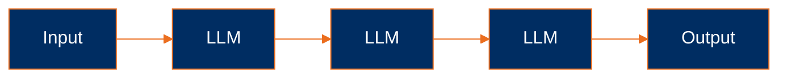
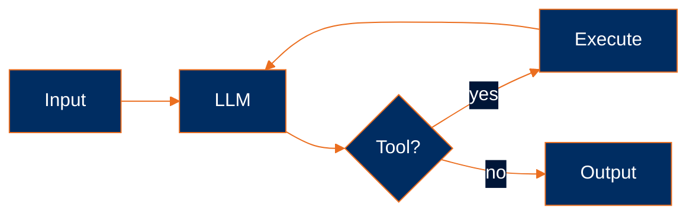
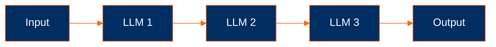
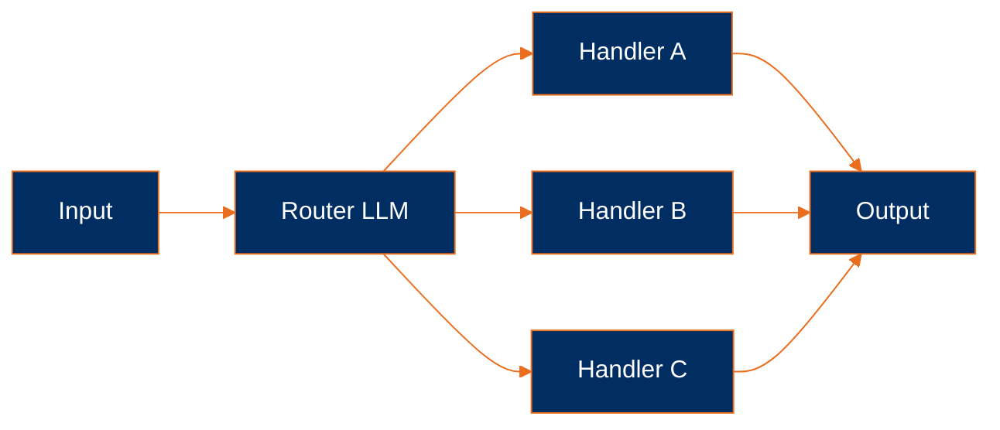
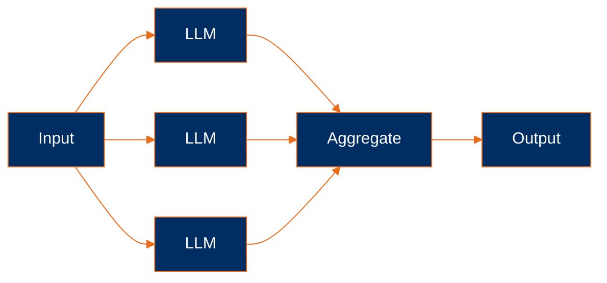
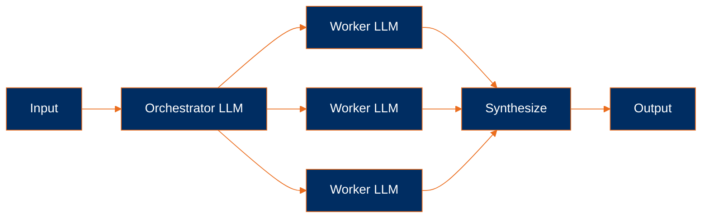
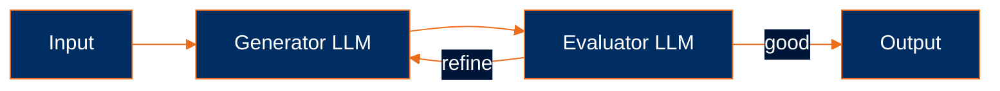
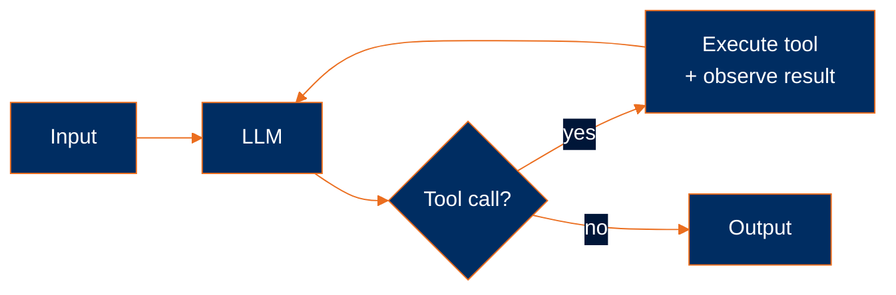

> Background reading for [building-agents](../README.md). The curriculum itself is about the *harness*; this page is about the shapes agentic systems take.

# Agentic systems: workflows and agents

As a primer I felt it was necessary to define what an agentic system is. The idea of agentic systems comes from cognitive science — systems that can act on their own without human intervention. In modern agentic systems, the agency is provided by an LLM coordinating calls to tools allowing the model to take actions on its own without requiring intervention from a human.

## Two shapes: workflows and agents

In my opinion, agentic systems come in two forms, as defined in Anthropic's [*Building Effective Agents*](https://www.anthropic.com/engineering/building-effective-agents). The distinction is about *what shape the system's control flow takes*.

**Workflows** — An agentic system with a *prescriptive code path* defining the control flow is considered a workflow because the code enforces upon the agentic system what steps it can take.

**Agents** — An agentic system with a loosely defined control flow has agency to determine the steps it will take on an ad-hoc basis and is considered an agent.

The key distinction between workflows and agents is the control flow. In the case of an agentic system where a control flow drives the model it is considered a workflow, and in the case where the model drives the control flow it is considered an agent.

## Common workflow patterns

Below are some common workflow patterns that are used to orchestrate LLM calls.

**Prompt chaining:**

Definition — In my opinion this is the simplest of the workflow patterns. The model gets called in a fixed phased sequence, and the only context each call has is what the previous call produced. The code, not the model, decides how many calls happen and in what order.

Example: Think of a phased technical document workflow where the first call produces a structured outline of the sections, that outline then gets handed off to a second call which expands each section into detailed prose, and the result of that finally goes to a third call that edits everything for clarity and consistency. The input to each call is whatever the previous call output.

**Routing:**

Definition — A workflow pattern where the first model call's job is to look at the input and classify it into one of N categories, and then based on that classification the input gets dispatched to a category-specific downstream handler. The model isn't picking the handler dynamically — it's just doing the classification, and the code is doing the routing.

Example: Think of a customer support inbox where every incoming ticket gets read by the first model call, classified as billing, technical, or refund, and then routed off to a different downstream handler tuned for that specific kind of issue. That way each category gets its own specialized handler instead of one giant prompt trying to handle every case at once.

**Parallelization:**

Definition — A workflow pattern where the same task gets sent off to N model calls running in parallel and the responses get aggregated back into a single output. The way I think about it: fan out, then fan in. The model isn't deciding anything about the orchestration — the code spawns the parallel calls and stitches the responses.

Example: Say you want a balanced answer to a contested question. Instead of asking one model and hoping for the best, you fire off the same prompt to several model calls in parallel, each picking up a different angle or perspective, and then aggregate the responses into a single answer that incorporates all of them.

**Orchestrator-workers:**

Definition — A workflow pattern where one model call (the orchestrator) reads the task and decides how to split it into sub-tasks, each sub-task gets handed off to its own worker call, and a final synthesis step stitches the worker outputs back into one cohesive result. The orchestrator is doing some thinking about how to decompose the work, but the overall control flow is still in code — not driven dynamically by the model.

Example: Think of writing a market research report where the orchestrator reads the brief and splits it into sections like competitive landscape, customer interviews, and financial outlook, each section then gets written by its own worker call in depth, and a synthesizer at the end stitches them back into one report.

**Evaluator-optimizer:**

Definition — A workflow pattern where one model call (the generator) produces a draft, a second model call (the evaluator) scores the draft against a rubric, and the loop continues until the evaluator approves. The model is involved in both the generation and the quality check, but the loop itself — the "keep going until good" logic — is enforced by code, not the model.

Example: Say you're writing marketing copy and you have specific quality criteria in mind. The generator drafts the copy, the evaluator reads it against your criteria and either approves or sends back critique, and the generator keeps revising until the evaluator finally says it's good enough.

## The agent pattern

Below is the one and only canonical agent pattern.

**Autonomous agent:**

Definition — An agentic system where the model is placed in a loop with tools, and on each turn the model decides on its own what to do next based on what it observes from the previous step. There's no prescriptive code path here — the control flow is whatever the model picks, and that's exactly what makes it an agent rather than a workflow.

Example: Think of a coding agent given a task like *"find and fix the bug in `auth.py`"*. The agent decides on its own to grep for related code, read the file, run the test suite to reproduce the failure, edit based on what it sees, run the tests again, and stop only once they pass. None of those steps are planned in advance — the model picks each next action based on the output of the last one.

This is the pattern this repo builds: [quark](../examples/quark.py) is an autonomous agent.

## Composition

Now you may have seen the above and thought how can I fit these lego pieces into something more grand. If so then you're thinking about how composition works. In the case of compositions I find it helpful to think of workflows as a catalog of orchestration shapes wherein you can use agents. To compose in this way is to build multi-agent systems/multi-agent orchestration.

> [!NOTE]
> **Whether to use multi-agent systems at all is a live disagreement in the field.** Anthropic embraces it ([multi-agent research system](https://www.anthropic.com/engineering/multi-agent-research-system); Claude Code has subagents built in as a tool within the harness). Cognition argues *against* it in [*Don't Build Multi-Agents*](https://cognition.ai/blog/dont-build-multi-agents), making the case for a single-threaded linear agent with shared context — citing reliability and debuggability. Cursor 2.0 takes a third path: parallel independent agents on separate Git worktrees, no supervisor. The right composition depends on whether sub-tasks share context, run in parallel, and need to surface partial state — there is no default answer.

## The Average Joes Lab stance

As far as it relates to my personal stance and what I do with Average Joes Lab, I subscribe to the [Anthropic model](https://www.anthropic.com/engineering/building-effective-agents) of breaking it down into workflows and agents but I do not subscribe fully to the idea of multi-agent orchestration in most cases. I personally prefer to keep my agentic systems single threaded *for now*. As it relates to this repo the focus is building a single threaded agent — and the harness around it.
