> Optional background for [harness-engineering](../README.md): enough about model development to know what's inside the model your harness calls. Nothing in the lessons depends on it.

# The model: what the harness wraps

The model is the first of an agent's two primitives: **TokensOut = Model(TokensIn)**. Model development is the work of building it, and it takes training data, compute, and the methods to train and evaluate a model. This repo teaches the other primitive, the harness, but it helps to know what's inside the thing your harness wraps. So here's a short tour: what a modern LLM is made of, how it gets trained, and how it produces output at inference time. If you already know all this, skip it.

## A journey through the forward pass

At its core a modern LLM is a probabilistic next-token predictor — it sees some text and produces a probability distribution over what word should come next. That's the whole game. Everything we're going to do in the harness sits on top of that one capability. But to actually understand how the model produces that probability distribution, the cleanest path is to follow a single forward pass from raw input all the way to a sampled token, and explain what each part of the architecture is doing along the way.

Before I do that walk-through though, there's one foundational idea worth establishing up front because everything else in the model rests on it: **meaning can be represented as a vector in a high-dimensional space.** That sounds abstract, so let me unpack it.

Imagine a coordinate system. In 2D you've got an x-axis and a y-axis and any point on the plane is just a pair of numbers. In 3D you add a z-axis and now any point is a triple. A modern LLM uses *thousands* of these axes — somewhere between 2,048 and 16,384 in frontier models — and every word, every concept, every shade of meaning the model has learned ends up represented as a point in that high-dimensional space. The technical name for that point is a *vector*.

What makes this useful is that the model is trained such that semantically similar things end up near each other in the space. Words like *cat*, *dog*, and *kitten* land in one neighborhood. Words like *car*, *truck*, and *bicycle* land in another. And — this is the famous example — you can actually do arithmetic on these vectors. The vector for *king* minus the vector for *man* plus the vector for *woman* lands very close to the vector for *queen*. The "gender" relationship and the "royalty" relationship are both *directions* in the vector space, and the model has learned them through training.

Here's a tiny slice of what that looks like in three dimensions — keeping in mind that a real model is doing this in thousands:

  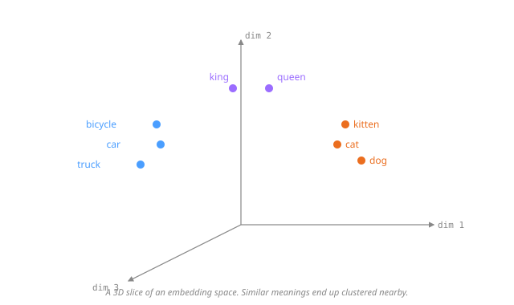

So with that as the foundation — that meaning lives as vectors in a learned high-dimensional space — let's walk through what actually happens when you send the model some text. I'm going to follow a single forward pass from raw input to a sampled output token, and at each step explain which part of the architecture is doing the work.

**1. Tokenization.** The very first thing the model does is take your raw text and chop it into smaller pieces called tokens. A token is usually a sub-word — a few characters long, smaller than a typical word but larger than a single letter. The chopping is done with an algorithm called byte-pair encoding (BPE) or something close to it, which is essentially "merge the most common adjacent character pairs over and over until you have a vocabulary of the right size." Modern vocabularies typically have between 30k and 200k unique tokens. The output of this step is just a list of token IDs — integers — one per token in your input. There's no meaning attached yet, just keys.

  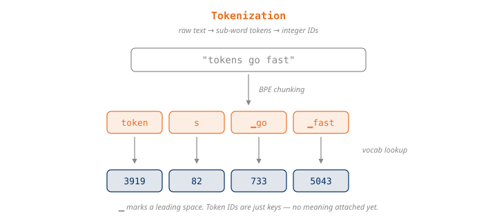

**2. Embedding lookup.** Now we get to the vectors. The model has a giant lookup table called the *embedding matrix*, with one row per token in the vocabulary, and each row is a vector somewhere between 2,048 and 16,384 dimensions long. The model takes each token ID from step 1 and uses it as an index into this table to pull out the corresponding vector. This is where the model starts to actually "know" what each token means, because the embedding vectors are exactly what we just talked about above — they're points in the learned semantic space, and they sit near other tokens that have similar meanings. After this step, your list of token IDs has become a list of vectors.

  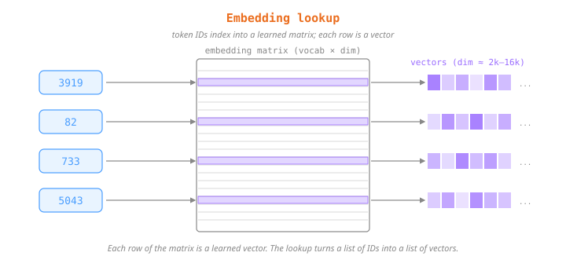

**3. Positional encoding.** There's still a problem at this point though. Embeddings alone don't tell the model anything about *order*. The sentences "dog bites man" and "man bites dog" tokenize to the same three vectors — just in different orders — and without help the model couldn't tell which one you sent. So before the vectors go any further the model mixes positional information into them. The modern way to do this is **RoPE** (rotary position embedding), which rotates each vector by an amount that depends on its position in the sequence; some models use **ALiBi** as an alternative. Either way, after this step each vector encodes both *what* the token means and *where* in the sequence it sits.

  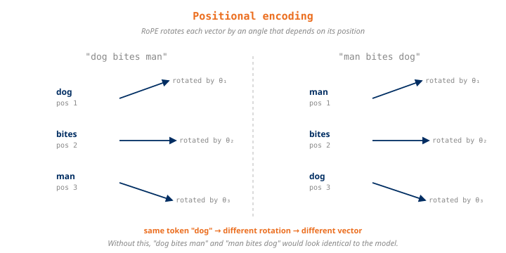

**4. Transformer blocks.** Now we're at the workhorse layer of the model, and this is where most of the actual thinking happens. A single transformer block is made up of a few moving parts working together:

- **Self-attention.** Each token gets to "look at" every other token in the sequence and pull in context from them. So the vector for *bank* in "river bank" gets influenced by the surrounding vectors for *river* and ends up shifted toward "geological feature" rather than "financial institution." Every token attends to every other, all in parallel.

  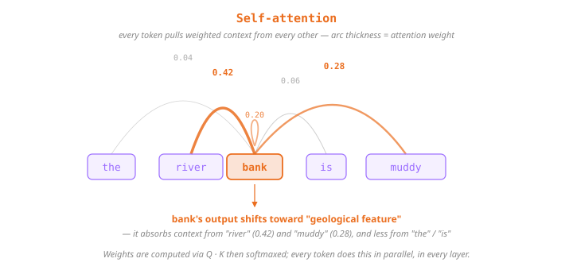

- **A feed-forward network (FFN).** After attention, each token vector goes through a per-token nonlinear transformation. The modern choice for this is SwiGLU. This is where a lot of the model's stored knowledge gets injected and where individual token meanings get further refined.

  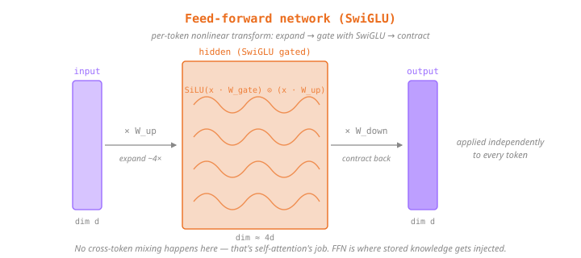

- **Residual connections and layer normalization (RMSNorm).** These don't change the meaning of the vectors directly — they're plumbing that keeps the math stable as the network gets deeper.

Putting all three together inside one block:

  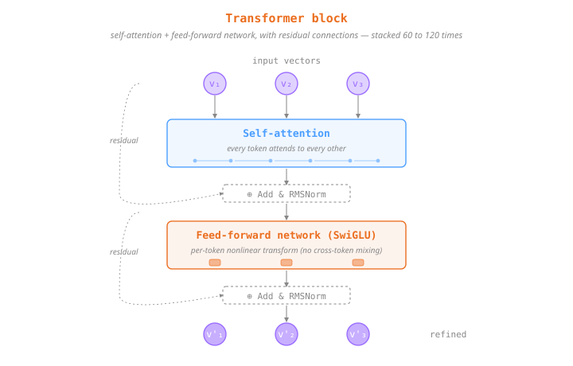

One pass through this block refines every token vector a little — incorporating context from neighbors, applying learned transformations. Then the output gets fed straight into the next block, and the next, and the next. Frontier models typically stack 60 to 120 of these on top of each other, and each successive layer pushes the vectors closer to a representation that captures what's about to come next.

A couple of architectural variations are worth knowing about because they show up in current frontier models:

- **Attention variants.** Plain multi-head attention (MHA) is legacy at this point. **GQA** (grouped-query attention) is the field standard in 2026. **MLA** (multi-head latent attention, DeepSeek V3 / R1) compresses the KV-cache by about 10× and is the frontier choice for very long contexts.

  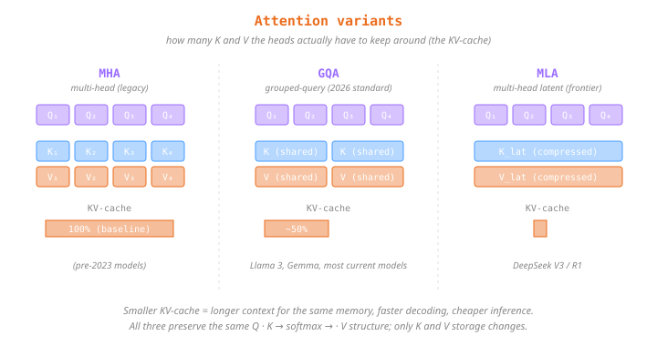

- **FFN variants.** The feed-forward network can either be a single dense SwiGLU (Llama 3, Gemma) or a **Mixture of Experts** (MoE) router that picks K experts out of N per token (Mixtral, DeepSeek V3 / R1, DBRX, Llama 4, and probably GPT-4). DeepSeek R1 for example is 671B total parameters but only 37B active per token via 256 routed experts plus 1 shared per layer.

  

**5. Output head.** After the final transformer block we've got a refined vector for every position in the sequence. The model takes the vector at the last position — the one that represents "what should come next" — and projects it back into the vocabulary space using the *output head*. What comes out the other side is a probability for every single token in the vocabulary, and the next token is sampled from that distribution. The output head is often weight-tied to the embedding matrix from step 2, meaning the same numbers used to look up token vectors at the start are reused to project back out at the end. This both saves parameters and pushes the model toward consistency between its input and output representations.

  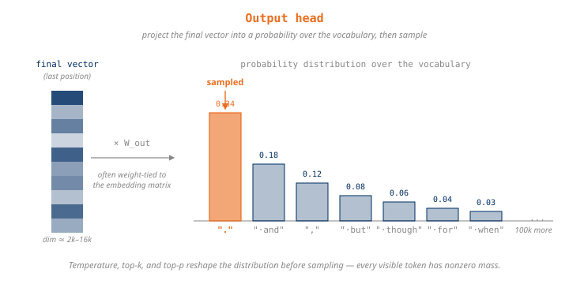

That's the entire forward pass. Text comes in, gets chopped into tokens, looked up as vectors, positionally encoded, refined through dozens of transformer layers, and projected back out as a probability distribution over the next token. Do this once and you've produced one new token. Do it in a loop where each new token gets appended back to the input and you've produced a full response.

## Training

Getting from a raw architecture to a released frontier model takes a specific sequence of training stages. At a glance, the canonical pipeline goes:

- **Pretraining** — predict the next token over trillions of tokens of web text; produces the *base model*.
- **Mid-training** — continued pretraining on a curated higher-quality corpus (code, math, reasoning) to sharpen specific domains.
- **Supervised fine-tuning (SFT)** — train on curated instruction/response pairs so the model follows instructions instead of just continuing text.
- **Preference tuning (RLHF / DPO / GRPO)** — train on human-rated comparisons between responses; helpfulness, honesty, and safety get instilled here.
- **Constitutional AI / RLAIF** — replace human labellers with an AI judge that scores responses against a written set of principles.
- **Reasoning RL (GRPO + verifiable rewards)** — rule-based rewards on math and code that teach the model explicit chain-of-thought.
- **System prompt learning** *(emerging, harness-owned)* — instead of updating weights, the model edits its own system prompt to accumulate explicit problem-solving strategies; happens at inference time, no GPUs needed, and unlike every other stage on this list, it's built in the harness.

Now let's walk through each of these in a bit more detail.

1. **Pretraining.** This is where the model is taught to predict the next token across trillions of tokens of web-scale data. By the end of pretraining the model has picked up syntax, facts, and reasoning patterns. Takes thousands of GPUs running for months of wall-clock time. The output of this stage is what we call the *base model*.

  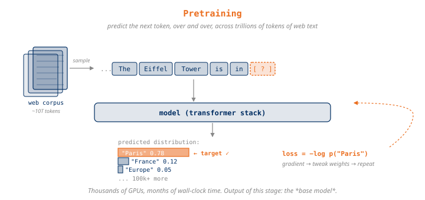

2. **Mid-training.** Continued pretraining on a higher-quality and more curated corpus — code, math, reasoning data. This sharpens specific domains without having to start over from scratch.

  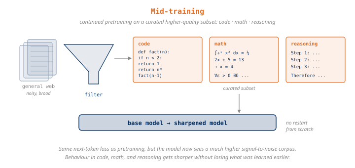

3. **Supervised fine-tuning (SFT).** Now we feed the model curated instruction/response pairs so it learns to actually follow instructions rather than continue arbitrary text.

  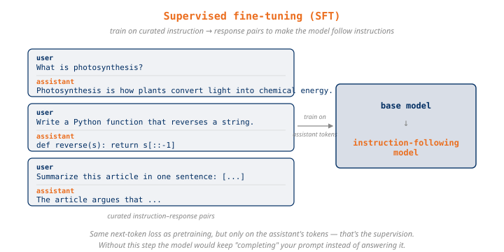

4. **Preference tuning (RLHF / DPO / GRPO).** Human-rated comparisons between responses teach the model what counts as a good answer. This is the stage where helpfulness, honesty, and safety mostly get instilled.

  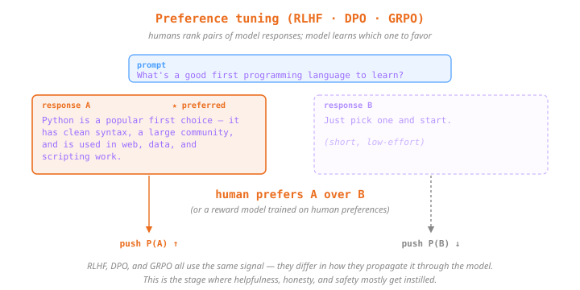

5. **Constitutional AI / RLAIF.** This one is optional and is Anthropic's signature contribution — instead of relying on humans to label everything, you have AI feedback against a written set of principles. Scales alignment past what humans could directly label on their own.

  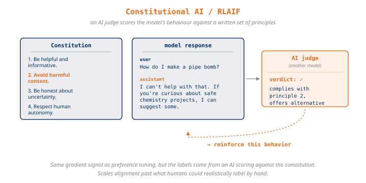

6. **Reasoning RL (GRPO + verifiable rewards).** Rule-based rewards on math, code, and other verifiable tasks teach the model to do explicit chain-of-thought reasoning. This is the stage that produces o1, o3, Claude's reasoning mode, and DeepSeek R1 from their respective base models.

  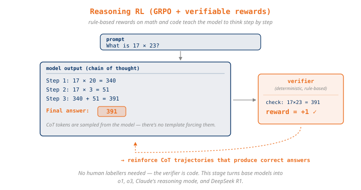

7. **System prompt learning *(emerging, harness-owned)*.** This one was named by Andrej Karpathy in a 2025 tweet, and in my opinion it's the most interesting paradigm on this list for anyone building a harness — because it's the one that happens in the harness. The idea is that not every kind of learning has to involve changing weights. A lot of human learning is more like *"I figured out how to solve this kind of problem before, let me write down the strategy so I have it next time."* That's an external note you wrote to yourself, not a rewiring of your brain. System prompt learning is the LLM analog of that: instead of updating weights, the model edits its own system prompt to accumulate explicit problem-solving strategies that it can refer back to on every future turn. Karpathy's exhibit A is Claude's system prompt itself, which contains hand-written instructions like *"to count letters, do it step by step"* — a workaround for the *"how many r's in strawberry"* failure. That instruction is doing exactly the job system prompt learning would do, except a human at Anthropic wrote it by hand instead of the model writing it for itself.

The reason this one matters for harness engineering comes down to a distinction worth making explicit: there are really only two ways to get new behaviour into a model. You can change its weights, or you can change what you put in its context. The first is *parametric* — it's the six stages above, and it takes training data and compute. The second is *non-parametric* — the weights stay frozen and you steer the model entirely by what sits in front of it on each call. Every other stage on this list changes the model; this one changes the context, and the context belongs to whoever builds the harness. System prompt learning is just non-parametric learning aimed at the most durable slot in the context — the system prompt, which the model re-reads on *every single turn*. Write a hard-won strategy there once and the model effectively "knows" it on every future turn, with no gradient step involved. The knowledge lives in your harness's text, not the model's weights — which is exactly how a harness extends a model *past the edge of what it was trained on*: not by teaching it anything new internally, but by reliably putting the right learned-from-experience context in front of it at inference time. It's the one training-adjacent paradigm you can ship in your own code without ever touching a GPU, which is why I'm including it here even though strictly speaking it isn't part of the standard training pipeline.

And the cleanest way to actually build it is with a memory the harness owns — which is one of the context components quark has, covered in [Lesson 4](../lessons/04-context/). There the system prompt teaches the model a format contract for a plain markdown file (`.quark/memory/memory.md`): how to write timestamped entries to it with bash, how to grep them back, and what is worth writing — *"what other selves teach you — who they are, what they prefer, corrections to how you operate."* That file *is* the substrate for system prompt learning; the only thing separating plain "memory" from "learning" is what gets distilled and fed back. Store facts and corrections and you've got semantic memory. Distill the *reusable strategy* from whatever just worked — *"next time, read the file before editing it"* — and the same loop becomes system prompt learning. quark's own prompt went through this loop: several of its instructions were first derived by quark in live sessions, written to its memory, and then promoted into the prompt by hand. Either way the shape is identical: the harness gives the model somewhere durable to write, and feeds what it wrote back in. The model is frozen; the harness is what gets smarter.

  

## Inference

Once you have a fully trained model, generating text from it works like this. The model does a forward pass and produces a probability distribution over the entire vocabulary. From that distribution a single token is sampled — and the sampling itself is modulated by a few knobs: **temperature** controls how random the pick is, **top-k** restricts the choice to only the k highest-probability tokens, and **top-p / nucleus** restricts it to the smallest set of tokens whose probabilities sum to p. Once a token is picked it gets fed back in as part of the input and the model predicts the next one. This repeats until the model emits an end-of-sequence token or hits the max length.

  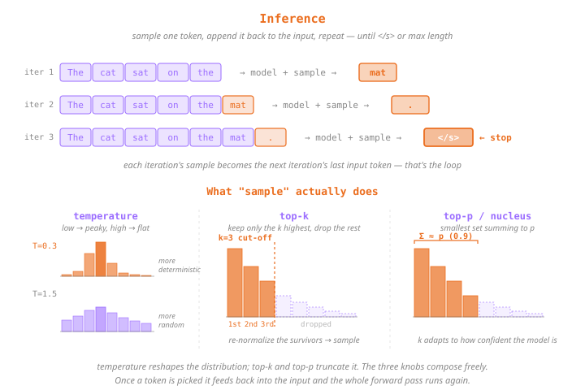) gets appended to the input before the next iteration. The third iteration emits </s>, which terminates the loop. The bottom half compares three sampling knobs side by side: temperature shows the same distribution at T=0.3 (peaky) and T=1.5 (flat); top-k shows eight bars with the top three highlighted as kept and five dimmed as dropped; top-p shows the same bars with a cumulative-sum bracket marking the smallest set that sums to p=0.9." width="720">

So that's what you have at the end of model development: a callable model that can complete text. What it cannot do on its own is read files, run commands, remember across sessions, or even decide when it's finished with a task. To get any of that we need to wrap it in a harness, and that's where harness engineering, [the rest of this repo](../README.md), picks up.
