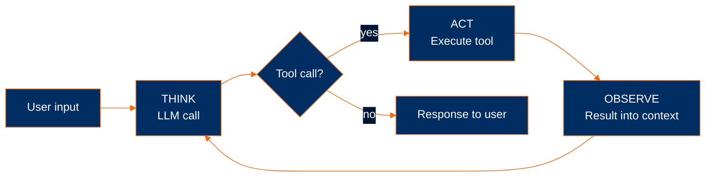

# What is an agent?

In my opinion the simplest way to think about an agent is as a system that can think, act, and observe on its own — without a human having to step in between any of those steps. It's a model wrapped in just enough code to keep going until the task is actually finished.

> **Agent = Model + Harness.**
> The model is the intelligence substrate — Claude, GPT, Gemini, or whatever you're calling via an API. The harness is everything else: the code, configuration, and execution logic that wraps the model and gives it state, tools, an execution environment, feedback, and constraints.
>
> A raw model is not an agent. The harness is what turns it into one. This curriculum teaches **harness engineering** — how to build that surrounding runtime from first principles.

## The three components

In my opinion the bare minimum required to actually call something an agent is three moving parts. Real production agents have way more going on in the harness — memory, sandboxing, guardrails, observability, performance work, and more — and that's exactly what we're going to build out over the rest of the curriculum. But at the irreducible core you only need these three: an LLM call, tools, and a loop. One of them (the LLM call) is the model itself; the other two are the most fundamental primitives of the harness. Let me walk through each one with a self-contained snippet showing what it actually looks like in code.

### 1. An LLM call

The reasoning engine, which is the **model**. At the most basic level this is just an HTTP POST to the model provider's API which is shown below using Anthropic's SDK where you send a prompt and get back a response made up of content blocks (usually text, sometimes structured tool requests). One prompt in, one response out. That's the whole mechanic at this layer, and it's exactly what Module 2 will go into depth on.

```python
from anthropic import Anthropic

client = Anthropic()

response = client.messages.create(
    model="claude-sonnet-4-5",
    max_tokens=1024,
    messages=[{"role": "user", "content": "What is 2 + 2?"}],
)
print(response.content[0].text)
```

### 2. Tools

The harness's interface to the outside world. A tool has two parts that together make it usable by the model: an **implementation** (the actual function written in your agent's language, which does the actual work) and a **schema** (a structured description of the inputs the function expects, which the model reads at runtime to figure out what arguments to pass). The LLM industry has standardized on [JSON Schema](https://json-schema.org/) for the schema side of things, so the schema part looks the same regardless of whether your agent is written in Python, TypeScript, Go, or Rust — only the implementation changes between languages. Tools always return strings to the model, and if something goes wrong they return an error message *as* a string so the model can self-correct on the next turn instead of the whole program crashing.

For the toy in this module we'll use a single `bash` tool — the model can ask to run any shell command, and we run it. That's intentionally the broadest possible tool: technically `bash` can do anything you can type into a terminal, which makes it the minimum primitive that proves the tool concept end-to-end. It also makes it a terrible thing to hand a model in production without serious guardrails. Starting in Module 5 we'll introduce safer purpose-built tools like `read`, `write`, `edit`, `grep`, and `glob`, but for showing what a tool actually *is* mechanically, one bash tool is the simplest thing that gets us all the way there.

```python
def bash(cmd: str) -> str:
    try:
        result = subprocess.run(cmd, shell=True, capture_output=True, text=True, timeout=30)
    except subprocess.TimeoutExpired:
        return "error: command timed out after 30s"
    return (result.stdout + result.stderr).strip() or f"(exit {result.returncode})"


tools = [
    {
        "name": "bash",
        "description": "Run a shell command",
        "input_schema": {
            "type": "object",
            "properties": {"cmd": {"type": "string"}},
            "required": ["cmd"],
        },
    }
]
```

### 3. A loop (Think → Act → Observe)

The harness's body. Even with an LLM call and a tool defined, what we still don't have is anything that ties them together over multiple turns — and a single LLM call on its own isn't really an agent, it's just a question and an answer. To turn that into an agent we wrap the call in a loop where each iteration goes through three distinct phases:

- **THINK** — the LLM runs, emitting reasoning text and (optionally) tool requests.
- **ACT** — your code looks at the tool requests and actually executes the tools the model asked for.
- **OBSERVE** — the results of those tool calls get appended back into the conversation as new context for the model on the next iteration.

The cycle then repeats — Think → Act → Observe → Think → ... — until the model decides it's done by simply not asking for any more tools. That's what marks the end of a turn. This loop is commonly known in the literature as the **ReAct loop** after the 2022 paper [*ReAct: Synergizing Reasoning and Acting in Language Models*](https://arxiv.org/abs/2210.03629) by Yao et al. I personally prefer the TAO framing because the ReAct acronym drops the "observation" phase even though the paper itself includes it.

```python
while True:
    # THINK: call the model
    response = client.messages.create(
        model="claude-sonnet-4-5",
        max_tokens=1024,
        messages=messages,
        tools=tools,
    )
    messages.append({"role": "assistant", "content": response.content})

    tool_calls = [b for b in response.content if b.type == "tool_use"]
    if not tool_calls:
        break

    # ACT: run each requested tool
    results = [execute(call) for call in tool_calls]

    # OBSERVE: append results as the next user message
    messages.append({"role": "user", "content": results})
```

## The toy

Now we can put the three components together into a minimal working agent. This is a toy more than something you'd ever actually ship, but it shows the whole loop in around 50 lines of code. The runnable version of this lives at [`examples/test.py`](../../examples/test.py):

```python
import subprocess
from anthropic import Anthropic
from dotenv import load_dotenv

load_dotenv()
client = Anthropic()


def bash(cmd: str) -> str:
    try:
        result = subprocess.run(cmd, shell=True, capture_output=True, text=True, timeout=30)
    except subprocess.TimeoutExpired:
        return "error: command timed out after 30s"
    return (result.stdout + result.stderr).strip() or f"(exit {result.returncode})"


tools = [
    {
        "name": "bash",
        "description": "Run a shell command",
        "input_schema": {
            "type": "object",
            "properties": {"cmd": {"type": "string"}},
            "required": ["cmd"],
        },
    }
]


messages = [{"role": "user", "content": "Show me the contents of pyproject.toml and tell me what tool calls you made and how did they look"}]

while True:
    response = client.messages.create(
        model="claude-sonnet-4-5",
        max_tokens=1024,
        system="You are a helpful coding assistant. Use the bash tool CAREFULLY to do work ONLY as needed",
        messages=messages,
        tools=tools,
    )
    messages.append({"role": "assistant", "content": response.content})

    tool_calls = [b for b in response.content if b.type == "tool_use"]
    if not tool_calls:
        break

    results = [
        {"type": "tool_result", "tool_use_id": c.id, "content": bash(**c.input)}
        for c in tool_calls
    ]
    messages.append({"role": "user", "content": results})

for block in response.content:
    if block.type == "text":
        print(block.text)
```



And here's the actual output you get back when you run the toy — the model answered both parts of the prompt, showing the file contents *and* surfacing the tool call it made along the way:

````
cloudchase@m1Pro examples % uv run test.py
## Contents of pyproject.toml:

The file contains a Python project configuration with:
- **Project name**: "examples"
- **Version**: 0.1.0
- **Description**: Runnable checkpoints for the agenteng curriculum with shared venv, .env, and dependencies
- **Python requirement**: >=3.13
- **Dependencies**:
  - anthropic (>=0.97.0)
  - python-dotenv (>=1.2.2)
  - sentence-transformers (>=3.0.0)
  - transformers (>=4.40.0)
  - numpy (>=2.0.0)
  - pyyaml (>=6.0)
  - tiktoken (>=0.8.0)

## Tool Call Details:

I made **1 tool call** using the `bash` function:

```xml
<invoke name="bash">
<parameter name="cmd">cat pyproject.toml</parameter>
</invoke>
```

**What this looked like:**
- **Function name**: `bash` — allows me to run shell commands
- **Parameter name**: `cmd` — the command to execute
- **Parameter value**: `cat pyproject.toml` — a shell command that displays the contents of the file
````

The model chose every action it took, read every result it got back, and decided on its own when to stop. In my opinion that's the cleanest way to see the workflow-vs-agent distinction in action — and it's exactly the pattern this repo is going to build up over the next ten modules.

## Run it

```bash
cd examples
uv run test.py
```

It prints the model's reasoning along the way, shows the contents of `pyproject.toml`, and tells you which tool calls it made to get there. Once you can run this you've seen the goal in miniature.

## Where we go from here

The toy you just ran is the whole agent pattern in about 50 lines. Starting in Module 2 we actually go back to the foundation — just a single LLM call, no tools and no loop — and build the harness back up one component at a time over the rest of the curriculum, ending up with something much more substantial than this little toy.

Specifically, **Module 2** picks up at the bottom of the stack and walks through three things: how to actually make an LLM call (the four fields the API needs from you), the difference between the sync and async streaming versions of that call, and when you want each one.

---

**Next:** [Module 2: An LLM call](../02-an-llm-call/)
