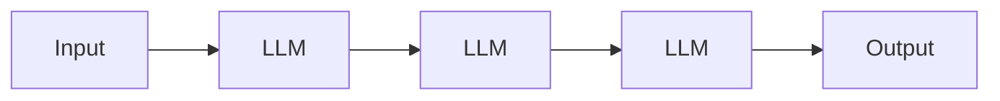
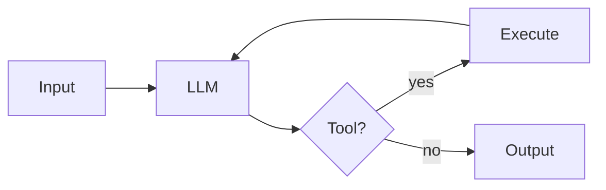
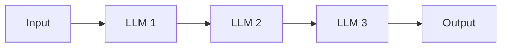
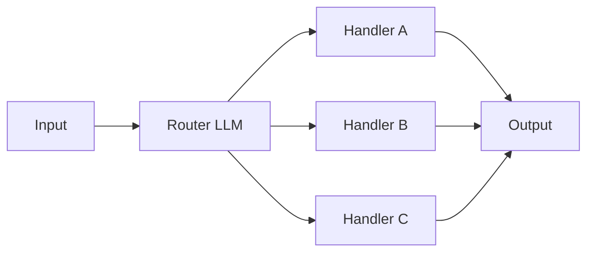
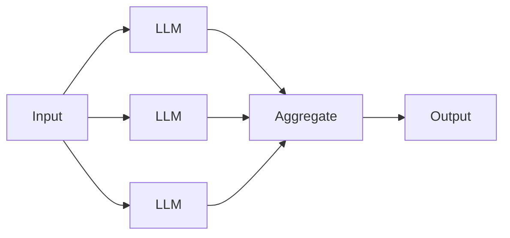
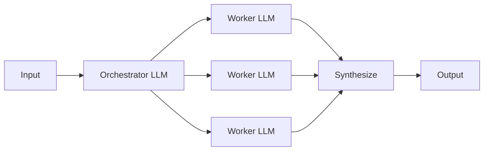
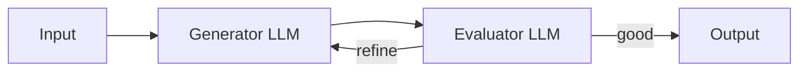
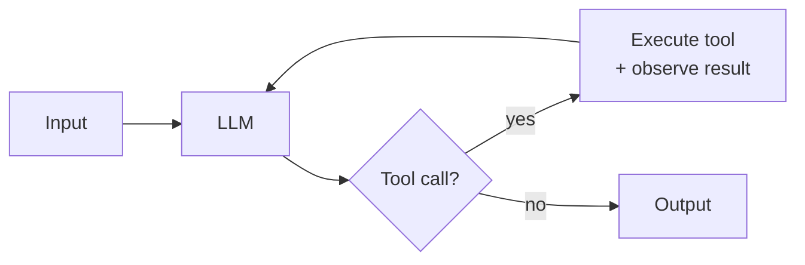
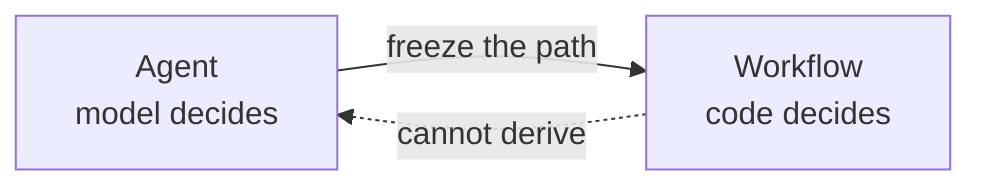
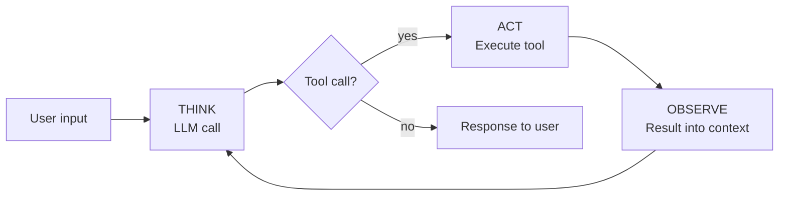

# What is an agent?

An agent is a system that can think, act, and observe without human intervention.

> **Agent = Model + Harness.**
> The model is the intelligence substrate (Claude, GPT, etc.) — typically consumed via API. The harness is everything else: the code, configuration, and execution logic around the model that gives it state, tools, execution, feedback, and constraints.
>
> A raw model is not an agent. The harness is what turns it into one. This curriculum teaches **harness engineering** — how to build that surrounding runtime from first principles.

## What an agentic system is

The idea of agentic systems comes from cognitive science — systems that can act on their own, without human intervention. In modern agentic systems, the agency is provided by an LLM coordinating calls to accomplish a goal without supervision.

## Two shapes: workflows and agents

In my opinion, agentic systems come in two forms, as defined in Anthropic's [*Building Effective Agents*](https://www.anthropic.com/engineering/building-effective-agents). The distinction is about *what shape the system's control flow takes*.

**Workflows** — LLMs and tools orchestrated through **predefined code paths**. Prescriptive code paths define the sequence of steps that will be taken to accomplish a goal.



**Agents** — **LLMs dynamically direct their own path through the control flow**. The model decides the sequence of steps; no prescriptive code paths are followed and the model exercises its probability distribution to determine the next step.



## Common workflow patterns

**Prompt chaining** — LLM → LLM → LLM, fixed order. Example: outline → draft → polish.



**Routing** — Classify input → dispatch to one of N handlers. Example: support tickets routed to billing / technical / refunds.



**Parallelization** — Run N LLM calls in parallel → aggregate. Example: N perspectives on one question.



**Orchestrator-workers** — One LLM splits work → workers handle sub-tasks. Example: research report with multiple sections.



**Evaluator-optimizer** — Generator → Evaluator → loop until good. Example: draft with a quality-gate loop.



## The agent pattern

Workflows are a catalog of orchestration shapes. Agents are **one pattern** — an autonomous loop — and that's the whole list. What varies between agents in practice is the *harness around the model*: the environment, memory and context management, the toolkit, and whether one of the tools happens to be another agent.

**Autonomous agent** — an LLM in a loop with tools, choosing what to do next based on what it observes. This is the pattern this repo builds.



## Composition

By composing the above workflows and agent patterns, you can build multi-agent systems, multi-workflow systems, or systems that mix both.

> [!NOTE]
> **Whether to use multi-agent composition at all is a live disagreement in the field.** Anthropic embraces it ([multi-agent research system](https://www.anthropic.com/engineering/multi-agent-research-system); Claude Code subagents). Cognition argues *against* it in [*Don't Build Multi-Agents*](https://cognition.ai/blog/dont-build-multi-agents), making the case for a single-threaded linear agent with shared context — citing reliability and debuggability. Cursor 2.0 takes a third path: parallel independent agents on separate Git worktrees, no supervisor. The right composition depends on whether sub-tasks share context, run in parallel, and need to surface partial state — there is no default answer.

## The Average Joes Lab stance: purist agents only

We believe in the [Anthropic model](https://www.anthropic.com/engineering/building-effective-agents): **a real agent has autonomy over its own control flow** where the model decides what tool to call, what to do with the result, and when the task is done. Building harnesses for purist agents is the focus of this repo.

Workflows are outside the scope of what follows.



The primitives are the same — LLM calls, tools, context, memory. An agent's control flow is the model making those choices live; a workflow's control flow is you making them in advance. The building blocks transfer; how you orchestrate them into a fixed sequence is its own discipline.

For most production systems a workflow is more reliable, cheaper, and easier to evaluate — build a workflow if you can. But the interesting engineering problems — designing tools the model will use well, managing an open-ended context, making a non-deterministic loop reliable, evaluating a trajectory you can't enumerate — are agent problems.

## What agents look like

- **Coding agents** — [Claude Code](https://claude.com/claude-code), [Cursor](https://cursor.com), [Devin](https://devin.ai), [Aider](https://aider.chat), [nanoagent](https://github.com/averagejoeslab/nanoagent). The model opens files, edits them, runs tests, iterates.
- **Research agents** — [OpenAI Deep Research](https://openai.com/index/introducing-deep-research/), Claude's research mode. The model searches, synthesizes, digs deeper.
- **Task completion agents** — [SWE-agent](https://swe-agent.com), browser-use agents. The model manipulates a filesystem or GUI to complete a task.

In each case, the next action depends on what the previous action produced. The paths can't be enumerated in advance.

> [!IMPORTANT]
> Most systems marketed as "agents" in 2026 are workflows. That's often the right answer. This content is about the case when it isn't.

---

## What an agent looks like in code

Conceptually you've now placed the category. Mechanically, an agent has three moving parts. One is the model; two are the irreducible primitives of the harness:

1. **An LLM call** — the reasoning engine (the **model**)
2. **A loop** (Think, Act, Observe) — the harness's body, turning single calls into sustained work
3. **Tools** — the harness's interface to the environment

## Show an LLM call

An LLM call is an HTTP POST to the model provider's API. The response comes back as a list of content blocks — text, and optionally tool requests.

```python
response = client.messages.create(
    model="claude-sonnet-4-5",
    max_tokens=1024,
    messages=[{"role": "user", "content": "What is 2 + 2?"}],
)
print(response.content[0].text)
```

One prompt in, one response out.

## Show a TAO loop

Each iteration has three phases: **Think, Act, Observe**.

1. **THINK** — the LLM runs; it emits reasoning text and (optionally) tool requests
2. **ACT** — your code executes the tools the model requested
3. **OBSERVE** — the results are appended to the conversation

The cycle repeats: Think → Act → Observe → Think → ... until the model produces no more tool requests. That's the end of the turn.

```python
while True:
    # THINK: call the model
    response = client.messages.create(
        model="claude-sonnet-4-5",
        max_tokens=1024,
        messages=messages,
        tools=tools,
    )
    messages.append({"role": "assistant", "content": response.content})

    # If no tool_use blocks, the model is done
    tool_calls = [b for b in response.content if b.type == "tool_use"]
    if not tool_calls:
        break

    # ACT: run each requested tool
    results = [execute(call) for call in tool_calls]

    # OBSERVE: append results as the next user message
    messages.append({"role": "user", "content": results})
```

> [!NOTE]
> This loop is commonly known as the **ReAct loop** — after the 2022 paper [*ReAct: Synergizing Reasoning and Acting in Language Models*](https://arxiv.org/abs/2210.03629) by Yao et al. The ReAct acronym drops observation; TAO keeps it visible. (The paper itself includes observation — it's the acronym that's lossy.)

## Show a tool

A tool has two parts:

- An **implementation** — a function, in whatever language the agent is written in. It does the work.
- A **schema** — a structured description of the inputs the function expects. The model reads the schema to figure out what to pass.

The LLM industry standardized on [JSON Schema](https://json-schema.org/) for the schema side, so that part looks the same in Python, TypeScript, Go, or Rust. Only the implementation changes. Here both sides are Python:

```python
def read(path: str) -> str:
    try:
        with open(path, "r") as f:
            return f.read()
    except Exception as e:
        return f"error: {e}"

tools = [
    {
        "name": "read",
        "description": "Read the contents of a file",
        "input_schema": {
            "type": "object",
            "properties": {
                "path": {"type": "string"},
            },
            "required": ["path"],
        },
    }
]
```

The tool returns a string. If something goes wrong, it returns the error as a string so the model can self-correct instead of crashing the program.

## Putting it together

All three components assembled into a minimal agent:

```python
import os
from anthropic import Anthropic
from dotenv import load_dotenv

load_dotenv()
client = Anthropic(api_key=os.environ["ANTHROPIC_API_KEY"])


def read(path: str) -> str:
    try:
        with open(path, "r") as f:
            return f.read()
    except Exception as e:
        return f"error: {e}"


tools = [
    {
        "name": "read",
        "description": "Read the contents of a file",
        "input_schema": {
            "type": "object",
            "properties": {"path": {"type": "string"}},
            "required": ["path"],
        },
    }
]


messages = [{"role": "user", "content": "What's in pyproject.toml?"}]

while True:
    response = client.messages.create(
        model="claude-sonnet-4-5",
        max_tokens=1024,
        system="You are a helpful coding assistant. Use the read tool when you need to examine file contents.",
        messages=messages,
        tools=tools,
    )
    messages.append({"role": "assistant", "content": response.content})

    tool_calls = [b for b in response.content if b.type == "tool_use"]
    if not tool_calls:
        break

    results = []
    for c in tool_calls:
        results.append({
            "type": "tool_result",
            "tool_use_id": c.id,
            "content": read(**c.input),
        })
    messages.append({"role": "user", "content": results})

for block in response.content:
    if block.type == "text":
        print(block.text)
```



A concrete trace:

```
User: "Find and summarize the TODOs in this codebase"

[THINK]    I'll search for TODO comments
[ACT]      grep("TODO", ".")
[OBSERVE]  src/auth.ts:42:  // TODO: session expiration
           src/auth.ts:87:  // TODO: rate limiting
           src/db.ts:14:    // TODO: connection pooling
           [...44 more matches]
[THINK]    Most are in src/auth.ts — I'll read that file for context
[ACT]      read("src/auth.ts")
[OBSERVE]  [full file contents]
[THINK]    I have enough to summarize
[STOP]     "You have 47 TODOs across 12 files, concentrated in auth..."
```

The model chose every action, read every result, and decided when to stop.

## What you'll need

- [Python 3.13 or newer](https://www.python.org/downloads/)
- [uv](https://docs.astral.sh/uv/) for dependency management
- An Anthropic API key from [console.anthropic.com](https://console.anthropic.com)

---

**Next:** [Module 2: An LLM call](../02-an-llm-call/)
