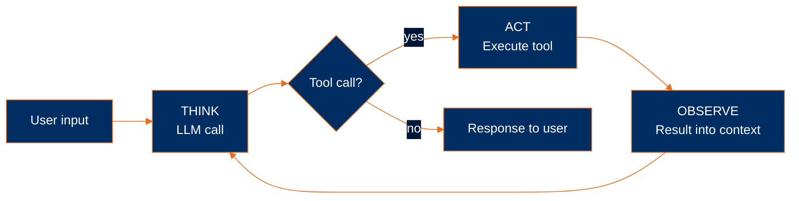

# What is an agent?

In my opinion the simplest way to think about an agent is as a system that can think, act, and observe on its own — without a human having to step in between any of those steps. It's a model wrapped in just enough code to keep going until the task is actually finished.

> **Agent = Model + Harness.**
> The model is the intelligence substrate — Claude, GPT, Gemini, or whatever you're calling via an API. The harness is everything else: the code, configuration, and execution logic that wraps the model and gives it state, tools, an execution environment, feedback, and constraints.
>
> A raw model is not an agent. The harness is what turns it into one. This curriculum teaches **harness engineering** — how to build that surrounding runtime from first principles.

> [!NOTE]
> For the broader conceptual picture — what an *agentic system* actually is, the workflow-vs-agent distinction, the multi-agent composition debate, and where Average Joes Lab lands on all of it — see the [top-level README](../../README.md#what-is-an-agentic-system). This module is the mechanical view: what an agent actually looks like in code.

## The three components

In my opinion an agent only really has three moving parts. One of them is the model itself, and the other two are the irreducible primitives of the harness:

1. **An LLM call** — the reasoning engine, which is the **model**.
2. **A loop** (Think → Act → Observe) — the harness's body, turning a single call into sustained work over many turns.
3. **Tools** — the harness's interface to the outside world.

Let's walk through each of them.

## Show an LLM call

The simplest of the three is just calling the model. An LLM call is essentially an HTTP POST to the model provider's API, and the response comes back as a list of content blocks — usually text, sometimes tool requests, but always structured.

```python
response = client.messages.create(
    model="claude-sonnet-4-5",
    max_tokens=1024,
    messages=[{"role": "user", "content": "What is 2 + 2?"}],
)
print(response.content[0].text)
```

One prompt in, one response out. That's the whole mechanic at this layer.

## Show a TAO loop

On its own a single LLM call isn't an agent — it's just a question and an answer. To turn that into an agent we wrap the call in a loop where each iteration goes through three distinct phases:

1. **THINK** — the LLM runs, emitting reasoning text and (optionally) tool requests.
2. **ACT** — your code looks at the tool requests and actually executes the tools the model asked for.
3. **OBSERVE** — the results of those tool calls get appended back into the conversation as new context for the model.

The cycle repeats — Think → Act → Observe → Think → ... — until the model decides it's done by simply not asking for any more tools. That's what marks the end of a turn.

```python
while True:
    # THINK: call the model
    response = client.messages.create(
        model="claude-sonnet-4-5",
        max_tokens=1024,
        messages=messages,
        tools=tools,
    )
    messages.append({"role": "assistant", "content": response.content})

    # If no tool_use blocks, the model is done
    tool_calls = [b for b in response.content if b.type == "tool_use"]
    if not tool_calls:
        break

    # ACT: run each requested tool
    results = [execute(call) for call in tool_calls]

    # OBSERVE: append results as the next user message
    messages.append({"role": "user", "content": results})
```

> [!NOTE]
> This loop is commonly known in the literature as the **ReAct loop** — after the 2022 paper [*ReAct: Synergizing Reasoning and Acting in Language Models*](https://arxiv.org/abs/2210.03629) by Yao et al. I personally prefer the TAO framing because the ReAct acronym drops the "observation" phase even though the paper itself includes it. TAO keeps all three phases explicit, and to me that maps better onto what the harness is actually doing.

## Show a tool

A tool has two parts that together make it usable by the model:

- An **implementation** — the actual function written in whatever language your agent is in. This is the code that does the work.
- A **schema** — a structured description of the inputs the function expects, which the model reads at runtime to figure out what arguments to pass.

The LLM industry has standardized on [JSON Schema](https://json-schema.org/) for the schema side of things, so the schema part looks the same regardless of whether your agent is written in Python, TypeScript, Go, or Rust — only the implementation changes between languages. Here both sides happen to be in Python:

```python
def read(path: str) -> str:
    try:
        with open(path, "r") as f:
            return f.read()
    except Exception as e:
        return f"error: {e}"

tools = [
    {
        "name": "read",
        "description": "Read the contents of a file",
        "input_schema": {
            "type": "object",
            "properties": {
                "path": {"type": "string"},
            },
            "required": ["path"],
        },
    }
]
```

Notice that the tool always returns a string. And if something goes wrong it still returns a string — just one that starts with `error:` — so the model can read the error message and self-correct on the next turn instead of the whole program crashing.

## Putting it together

Now we can put the three components together into a minimal working agent. This is a toy more than something you'd ever actually ship, but it shows the whole loop in fewer than 50 lines of code. The runnable version of this lives at [`examples/test.py`](../../examples/test.py):

```python
import os
from anthropic import Anthropic
from dotenv import load_dotenv

load_dotenv()
client = Anthropic(api_key=os.environ["ANTHROPIC_API_KEY"])


def read(path: str) -> str:
    try:
        with open(path, "r") as f:
            return f.read()
    except Exception as e:
        return f"error: {e}"


tools = [
    {
        "name": "read",
        "description": "Read the contents of a file",
        "input_schema": {
            "type": "object",
            "properties": {"path": {"type": "string"}},
            "required": ["path"],
        },
    }
]


messages = [{"role": "user", "content": "What's in pyproject.toml?"}]

while True:
    response = client.messages.create(
        model="claude-sonnet-4-5",
        max_tokens=1024,
        system="You are a helpful coding assistant. Use the read tool when you need to examine file contents.",
        messages=messages,
        tools=tools,
    )
    messages.append({"role": "assistant", "content": response.content})

    tool_calls = [b for b in response.content if b.type == "tool_use"]
    if not tool_calls:
        break

    results = []
    for c in tool_calls:
        results.append({
            "type": "tool_result",
            "tool_use_id": c.id,
            "content": read(**c.input),
        })
    messages.append({"role": "user", "content": results})

for block in response.content:
    if block.type == "text":
        print(block.text)
```



And here's a concrete trace of what that loop actually looks like when the model is solving a real task:

```
User: "Find and summarize the TODOs in this codebase"

[THINK]    I'll search for TODO comments
[ACT]      grep("TODO", ".")
[OBSERVE]  src/auth.ts:42:  // TODO: session expiration
           src/auth.ts:87:  // TODO: rate limiting
           src/db.ts:14:    // TODO: connection pooling
           [...44 more matches]
[THINK]    Most are in src/auth.ts — I'll read that file for context
[ACT]      read("src/auth.ts")
[OBSERVE]  [full file contents]
[THINK]    I have enough to summarize
[STOP]     "You have 47 TODOs across 12 files, concentrated in auth..."
```

The model chose every action it took, read every result it got back, and decided on its own when to stop. In my opinion that's the cleanest way to see the workflow-vs-agent distinction in action — and it's exactly the pattern this repo is going to build up over the next ten modules.

## What you'll need

A few things to have installed before you can run any of the example checkpoints from here on:

- [Python 3.13 or newer](https://www.python.org/downloads/)
- [uv](https://docs.astral.sh/uv/) for dependency management
- An Anthropic API key from [console.anthropic.com](https://console.anthropic.com)

## Run it

```bash
cd examples
uv run test.py
```

It prints the model's reasoning along the way and finishes with a summary of `pyproject.toml`. Once you can run this you've seen the goal in miniature.

## Where we go from here

The toy you just ran is the whole agent pattern in about 50 lines. Starting in Module 2 we actually go back to the foundation — just a single LLM call, no tools and no loop — and build the harness back up one component at a time over the rest of the curriculum, ending up with something much more substantial than this little toy.

Specifically, **Module 2** picks up at the bottom of the stack and walks through three things: how to actually make an LLM call (the four fields the API needs from you), the difference between the sync and async streaming versions of that call, and when you want each one.

---

**Next:** [Module 2: An LLM call](../02-an-llm-call/)
