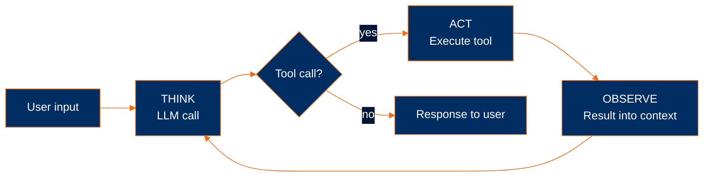

# What is an agent?

An agent is a system that can think, act, and observe without human intervention.

> **Agent = Model + Harness.**
> The model is the intelligence substrate (Claude, GPT, etc.) — typically consumed via API. The harness is everything else: the code, configuration, and execution logic around the model that gives it state, tools, execution, feedback, and constraints.
>
> A raw model is not an agent. The harness is what turns it into one. This curriculum teaches **harness engineering** — how to build that surrounding runtime from first principles.

> [!NOTE]
> For the broader conceptual picture — what an *agentic system* is, workflows vs. agents, the multi-agent composition debate, the purist stance this curriculum takes — see the [top-level README](../../README.md#what-is-an-agentic-system). This module is the mechanical view: what an agent looks like in code.

## The three components

An agent has three moving parts. One is the model; two are the irreducible primitives of the harness:

1. **An LLM call** — the reasoning engine (the **model**)
2. **A loop** (Think, Act, Observe) — the harness's body, turning single calls into sustained work
3. **Tools** — the harness's interface to the environment

## Show an LLM call

An LLM call is an HTTP POST to the model provider's API. The response comes back as a list of content blocks — text, and optionally tool requests.

```python
response = client.messages.create(
    model="claude-sonnet-4-5",
    max_tokens=1024,
    messages=[{"role": "user", "content": "What is 2 + 2?"}],
)
print(response.content[0].text)
```

One prompt in, one response out.

## Show a TAO loop

Each iteration has three phases: **Think, Act, Observe**.

1. **THINK** — the LLM runs; it emits reasoning text and (optionally) tool requests
2. **ACT** — your code executes the tools the model requested
3. **OBSERVE** — the results are appended to the conversation

The cycle repeats: Think → Act → Observe → Think → ... until the model produces no more tool requests. That's the end of the turn.

```python
while True:
    # THINK: call the model
    response = client.messages.create(
        model="claude-sonnet-4-5",
        max_tokens=1024,
        messages=messages,
        tools=tools,
    )
    messages.append({"role": "assistant", "content": response.content})

    # If no tool_use blocks, the model is done
    tool_calls = [b for b in response.content if b.type == "tool_use"]
    if not tool_calls:
        break

    # ACT: run each requested tool
    results = [execute(call) for call in tool_calls]

    # OBSERVE: append results as the next user message
    messages.append({"role": "user", "content": results})
```

> [!NOTE]
> This loop is commonly known as the **ReAct loop** — after the 2022 paper [*ReAct: Synergizing Reasoning and Acting in Language Models*](https://arxiv.org/abs/2210.03629) by Yao et al. The ReAct acronym drops observation; TAO keeps it visible. (The paper itself includes observation — it's the acronym that's lossy.)

## Show a tool

A tool has two parts:

- An **implementation** — a function, in whatever language the agent is written in. It does the work.
- A **schema** — a structured description of the inputs the function expects. The model reads the schema to figure out what to pass.

The LLM industry standardized on [JSON Schema](https://json-schema.org/) for the schema side, so that part looks the same in Python, TypeScript, Go, or Rust. Only the implementation changes. Here both sides are Python:

```python
def read(path: str) -> str:
    try:
        with open(path, "r") as f:
            return f.read()
    except Exception as e:
        return f"error: {e}"

tools = [
    {
        "name": "read",
        "description": "Read the contents of a file",
        "input_schema": {
            "type": "object",
            "properties": {
                "path": {"type": "string"},
            },
            "required": ["path"],
        },
    }
]
```

The tool returns a string. If something goes wrong, it returns the error as a string so the model can self-correct instead of crashing the program.

## Putting it together

All three components assembled into a minimal agent:

```python
import os
from anthropic import Anthropic
from dotenv import load_dotenv

load_dotenv()
client = Anthropic(api_key=os.environ["ANTHROPIC_API_KEY"])


def read(path: str) -> str:
    try:
        with open(path, "r") as f:
            return f.read()
    except Exception as e:
        return f"error: {e}"


tools = [
    {
        "name": "read",
        "description": "Read the contents of a file",
        "input_schema": {
            "type": "object",
            "properties": {"path": {"type": "string"}},
            "required": ["path"],
        },
    }
]


messages = [{"role": "user", "content": "What's in pyproject.toml?"}]

while True:
    response = client.messages.create(
        model="claude-sonnet-4-5",
        max_tokens=1024,
        system="You are a helpful coding assistant. Use the read tool when you need to examine file contents.",
        messages=messages,
        tools=tools,
    )
    messages.append({"role": "assistant", "content": response.content})

    tool_calls = [b for b in response.content if b.type == "tool_use"]
    if not tool_calls:
        break

    results = []
    for c in tool_calls:
        results.append({
            "type": "tool_result",
            "tool_use_id": c.id,
            "content": read(**c.input),
        })
    messages.append({"role": "user", "content": results})

for block in response.content:
    if block.type == "text":
        print(block.text)
```



A concrete trace:

```
User: "Find and summarize the TODOs in this codebase"

[THINK]    I'll search for TODO comments
[ACT]      grep("TODO", ".")
[OBSERVE]  src/auth.ts:42:  // TODO: session expiration
           src/auth.ts:87:  // TODO: rate limiting
           src/db.ts:14:    // TODO: connection pooling
           [...44 more matches]
[THINK]    Most are in src/auth.ts — I'll read that file for context
[ACT]      read("src/auth.ts")
[OBSERVE]  [full file contents]
[THINK]    I have enough to summarize
[STOP]     "You have 47 TODOs across 12 files, concentrated in auth..."
```

The model chose every action, read every result, and decided when to stop.

## What you'll need

- [Python 3.13 or newer](https://www.python.org/downloads/)
- [uv](https://docs.astral.sh/uv/) for dependency management
- An Anthropic API key from [console.anthropic.com](https://console.anthropic.com)

---

**Next:** [Module 2: An LLM call](../02-an-llm-call/)
