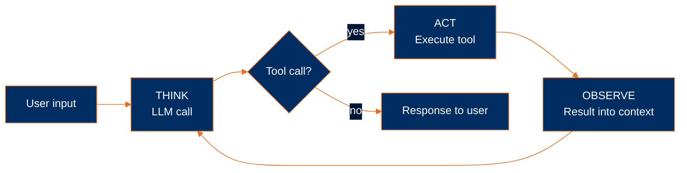

# Add tools

> **Harness component: the tool/action layer.** Without tools the harness can only ferry text. With them, the harness gives the model effects on the world — and the TAO loop hands control of *what* to do next to the model. This is the moment the stateful chatbot becomes a stateful agent.

Module 4's stateful chatbot can remember but not act. Tools change that — they let the model ask your code to run a function on its behalf, see the result, and decide what to do next. **The stateful chatbot becomes a stateful agent the moment it gets tools and a loop to use them in.**

This module covers the whole arc:

1. **One tool** — function + schema + dispatch. See the workflow shape.
2. **Wrap in a loop** — the **TAO loop**. Workflow → agent.
3. **Tool design** — what makes a tool the model uses well.
4. **A registry** — define each tool once; derive schemas and dispatch.
5. **The toolkit** — six tools every coding agent needs.
6. **A central executor** — one place that handles errors for all tools.
7. **Async + parallel dispatch** — run multiple tool calls concurrently.

The persistence, budget, and recall machinery from Module 4 carries forward unchanged — the agent is stateful from the moment it's born. By the end you have [`examples/agent.py`](../../examples/agent.py).

## One tool

A tool is a function the model can ask your code to run. The model declares its intent in a structured `tool_use` block; your code executes the function and feeds the result back.

Three pieces:

1. **The function** — the implementation, in your language.
2. **The schema** — a JSON Schema description the model reads to know what arguments to pass. JSON Schema is the cross-language standard the LLM industry settled on, so the schema looks the same in Python, TypeScript, Go, or Rust — only the function changes.
3. **The dispatch** — your code spotting the `tool_use` block, running the function, and feeding back a `tool_result`.

```python
def read(path: str) -> str:
    try:
        with open(path, "r") as f:
            return f.read()
    except Exception as e:
        return f"error: {e}"


tools = [
    {
        "name": "read",
        "description": "Read the contents of a file",
        "input_schema": {
            "type": "object",
            "properties": {"path": {"type": "string"}},
            "required": ["path"],
        },
    }
]
```

The function returns a string. **On error, it returns the error message *as a string* instead of raising.** The model can read the error and self-correct; a thrown exception would just kill the loop.

Wire it into one turn:

```python
messages = [{"role": "user", "content": "What's in pyproject.toml?"}]

response = client.messages.create(
    model="claude-sonnet-4-5",
    max_tokens=1024,
    system="You are a helpful coding assistant.",
    messages=messages,
    tools=tools,
)
messages.append({"role": "assistant", "content": response.content})

# Look for a tool_use block
for block in response.content:
    if block.type == "tool_use":
        result = read(**block.input)
        messages.append({
            "role": "user",
            "content": [
                {"type": "tool_result", "tool_use_id": block.id, "content": result}
            ],
        })

# Now ask the model to interpret the result
response = client.messages.create(
    model="claude-sonnet-4-5",
    max_tokens=1024,
    system="You are a helpful coding assistant.",
    messages=messages,
    tools=tools,
)
print(response.content[0].text)
```

Two new wire-format details:

- **`response.content` is a list of blocks.** With tools enabled, a single response can contain `text` blocks, one or more `tool_use` blocks, or both.
- **Tool results come back as a `user` message.** The `content` is a list of `tool_result` blocks; each is matched to its request by `tool_use_id`.

This works — but notice the structure: **call the model, run the tool, call the model again.** Two calls, hardcoded. What if the model needs to read another file based on what it saw? What if it needs to read three files? The fixed two-call shape doesn't scale.

This is a **workflow** — your code decides the sequence (call → tool → call). For a known task it's fine. For open-ended work, the model needs to decide when it's done.

## Wrap it in a loop

Replace the fixed two calls with a loop. Each iteration: call the model. If it asked for a tool, run it and loop again. If it didn't, the turn is over. We use `messages.stream` (introduced in Module 2) so the model's text streams live; `get_final_message()` then returns the structured response so we can dispatch tool calls from it:

```python
while True:
    user_input = input("❯ ")
    if user_input.lower() in ("/q", "exit"):
        break

    messages.append({"role": "user", "content": user_input})

    # The TAO loop
    while True:
        # THINK: call the model — stream the text for UX, then capture the
        # final structured response (with any tool_use blocks).
        async with client.messages.stream(
            model="claude-sonnet-4-5",
            max_tokens=1024,
            system="You are a helpful coding assistant.",
            messages=messages,
            tools=tools,
        ) as stream:
            async for text in stream.text_stream:
                print(text, end="", flush=True)
            print()
            response = await stream.get_final_message()

        messages.append({"role": "assistant", "content": response.content})

        tool_calls = [b for b in response.content if b.type == "tool_use"]
        if not tool_calls:
            break  # Model didn't ask for a tool — turn is over

        # ACT: run each requested tool
        results = []
        for c in tool_calls:
            results.append({
                "type": "tool_result",
                "tool_use_id": c.id,
                "content": read(**c.input),
            })

        # OBSERVE: feed results back as the next user message
        messages.append({"role": "user", "content": results})
```

The streaming context manager is what makes "stream for UX, dispatch tools afterward" work. The SDK accumulates events as they arrive; `text_stream` yields the *text* deltas (skipping `tool_use` events); when the iterator is exhausted, `get_final_message()` returns the complete `Message` with all blocks — the same shape you'd get from `messages.create`. There's no race; tools are dispatched only after the model is done.

Two loops, nested:

- **Outer loop** — the conversation. One iteration per user turn (same as the chatbot).
- **Inner loop** — the **TAO loop** (Think → Act → Observe). One iteration per model call plus its tool dispatches. The model decides when to stop by simply not requesting more tools.

**This is the agent.** The control-flow choice — *do I need another tool, or am I done?* — moved from your code into the model. Your code no longer knows in advance how many tool calls a turn will take. The chatbot's outer loop is still there; what's new is that *the model now drives the inner loop*.



> [!NOTE]
> This is the **ReAct loop** from the 2022 paper [*ReAct: Synergizing Reasoning and Acting in Language Models*](https://arxiv.org/abs/2210.03629) by Yao et al. The ReAct acronym drops observation; TAO keeps it visible.

One tool is enough to make the loop work. Now we need more tools, and the dispatch above doesn't scale.

## Tool design

A tool is the agent's interface to its environment. Bad tools cost more tokens, take more turns, and produce worse results — even if the model is fine. A few principles, drawn from Anthropic's [*Writing Tools for Agents*](https://www.anthropic.com/engineering/writing-tools-for-agents):

**Pick the right granularity.** A `search_and_summarize` tool that does the whole job in one call beats `list_files` → `read` → `read` → `read`. Each tool call is a model round-trip; fewer round-trips means lower latency and fewer chances to derail. But going too coarse (`do_everything(task)`) hides choices the model needs to make. Aim for tools that match how a human would describe a sub-step.

**Name and describe like docs.** The model picks a tool by reading the name and description. `edit` beats `modify_file_contents`; *"Replace 'old' with 'new' in a file; 'old' must appear exactly once"* beats *"edits files"*. Constraints in the description (*"must appear exactly once"*) save the model from making mistakes the first time.

**Return strings.** The model consumes text. A tool can compute anything internally, but it returns a string for the model to read.

**Return errors as strings, never raise.** If the file doesn't exist, the tool returns `"error: file not found"` — the model sees the message and tries something else. A raised exception kills the loop.

**Make outputs informative but bounded.** A `grep` that returns 10,000 matches blows the context window. Cap the output, summarize, or paginate. The agent should never waste tokens reading noise.

## A registry

Each new tool needs three things plumbed: the function, the schema, and the dispatch branch. With one tool that's fine; with six it's three places to edit per tool, easy to drift out of sync.

A registry collapses those into one definition. Each parameter declares its **type** (so the model knows whether to send a string, integer, or boolean) and whether it's **required**. Optional parameters default to `required=False`:

```python
TOOLS = {
    "read": {
        "fn": read,
        "description": "Read a file's contents (with optional line pagination)",
        "params": {
            "path":   {"type": "string",  "description": "Path to the file"},
            "offset": {"type": "integer", "description": "First line to read, 0-indexed", "required": False},
            "limit":  {"type": "integer", "description": "Maximum lines to read", "required": False},
        },
    },
    "edit": {
        "fn": edit,
        "description": "Replace 'old' with 'new' in a file",
        "params": {
            "path": {"type": "string",  "description": "Path to edit"},
            "old":  {"type": "string",  "description": "Exact text to replace"},
            "new":  {"type": "string",  "description": "Replacement text"},
            "all":  {"type": "boolean", "description": "Replace every occurrence (default: require unique match)", "required": False},
        },
    },
    # ... write, grep, glob, bash ...
}
```

Two things this richer shape buys you:

- **`read` can paginate.** When the model reads a 5000-line file just to look at one function, it pays for the whole file in tokens. With `offset`/`limit`, it can ask for lines 200–230. Same tool surface; meaningfully less token waste.
- **`edit` can opt in to multi-occurrence replacement.** The default still refuses ambiguous matches (good — keeps the model from accidentally rewriting unrelated code), but `all=true` lets it deliberately replace every occurrence when that's the intent.

The schema builder pulls the type and required-ness directly from the registry:

```python
def build_tool_schemas(tools):
    schemas = []
    for name, meta in tools.items():
        properties = {}
        required = []
        for pname, pmeta in meta["params"].items():
            properties[pname] = {"type": pmeta["type"], "description": pmeta["description"]}
            if pmeta.get("required", True):
                required.append(pname)
        schemas.append({
            "name": name,
            "description": meta["description"],
            "input_schema": {
                "type": "object",
                "properties": properties,
                "required": required,
            },
        })
    return schemas


TOOL_SCHEMAS = build_tool_schemas(TOOLS)
```

Adding a tool is now one entry in `TOOLS`. The JSON Schema and the dispatch update automatically; no risk of drift.

## The toolkit

Six tools cover most coding work — three read tools, three write/exec tools.

| Tool | Purpose |
|---|---|
| `read` | Read a file's contents |
| `grep` | Search file contents under a directory for a regex |
| `glob` | List files matching a glob pattern |
| `write` | Create or overwrite a file |
| `edit` | Replace exact text in a file (must match once) |
| `bash` | Run a shell command |

A few notes on the choices:

**`edit` requires `old` to match exactly once.** Models are good at copying enough surrounding context to make a target unique. If `old` matches multiple times, the tool returns an error rather than guessing — the model adjusts and retries.

**`grep` and `glob` are separate.** `grep` searches *inside* files (regex over content); `glob` searches *over* paths (filename patterns). They're complementary; combining them into one tool would force the model to encode the difference in arguments.

**`bash` is a single escape hatch.** Rather than tools for `run_tests`, `git_status`, `npm_install`, the model gets one general-purpose shell. The tradeoff: less guidance for the model, more flexibility, far fewer tools to maintain. For an experienced coding model, it works.

```python
async def read(path: str, offset: int | None = None, limit: int | None = None) -> str:
    with open(path, "r") as f:
        lines = f.read().splitlines()
    start = offset or 0
    end = start + limit if limit is not None else len(lines)
    selected = lines[start:end]
    return "\n".join(f"{i + 1 + start:4}| {line}" for i, line in enumerate(selected))


async def write(path: str, content: str) -> str:
    with open(path, "w") as f:
        f.write(content)
    return f"wrote {len(content)} chars to {path}"


async def edit(path: str, old: str, new: str, all: bool = False) -> str:
    with open(path, "r") as f:
        content = f.read()
    if old not in content:
        return f"error: 'old' string not found in {path}"
    count = content.count(old)
    if not all and count > 1:
        return f"error: 'old' appears {count} times — set all=true or make it more specific"
    result = content.replace(old, new) if all else content.replace(old, new, 1)
    with open(path, "w") as f:
        f.write(result)
    return "ok"


async def grep(pattern: str, path: str) -> str:
    regex = re.compile(pattern)
    hits = []
    for root, _, files in os.walk(path):
        if ".git" in root or "__pycache__" in root or ".venv" in root:
            continue
        for fname in files:
            fpath = os.path.join(root, fname)
            try:
                with open(fpath) as f:
                    for i, line in enumerate(f, 1):
                        if regex.search(line):
                            hits.append(f"{fpath}:{i}:{line.rstrip()}")
            except (OSError, UnicodeDecodeError):
                continue
    return "\n".join(hits[:100]) or "no matches"


async def glob(pattern: str) -> str:
    matches = sorted(_glob.glob(pattern, recursive=True))
    return "\n".join(matches) or "no matches"


async def bash(cmd: str) -> str:
    try:
        result = subprocess.run(
            cmd, shell=True, capture_output=True, text=True, timeout=30,
        )
    except subprocess.TimeoutExpired:
        return "error: command timed out after 30s"
    out = result.stdout + result.stderr
    return out.strip() or f"(exit {result.returncode})"
```

The functions are `async` because the next section runs them concurrently. A few details worth noticing:

- **`grep` skips noise directories** (`.git`, `__pycache__`, `.venv`) and caps results at 100 lines. Without these limits a single `grep` can blow the context window.
- **`bash` has a 30-second timeout** and merges stdout/stderr — the model can read either kind of output uniformly.
- **`edit` and `write` return short confirmations.** `"ok"` and `"wrote 1234 chars to foo.py"` give the model just enough to know the action succeeded.

## A central executor

With six tools, every tool call goes through one place. That place becomes the natural home for cross-cutting concerns — error handling, future logging, future approval gates.

```python
async def execute_tool(name: str, input: dict) -> str:
    tool = TOOLS.get(name)
    if tool is None:
        return f"error: unknown tool {name}"
    try:
        result = await tool["fn"](**input)
        return result if isinstance(result, str) else str(result)
    except Exception as e:
        return f"error: {e}"
```

This is the safety net. Individual tools can use plain `with open(...)` — if the file doesn't exist, the executor catches the exception and returns it as a string. The agent loop never sees an exception; the model just sees a `tool_result` saying `"error: ..."` and adapts.

## Parallel tool dispatch

The TAO loop above runs tools one at a time. If the model asks for three file reads, the second waits for the first, the third waits for the second — even though they could run in parallel.

The fix is **concurrent dispatch**: kick off all the tool calls at once and wait for the whole batch. We're already async (since Module 3's chatbot adopted `AsyncAnthropic` for streaming), so this is just a one-line change — the per-tool loop becomes a `gather`. Every modern language has the same primitive — Python's `asyncio.gather`, JavaScript's `Promise.all`, Go's goroutines, Rust's `join!`.

```python
outputs = await asyncio.gather(
    *(execute_tool(c.name, c.input) for c in tool_calls)
)

messages.append({
    "role": "user",
    "content": [
        {"type": "tool_result", "tool_use_id": c.id, "content": o}
        for c, o in zip(tool_calls, outputs)
    ],
})
```

For a single tool call this is no different from running serially; for many, the turn finishes in roughly the time of the slowest tool instead of the sum of all of them.

## Run it

The end state lives at [`examples/agent.py`](../../examples/agent.py) — six tools through a registry, one executor, one async TAO loop:

```bash
cd examples
uv run agent.py
```

Try it on a real task:

```
❯ find all the TODOs in this codebase and write a summary to TODOS.md
```

The model picks its own path: probably `glob` or `grep` first, maybe `read` on a few hot files, then `write`. Each tool call is one entry in the registry; the loop doesn't know or care how many there are. **This is what makes it an agent — the model, not your code, decides what comes next.** And because Module 4's persistence and recall machinery is still wired up, the agent remembers what it did across sessions — it's stateful from day one.

## Two budget tweaks

The persistence/budget/recall trio carries forward unchanged from Module 4 — with two adjustments tools force on us.

### 1. Don't split tool_use / tool_result pairs

Tool-using messages can carry `tool_result` blocks back as `user` messages, and splitting a `tool_use` / `tool_result` pair across an eviction boundary makes the API reject the request with a 400.

`find_turn_boundaries` extends to skip those:

```python
def _is_tool_result(block) -> bool:
    if isinstance(block, dict):
        return block.get("type") == "tool_result"
    return getattr(block, "type", None) == "tool_result"


def find_turn_boundaries(messages: list) -> list:
    boundaries = []
    for i, msg in enumerate(messages):
        if msg["role"] != "user":
            continue
        content = msg["content"]
        if isinstance(content, str):
            boundaries.append(i)
        elif not any(_is_tool_result(b) for b in content):
            boundaries.append(i)
    return boundaries
```

A user message with plain text is a safe boundary; one carrying tool results isn't. The budget formula extends too — tool schemas now contribute to fixed cost:

```python
TOOL_SCHEMA_TOKENS = approx_tokens(json.dumps(TOOL_SCHEMAS))


def assemble(user_input, system, history):
    fixed_tokens = (
        MAX_RESPONSE_TOKENS
        + TOOL_SCHEMA_TOKENS          # new: tools cost tokens too
        + approx_tokens(system)
        + approx_tokens(user_input)
    )
    # ... rest unchanged from Module 4 ...
```

`TOOL_SCHEMA_TOKENS` is a module-level constant — the schemas don't change at runtime, so we count them once at import and reuse.

### 2. Re-check the budget inside the TAO loop

`assemble()` fits the budget at the *start* of a user turn. But during a long agentic turn, messages keep growing — every iteration adds an assistant message with `tool_use` blocks plus a user message with `tool_result` blocks. After several iterations the buffer can drift past budget even though it fit at turn start.

Within-turn eviction fixes this. Before each iteration's LLM call, re-sum the messages; if over budget, drop the oldest past-history turn. Never touch the in-progress turn (`messages[turn_start:]`) — splitting it would break a tool_use/tool_result pair.

```python
def enforce_budget(messages, turn_start, system) -> tuple[list, int]:
    fixed = MAX_RESPONSE_TOKENS + TOOL_SCHEMA_TOKENS + approx_tokens(system)
    budget = CONTEXT_BUDGET - fixed

    while sum(message_tokens(m) for m in messages) > budget:
        if turn_start == 0:
            break  # nothing left in past history to drop
        past_boundaries = find_turn_boundaries(messages[:turn_start])
        if len(past_boundaries) < 2:
            messages = messages[turn_start:]   # drop the whole past
            turn_start = 0
            break
        drop_to = past_boundaries[1]            # drop oldest past turn
        messages = messages[drop_to:]
        turn_start -= drop_to

    return messages, turn_start
```

Wire it into the TAO loop, called every iteration:

```python
while True:
    messages, turn_start = enforce_budget(messages, turn_start, system)
    async with client.messages.stream(...) as stream:
        ...
```

For a chatbot (Module 4), there's no within-turn growth — one user message produces one assistant response and the turn ends. So `assemble()` at user-turn start was sufficient. Agents need the additional check because the inner loop can run many model calls per user turn.

## What's missing

- **`bash` runs on your machine.** Anything the model can type, your shell will execute. That's the next major problem.
- **No safety guards on dangerous tools.** The model can call `write`, `edit`, or `bash` without the user being asked.
- **The agent can loop forever.** A pathological turn could blow through your token budget without ever terminating.

---

**Next:** [Module 6: Add sandboxing](../06-add-sandboxing/)
