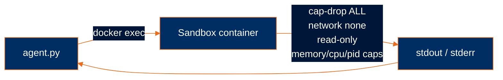
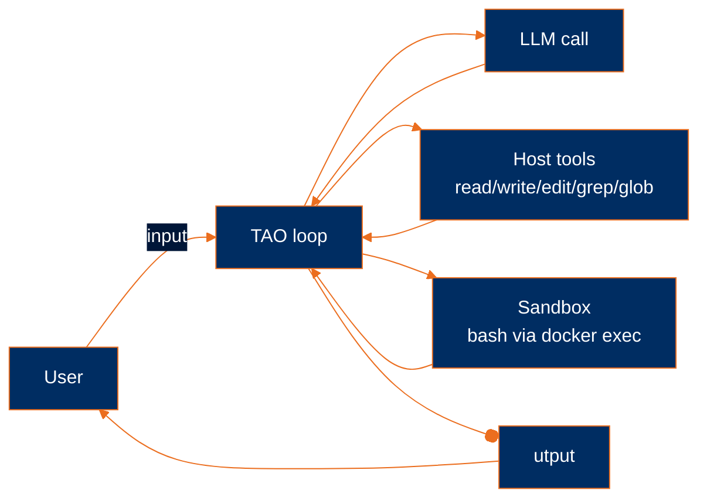

# Add sandboxing

> **Harness component: the execution environment.** Where the harness lets dangerous tools run. The harness wraps the model's actions in an isolation boundary so a bad command can't damage the host.

Module 5's agent has a `bash` tool that runs commands directly on your machine. The model can write to your filesystem, install packages, read your SSH keys, hit network endpoints — anything your user can do, the agent can do. By mistake. Or by prompt injection from a file it reads. Production-grade agents put dangerous tools behind a sandbox.

By the end you have [`examples/sandbox_agent.py`](../../examples/sandbox_agent.py).

## The threat model

Module 5's `bash` tool was four lines:

```python
async def bash(cmd: str) -> str:
    result = subprocess.run(
        cmd, shell=True, capture_output=True, text=True, timeout=30,
    )
    out = result.stdout + result.stderr
    return out.strip() or f"(exit {result.returncode})"
```

That's a `subprocess.run` on your host shell. Whatever the model emits as `cmd` gets executed with your user's permissions. Concretely, the model can:

- **Write to anywhere you can write.** `~/.ssh/authorized_keys`, `~/.aws/credentials`, the codebase you're working on.
- **Read anything you can read.** Credential files, browser cookies, private repos checked out elsewhere on disk.
- **Reach the network.** Curl an exfiltration endpoint. Pull and run a script.
- **Install software.** `pip install` a malicious package. Brew install something arbitrary.
- **Exhaust resources.** A runaway `find /` or fork bomb takes the host down.

Most of the time the model is honest and helpful. The problem isn't malice — it's that **a single bad command, by mistake or by prompt injection from a file the agent read, is irreversible**. There's no undo for "I deleted your `~/.config`."

The fix is to give `bash` a smaller world to run in. A world the agent can damage all it wants without touching the host.

## Docker as the sandbox

A Docker container is the right shape for this:

- **Filesystem isolation.** Mount only the working directory; the rest of the host is invisible.
- **Network isolation.** `--network none` removes the container from any network.
- **Capability dropping.** Linux capabilities can be revoked; with `--cap-drop ALL` the container can't `mount`, can't change UIDs, can't fiddle with kernel parameters.
- **Resource caps.** Memory, CPU, and PID limits stop a runaway process from taking the host down.
- **Read-only root.** The container's filesystem is mounted read-only except for a small tmpfs at `/tmp`. The model can't modify the container itself.
- **Non-root user.** The agent runs as UID 1000, not root, so even within the container a compromised process has limited reach.

Each of these is a layer of defense. None alone is sufficient; together they form a hardened boundary.



The agent on the host issues `docker exec` against a running container. The container reads/writes only what's bind-mounted (the workspace). When the agent exits, the container stops.

## The image: Dockerfile.sandbox

A nine-line Dockerfile, deliberately minimal:

```dockerfile
FROM debian:bookworm-slim

RUN apt-get update && apt-get install -y --no-install-recommends \
    bash coreutils findutils grep ripgrep \
 && rm -rf /var/lib/apt/lists/*

RUN useradd -m -u 1000 agent
USER agent
WORKDIR /workspace
```

Line-by-line:

- **`FROM debian:bookworm-slim`** — small base image, ~75MB. Enough for the model to run real shell commands, not enough to be a general-purpose attack surface.
- **`apt-get install ...`** — only the tools the model actually needs in a shell: `bash`, basic GNU utilities, `grep`, `ripgrep`. No compilers, no curl, no python, no anything else. The fewer binaries, the smaller the attack surface.
- **`rm -rf /var/lib/apt/lists/*`** — discard the package index so `apt` can't install more software inside the container.
- **`useradd -m -u 1000 agent`** + **`USER agent`** — run as a non-root user with a known UID. Matters because the bind-mounted workspace files end up owned by this UID; matching the host user keeps file ownership sane.
- **`WORKDIR /workspace`** — where the bind-mount lands. The model's `cd ..` can escape this directory but only inside the read-only container filesystem; it can't escape to the host.

## Starting and stopping the container

Two functions handle the container lifecycle.

### Build the image if missing, then run a container

```python
SANDBOX_IMAGE = "building-agents-sandbox"

_sandbox_name: str | None = None


def start_sandbox(workspace: str) -> None:
    global _sandbox_name
    inspect = subprocess.run(["docker", "image", "inspect", SANDBOX_IMAGE],
                              capture_output=True)
    if inspect.returncode != 0:
        print(f"Building sandbox image '{SANDBOX_IMAGE}'...")
        subprocess.run(
            ["docker", "build", "-f", "Dockerfile.sandbox", "-t", SANDBOX_IMAGE, "."],
            check=True,
        )

    _sandbox_name = f"sandbox-agent-{secrets.token_hex(8)}"
    subprocess.run([
        "docker", "run", "-d", "--rm",
        "--name", _sandbox_name,
        "--cap-drop", "ALL",
        "--security-opt", "no-new-privileges",
        "--network", "none",
        "--read-only",
        "--tmpfs", "/tmp:rw,noexec,nosuid,size=100m",
        "-v", f"{workspace}:/workspace",
        "-w", "/workspace",
        "--memory", "512m",
        "--cpus", "1.0",
        "--pids-limit", "100",
        "--user", "1000:1000",
        SANDBOX_IMAGE,
        "sleep", "infinity",
    ], check=True, capture_output=True)
```

Three things happen:

1. **Check for the image.** `docker image inspect` exits non-zero if the image doesn't exist. First-run build is automatic so the user doesn't have to remember a setup step.
2. **Pick a unique container name.** `secrets.token_hex(8)` gives a unique suffix so two agent instances don't collide.
3. **Run the container in the background.** The flags are the actual security boundary; every one is doing work:

| Flag | What it does |
|---|---|
| `-d --rm` | Detach and auto-remove the container when it stops. |
| `--name {name}` | Stable handle for `docker exec` and `docker stop`. |
| `--cap-drop ALL` | Drop every Linux capability. The container can't change UIDs, can't mount filesystems, can't bind privileged ports, can't read raw sockets. |
| `--security-opt no-new-privileges` | Block `setuid` escalation. Even a binary with the setuid bit can't gain new capabilities. |
| `--network none` | No network interface. The container can't reach DNS, can't curl anything, can't exfiltrate. |
| `--read-only` | Root filesystem is read-only. The model can't install software, can't write a script and run it, can't poison the image. |
| `--tmpfs /tmp:rw,noexec,nosuid,size=100m` | A small writable tmpfs at `/tmp` for legitimate temp files. `noexec` blocks running anything dropped here; `nosuid` blocks setuid; capped at 100MB. |
| `-v {workspace}:/workspace` | Bind-mount the current host directory at `/workspace` so the model can read and edit *the code under review* — and only that. |
| `-w /workspace` | Start each shell in the workspace. |
| `--memory 512m --cpus 1.0 --pids-limit 100` | Cap memory, CPU, and process count. A fork bomb hits 100 PIDs and gets blocked. |
| `--user 1000:1000` | Run as a non-root UID. Files written to the bind-mount are owned by the same UID as the host user (assuming they're 1000). |
| `SANDBOX_IMAGE sleep infinity` | Command to run inside the container: just sit there idle. We'll attach via `docker exec` to run each shell command. |

The container is now alive, idle, with `bash` and basic GNU utilities, no network, no escape.

### Stop it on exit

```python
def stop_sandbox():
    if _sandbox_name:
        subprocess.run(
            ["docker", "stop", "-t", "1", _sandbox_name],
            check=False, capture_output=True, timeout=10,
        )
```

`docker stop -t 1` gives the container 1 second to exit cleanly before SIGKILL. Subprocess timeout of 10 seconds prevents the cleanup itself from hanging. Wired up in `main()`:

```python
async def main():
    start_sandbox(os.getcwd())
    atexit.register(stop_sandbox)
    ...
```

`atexit` runs `stop_sandbox` whether the agent exits normally, via `/q`, or via Ctrl-C. The container always gets cleaned up.

## The new `bash` tool

```python
async def bash(cmd: str) -> str:
    try:
        result = subprocess.run(
            ["docker", "exec", _sandbox_name, "bash", "-c", cmd],
            capture_output=True, text=True, timeout=30,
        )
    except subprocess.TimeoutExpired:
        return "error: command timed out after 30s"
    out = result.stdout + result.stderr
    return out.strip() or f"(exit {result.returncode})"
```

Two changes from Module 5's `bash`:

- **`docker exec` instead of `shell=True`.** The command runs *inside* the sandbox container, not on the host. Same return-string contract: stdout + stderr concatenated, error captured as the result.
- **Same 30-second timeout.** Wrapping in Docker doesn't change the time budget.

That's it. The tool surface is identical from the model's perspective — same name, same input, same output. The implementation just routes through Docker.

## What's still on the host

Five tools (`read`, `write`, `edit`, `grep`, `glob`) still touch the host filesystem directly. Why?

The agent's job is to read and modify *your code*. If the file tools were sandboxed too, the changes would happen inside the container's bind-mount — visible on the host because of the mount, but conceptually one indirection removed from "the model edited my code." File operations are something **the user wants to see and approve**, not something to hide behind an isolation layer.

`bash` is different. The model uses `bash` to run *the code* — tests, build commands, lints, scripts. That's where arbitrary execution lives. That's the dangerous surface. Sandboxing it contains the blast radius without breaking the user-facing workflow.

The trust boundary is:

| Tool | Where it runs | Why |
|---|---|---|
| `read` | host | The user wants the model to read files in their project. |
| `write` | host | The user wants the model to create files in their project. |
| `edit` | host | The user wants the model to modify files in their project. |
| `grep` | host | Read-only search; same scope as `read`. |
| `glob` | host | Read-only listing; same scope as `read`. |
| `bash` | **sandbox** | Arbitrary execution. Highest blast radius. |

This is a deliberate design choice, not a limitation. A stricter sandbox would put every tool inside the container; a looser one would skip Docker entirely. The middle ground is the practical one: contain the arbitrary-execution surface, keep file operations visible.

## The harness, with the sandbox



Same TAO loop. Same six-tool toolkit. Same memory and budget machinery from Module 4. The only new piece is that `bash` now exits the harness process and re-enters a containerized world to run the command, then comes back. Everything else stacks unchanged.

## Run it

The end state lives at [`examples/sandbox_agent.py`](../../examples/sandbox_agent.py).

Requires Docker to be running.

```bash
cd examples
uv run sandbox_agent.py
```

First run builds the `building-agents-sandbox` image (~75MB) and starts a container. Subsequent runs reuse the image and start a fresh container.

Try a real coding task:

```
❯ run the test suite in this project
```

The model will reach for `bash` to run `pytest` or `uv run pytest`. The command executes inside the container; output comes back as a tool result; the model interprets the output. Same behaviour as before, with the difference that a `bash` command can't damage your machine.

Try something dangerous on purpose:

```
❯ delete /tmp/foo
```

The model will run `rm -rf /tmp/foo` via `bash`. It runs inside the container. `/tmp` is a tmpfs inside the container, completely separate from your host's `/tmp`. No host file is touched.

State directories are unchanged from Module 4:

- `~/.sandbox-agent/messages.json` — full conversation history.
- `~/.sandbox-agent/recall.json` — turn summaries with embeddings.

The container is named `sandbox-agent-{8-hex-chars}` and visible via `docker ps` while the agent is running.

## What's missing

- **Anyone can run any tool.** The model can `write` to your codebase or `bash` arbitrary commands without ever asking. A misunderstood request leads to changes you didn't want.
- **The agent can loop forever.** A pathological turn keeps issuing tool calls until you Ctrl-C it or your API quota runs out.
- **Transient API errors crash the loop.** A 529 rate-limit response from Anthropic and the agent dies mid-turn.

These are policy problems, not execution problems. The next module adds the policy layer: approval gates, loop bounds, retry/backoff.

---

**Next:** [Module 7: Add guardrails](../07-add-guardrails/)
