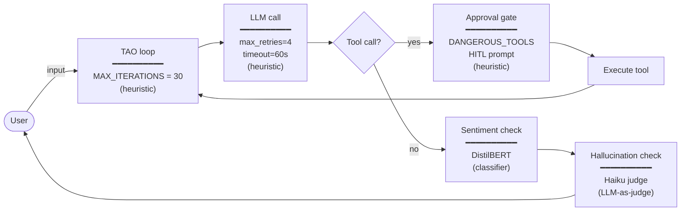

# Add guardrails

> **Harness component: safety constraints.** What the harness allows, what it asks the human about, what it refuses, and how long it's willing to run. The harness's policy layer.

Module 6 contained *where* the agent can do damage. Guardrails constrain *whether* it gets to act, and *what* it can produce. Sandboxing was a single mechanism (Docker). Guardrails are a discipline: a stack of independent controls layered around the TAO loop, each protecting against a different class of failure.

By the end you have [`examples/safe_agent.py`](../../examples/safe_agent.py), which ships three different guardrail mechanisms wired into the agent. The point isn't the specific examples we ship — it's the pattern. Once you understand the categories and where they hook in, you can build your own guardrails for whatever you care about.

## What guardrails are for

The model is non-deterministic, has a dangerous tool surface, can be prompt-injected via tool outputs, and might just produce a bad answer. A guardrail is **any check the harness runs around the LLM call or tool dispatch to enforce policy you've decided matters**.

What that policy covers is up to you. Real production agents protect against:

- **Unsafe actions** — destructive tool calls, writes to paths outside the workspace, network operations the agent shouldn't take.
- **Runaway resource usage** — infinite tool-call loops, runaway token budgets, cost overruns.
- **Transient failures** — rate limits, network blips, timeouts.
- **Unsafe content** — toxicity, NSFW, violence, hate speech in user input or model output.
- **Hallucination** — the model claiming things that aren't supported by what tools actually returned.
- **Off-policy responses** — the model wandering off-topic, breaking constraints stated in the system prompt, giving advice the agent shouldn't give.
- **Prompt injection** — instructions embedded in tool outputs that try to redirect the agent.

No single mechanism catches all of these. Different categories of failure need different categories of control.

## Three categories of guardrails

There are three broad mechanisms for enforcing policy at runtime. Each has different latency, cost, and coverage characteristics.

### 1. Heuristic guardrails

Rule-based: sets, regexes, counters, hard-coded thresholds. They run in microseconds, cost nothing, are deterministic, and catch the obvious cases. They can't reason about anything they weren't explicitly programmed to check.

### 2. Classifier guardrails

A small fine-tuned model with a fixed output head (typically 2–10 classes). Given some text, it produces a label plus a confidence score in ~10–50ms locally. Catches patterns it was trained on. Doesn't understand context outside those patterns. Industry-standard models for safety, sentiment, prompt-injection, NSFW, and so on are available off-the-shelf from HuggingFace and from frontier providers.

### 3. LLM-as-judge guardrails

A second LLM call (usually a small fast model: Haiku, Flash, 4o-mini) that reads relevant context and a rubric, then returns a verdict in natural language. ~300–800ms per call. Costs fractions of a cent. Handles novel situations, ambiguous cases, and rubrics expressed in plain English.

### How they compare

| Layer | Mechanism | Latency | Cost / call | What it catches |
|---|---|---|---|---|
| **Heuristic** | rule / set / counter | <1ms | $0 | The obvious — known dangerous tools, fixed limits |
| **Classifier** | fine-tuned NN | ~10–50ms | ~$0 (local) | Trained-on patterns — sentiment, toxicity, prompt injection |
| **LLM-as-judge** | second LLM call + rubric | ~300–800ms | $0.0001–0.001 | Contextual cases — hallucination, instruction-following, intent matching |

These compose. Heuristics are the floor. Classifiers add a learned layer. Judges sit on top for high-stakes calls. A production-grade harness stacks all three.

This module ships one worked example for each category. The examples are deliberately representative, not exhaustive — the point is the pattern.

---

## Example 1: heuristic guardrails

Heuristics protect against **clear, hardcoded policy violations** where the harness can decide yes/no without reasoning. We ship three:

- **Human-in-the-loop approval gates** for dangerous tool calls.
- **Loop bounds** on the inner TAO loop.
- **Retry and backoff** for transient API errors.

### Approval gates (HITL)

Of the six tools, three change state in ways the user cares about:

```python
DANGEROUS_TOOLS = {"write", "edit", "bash"}
```

`read`, `grep`, and `glob` are observation only. `write`, `edit`, and `bash` mutate state. Before any of those run, ask the human:

```python
async def request_approval(name: str, input: dict) -> bool:
    print(f"\n⚠ Tool '{name}' wants to run with: {input}")
    answer = input_(f"approve? [y/N] ").strip().lower()
    return answer in ("y", "yes")


# alias to avoid colliding with input dict param name in execute_tool
input_ = input
```

Wiring into `execute_tool`:

```python
async def execute_tool(name: str, input: dict) -> str:
    tool = TOOLS.get(name)
    if tool is None:
        return f"error: unknown tool {name}"
    if name in DANGEROUS_TOOLS:
        if not await request_approval(name, input):
            return "error: user denied approval"
    try:
        result = await tool["fn"](**input)
        return result if isinstance(result, str) else str(result)
    except Exception as e:
        return f"error: {e}"
```

Two new lines vs Module 5/6: if dangerous, prompt; if denied, return the rejection *as a tool result*. The model sees `"error: user denied approval"` like any other tool error and adapts. Returning the rejection through the normal tool result channel keeps the agent alive and the user in charge.

One subtlety: if a batch of tool calls contains *any* dangerous call, fall back to serial dispatch so the user isn't fielding concurrent approval prompts:

```python
def has_dangerous(tool_calls) -> bool:
    return any(c.name in DANGEROUS_TOOLS for c in tool_calls)

# In the TAO loop:
if has_dangerous(tool_calls):
    outputs = []
    for c in tool_calls:
        outputs.append(await execute_tool(c.name, c.input))
else:
    outputs = await asyncio.gather(*(execute_tool(c.name, c.input) for c in tool_calls))
```

The `DANGEROUS_TOOLS` set is the heuristic. The approval prompt is the gate. Both fixed at compile time.

### Loop bounds

A pathological turn might never produce a final answer — the model loops on an error it can't fix, gets stuck in a "let me read one more file" spiral, or hits an actual harness bug and emits tool calls forever. Each iteration costs an LLM call.

A simple bound:

```python
MAX_ITERATIONS = 30
```

Replace Module 5/6's `while True:` with a bounded `for ... else:`:

```python
for iteration in range(MAX_ITERATIONS):
    messages, turn_start = enforce_budget(messages, turn_start, system)
    async with client.messages.stream(...) as stream:
        ...
    tool_calls = [b for b in response.content if b.type == "tool_use"]
    if not tool_calls:
        break
    # dispatch tools, append tool_result ...
else:
    print(f"\n⚠ Reached {MAX_ITERATIONS} iterations without completion. Aborting turn.")
```

Python's `for ... else:` clause fires only when the loop exhausts without `break`. Natural completion (`if not tool_calls: break`) skips the else. Iteration cap hits, the else prints a warning, the turn ends cleanly. State is still saved. Next user input starts fresh.

### Retry and backoff

Anthropic's API can return 429s, 529s, 503s, or timeouts. In Module 5/6, any of these crashes the agent mid-turn. The fix is exponential backoff at the SDK layer:

```python
client = AsyncAnthropic(
    api_key=os.environ["ANTHROPIC_API_KEY"],
    max_retries=4,
    timeout=60.0,
)
```

Backoff schedule (default): 0.5s, 1s, 2s, 4s. The SDK handles every retry. The harness never sees a transient error.

Tool errors are different: the harness *doesn't* retry them. When `bash` returns `"error: command not found"`, the right response is for the **model** to read the error and adjust. Tool errors flow back to the model as `tool_result` strings; the model handles them.

### What heuristics catch and miss

| Catches | Misses |
|---|---|
| Known-dangerous tool names | A `bash` command that's actually safe vs. one that's destructive |
| A fixed iteration count | Productive turns that need 50 iterations because the task is complex |
| Transient network errors | Bad model outputs that look fine but contain wrong information |

Heuristics are the floor. They handle the deterministic cases at zero cost. They can't reason about content. That's where the other two categories come in.

---

## Example 2: classifier guardrails

Classifiers protect against **content that fits a learned pattern**. We don't write rules for what "negative sentiment" looks like — we use a model that was trained on millions of labeled examples. Industry-standard classifiers are available off-the-shelf for sentiment, toxicity, prompt injection, NSFW, hate speech, and other safety categories.

We ship one as an example: **sentiment analysis** on the model's final response, ensuring a coding assistant doesn't return a hostile or negative-toned answer.

### A two-class BERT classifier

We pull `distilbert-base-uncased-finetuned-sst-2-english` from HuggingFace. It's a distilled BERT (~67M parameters, ~6× smaller than full BERT-base) fine-tuned on the Stanford Sentiment Treebank v2. Two output classes: POSITIVE and NEGATIVE. The output layer is a 2-unit linear projection over the pooled `[CLS]` token, run through softmax to produce a probability distribution.

```python
from transformers import pipeline

print("Loading sentiment classifier...")
_sentiment_pipe = pipeline(
    "sentiment-analysis",
    model="distilbert-base-uncased-finetuned-sst-2-english",
)


def check_sentiment(text: str) -> tuple[str, float]:
    """Two-class BERT sentiment: POSITIVE / NEGATIVE with confidence."""
    if not text.strip():
        return ("POSITIVE", 1.0)
    result = _sentiment_pipe(text[:512])[0]  # truncate to BERT max-len
    return (result["label"], float(result["score"]))
```

Returns something like `("POSITIVE", 0.9943)` or `("NEGATIVE", 0.8721)`. The HuggingFace `pipeline` wrapper handles tokenization, the forward pass, and the softmax for you.

A few details that matter:

- **Truncate to 512 tokens.** BERT's positional embeddings are capped at 512 input tokens. We slice the input to fit.
- **Local inference.** The model runs on the CPU (or GPU if available) on your machine. No API call.
- **Deterministic given the same input.** Unlike LLM-as-judge, you'll get the same label and score every time for the same text. Easy to test, easy to reason about.

### Wiring it as a guardrail

We run the classifier on the model's final response — the text returned to the user when the inner loop exits because the model stopped calling tools.

```python
# After the inner loop, when the model produced a final response:
final_text = "".join(b.text for b in response.content if b.type == "text")

label, score = check_sentiment(final_text)
if label == "NEGATIVE" and score > 0.85:
    print(f"\n⚠ guardrail: response shows negative sentiment ({score:.2f})")
```

In this example, we just *flag* — print a warning. A stricter policy would:

- **Block.** Replace the response with a refusal before returning to the user.
- **Retry.** Append a system message (*"your last response had a negative tone; please rephrase"*) and re-enter the TAO loop.
- **Escalate.** Tag the conversation for human review.

Choosing the action is policy, not architecture. The classifier provides the signal; the harness decides what to do with it.

### What's actually happening under the hood

The classifier reads the text, tokenizes it into ~512 sub-word tokens, runs them through 6 transformer layers, takes the pooled hidden state of the `[CLS]` token, projects it to 2 logits, and softmaxes. The label is whichever of the two logits is larger; the score is the softmaxed probability of the chosen class.

This is the *same* architectural shape as the model the agent is built around (Module 2): tokenizer → embedding → transformer blocks → output head. The difference is the size (~67M vs. tens of billions of parameters), the training data (sentiment-labeled sentences vs. trillions of tokens of web text), and the output head (2 classes vs. ~128k vocabulary).

A classifier guardrail is a *small specialized brain* that lives alongside the *general-purpose brain* doing the agent's work.

### Other off-the-shelf classifier guardrails

The same pattern applies to other safety dimensions. Industry-standard classifiers you can swap in:

| Concern | Common pretrained model |
|---|---|
| Sentiment (2-class) | `distilbert-base-uncased-finetuned-sst-2-english` |
| Toxicity | `unitary/toxic-bert`, `s-nlp/roberta_toxicity_classifier` |
| Prompt injection | `protectai/deberta-v3-base-prompt-injection`, **Meta's Prompt Guard** |
| NSFW (text) | `KoalaAI/Text-Moderation` |
| Multi-category safety | **Meta Llama Guard 3** (8B), **Google ShieldGemma** (2B/9B/27B) |

All of these load the same way: `pipeline("text-classification", model="...")`. Swap the model name; the guardrail wiring stays the same.

### What frontier providers already give you

You don't always need to bring your own classifier. Frontier model providers ship moderation either inside the model or as adjacent endpoints:

| Provider | Built-in or adjacent moderation |
|---|---|
| **Anthropic** | Constitutional AI inside the model (refusals for violence, illegal content, CSAM, etc.) |
| **OpenAI** | `omni-moderation-latest` endpoint — multi-category classifier, free to call |
| **Google** | Gemini built-in safety filters (harassment, hate speech, sexually explicit, dangerous content) with configurable thresholds |
| **Meta** | **Llama Guard 3** / **Prompt Guard** — open-weight safety classifiers |

If your guardrail need is content safety (violence, toxicity, NSFW, jailbreaks), reach for a provider endpoint or a Llama Guard-style open model before writing your own classifier. The provider has trained on more data than you have. The classifiers *you* build are for things providers don't cover — instruction-following for your specific system prompt, domain-specific policy, task-completion checks against your custom rubric.

---

## Example 3: LLM-as-judge guardrails

LLM judges protect against **ambiguous cases that need contextual reasoning**. No fixed-label classifier can tell you whether the agent's response contained claims it didn't actually have evidence for. That's a judgement call, and you need a model that can read context and weigh it.

We ship one as an example: **hallucination protection** — checking whether the agent's final answer is supported by the tool outputs from the turn.

### The judge

```python
async def hallucination_judge(user_input: str, response_text: str, tool_evidence: str) -> tuple[bool, str]:
    """Returns (grounded, reason).

    grounded == True  → response is supported by tool evidence.
    grounded == False → response contains claims not supported by evidence.
    """
    judge = await client.messages.create(
        model=SUMMARY_MODEL,  # claude-haiku-4-5
        max_tokens=150,
        system=(
            "You evaluate whether an agent's response is grounded in evidence "
            "from its tool calls. Reply on the first line with exactly one word: "
            "GROUNDED or HALLUCINATED. Reply on the second line with a brief reason."
        ),
        messages=[{
            "role": "user",
            "content": (
                f"User asked: {user_input}\n\n"
                f"Agent answered: {response_text}\n\n"
                f"Evidence from tool calls in this turn:\n"
                f"{tool_evidence or '(no tool calls)'}\n\n"
                f"Is the answer supported by the evidence?"
            ),
        }],
    )
    text = judge.content[0].text.strip()
    verdict_line, _, reason = text.partition("\n")
    grounded = verdict_line.strip().upper().startswith("GROUNDED")
    return grounded, reason.strip() or verdict_line
```

The judge sees:

- What the user asked.
- What the agent's final text response was.
- All the tool outputs from the current turn (concatenated).

It returns a verdict + a one-line reason. The harness collects tool evidence from the turn's messages, calls the judge, and acts on the verdict:

```python
# Collect tool evidence from this turn's messages
tool_evidence_parts = []
for msg in messages[turn_start:]:
    content = msg.get("content")
    if isinstance(content, list):
        for block in content:
            if isinstance(block, dict) and block.get("type") == "tool_result":
                tool_evidence_parts.append(str(block.get("content", ""))[:500])
tool_evidence = "\n---\n".join(tool_evidence_parts)

# Judge the final response
if final_text:
    grounded, reason = await hallucination_judge(user_input, final_text, tool_evidence)
    if not grounded:
        print(f"\n⚠ guardrail: response may not be grounded — {reason}")
```

Like the sentiment classifier, we just *flag* in this example. Real policies would retry (append a corrective message and re-enter the loop), block (replace the response with a refusal), or escalate (tag for human review).

### Why a judge instead of a classifier here?

Hallucination is not a fixed-label problem. You can't pre-train a model on "hallucinated vs. grounded" because what counts as grounded depends on what *this particular* tool call returned for *this particular* question. The judge needs to read the user's question, read the response, read the evidence, and reason about whether the response is consistent with the evidence.

That kind of contextual reasoning is what LLMs do well. The trade-off: ~500ms of added latency and a fraction of a cent per turn. Worth it when the failure (an agent confidently asserting incorrect facts) is high-cost.

### Other rubrics that fit this pattern

Hallucination is one rubric. The same `hallucination_judge` shape works for:

- **Instruction-following.** *"Did the agent comply with the system prompt's stated constraints?"*
- **Tool-call intent.** *"Does this tool call match what the user asked for?"*
- **Output quality.** *"Did the agent actually answer the question, or did it just describe what it would do?"*
- **Completeness.** *"Did the agent finish the task, or did it stop early?"*
- **Honesty.** *"Did the agent accurately describe what it did, or did it overstate its work?"*

Each is one prompt change to the judge. The harness wiring is the same.

---

## Where each guardrail fits



Three heuristic gates inside the loop (loop bound, retry/backoff, approval gate). Two output gates after the loop exits (sentiment classifier, hallucination judge). Each is independent. Each could be swapped, added to, or removed without touching the others.

That's the design lesson: **guardrails are independent functions wrapped around the harness components from earlier modules**. The model interface (M2), the loop (M3), the memory (M4), the tools (M5), the sandbox (M6) all stay unchanged. Guardrails sit *around* them.

## Stacking the three layers

In production, you stack them top-to-bottom by cost:

| Order | Layer | When it runs |
|---|---|---|
| 1 | Heuristics | Always. Cost is zero. |
| 2 | Provider safety (Anthropic CAI, OpenAI moderation, Gemini filters, Llama Guard) | Always for content-policy. Free or near-free. |
| 3 | Domain-specific classifier (yours or open-weight from HuggingFace) | On every relevant message slice. Local, ~10–50ms. |
| 4 | LLM-as-judge | Reserved for high-stakes outputs — final answers, dangerous tool calls. ~$0.0001–0.001 per call. |

Each layer reads some slice of the conversation (the `messages` array, the latest tool output, the assistant's final response) and produces a verdict. The harness aggregates verdicts and decides: allow, modify, retry, escalate, refuse.

None alone is sufficient. Heuristics miss the contextual stuff. Classifiers miss novel patterns. Judges are too slow and expensive to run on every call. The combination is what makes the agent safe enough to ship.

## Build your own

The three examples in this module — DistilBERT sentiment, Haiku hallucination judge, the heuristic stack — are *examples*. They show the pattern. Your harness might need different guardrails:

- A regex that blocks any tool call writing to `~/.ssh/`.
- A classifier checking for prompt injection in the content of `read` (catches a malicious file trying to redirect the agent).
- A judge that confirms each tool call matches the current task plan.
- A retrieval check that verifies cited sources actually appear in the documents the agent fetched.

The patterns are the same:

- **Heuristic** when the rule is fixed.
- **Classifier** when there's a learned pattern and an open-weight model that already knows it.
- **LLM-as-judge** when the verdict needs context.

Pick the right layer for the right check.

## Run it

The end state lives at [`examples/safe_agent.py`](../../examples/safe_agent.py). Requires Docker.

```bash
cd examples
uv run safe_agent.py
```

First run downloads the DistilBERT sentiment model (~268MB) and the sentence-transformers embedding model (~80MB). Both cache locally.

Try a write call:

```
❯ create a file called notes.txt with the text "hello"

⚠ Tool 'write' wants to run with: {'path': 'notes.txt', 'content': 'hello'}
approve? [y/N] y
```

Try a question that should produce a clean response:

```
❯ what does stateless_chatbot.py import?
```

The agent will `read` the file, produce a response, then both output-guardrails run silently in the background. Healthy run: nothing prints (sentiment is POSITIVE, hallucination judge says GROUNDED).

Try something that might trigger hallucination:

```
❯ how many lines are in a file called does-not-exist.py?
```

If the agent guesses instead of admitting the file doesn't exist, the hallucination judge fires:

```
⚠ guardrail: response may not be grounded — Agent stated a specific line count without evidence
```

Force a loop bound:

```
❯ keep listing files in this directory until you find one named does-not-exist-anywhere.zzz
```

At iteration 30, the bound triggers:

```
⚠ Reached 30 iterations without completion. Aborting turn.
```

State directory: `~/.safe-agent/` — same `messages.json` and `recall.json` as Module 6, plus the guardrail warnings printed to the terminal.

## What's missing

- **Guardrail warnings disappear with the scrollback.** If yesterday's run had a hallucination flag, there's no record of which response triggered it or what the judge's reasoning was.
- **No structured trace of LLM calls or tool calls.** Tokens, latency, the actual content of each prompt and response — all ephemeral.
- **Nothing to feed into evals.** You can't ask "did adding the sentiment guardrail reduce negative responses?" if you didn't log them.

The harness needs to watch itself, structurally. That's observability.

---

**Next:** [Module 8: Add observability](../08-add-observability/)
