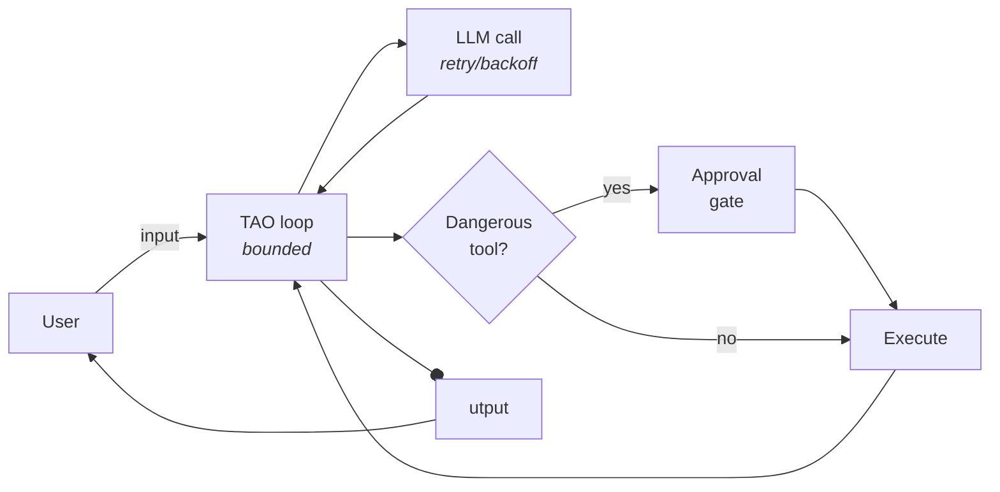

# Add guardrails

> **Harness component: safety constraints.** What the harness allows, what it asks the human about, what it refuses, and how long it's willing to run. The harness's policy layer.

Module 6 contained *where* the agent can do damage. Guardrails constrain *whether* it gets to act at all — and what happens when the world misbehaves around it. Three complementary controls, none of them about the sandbox:

1. **Approval gates** — pause before any destructive action and let the human say yes or no.
2. **Loop bounds** — cap how long a single user turn is allowed to run.
3. **Retry / backoff** — survive transient API errors without crashing.

By the end you have [`examples/safe_agent.py`](../../examples/safe_agent.py).

## Where each control sits



The three controls live in three different places:

- The **LLM call** itself gets retry/backoff (handled by the SDK).
- The **TAO loop** gets an iteration cap.
- The **tool dispatch** gets an approval gate for dangerous tools.

Each is independent; together they form the policy layer around the work the model wants to do.

## Approval gates

The simplest control: before running a tool that mutates state, ask the human.

### Which tools are dangerous?

Of the six tools, three change state in ways the user cares about:

```python
DANGEROUS_TOOLS = {"write", "edit", "bash"}
```

`read`, `grep`, and `glob` are observation only — no approval needed, run them as fast as you can. `write`, `edit`, and `bash` actually change something — files, the filesystem, the world outside the agent. These get gated.

This is a deliberately small set. You could add more (e.g. a future `git_commit` tool, anything that hits an API), but the principle stays: gate the tools whose effects you can't undo.

### The interactive y/N prompt

```python
async def request_approval(name: str, input: dict) -> bool:
    print(f"\n⚠ Tool '{name}' wants to run with: {input}")
    answer = input_(f"approve? [y/N] ").strip().lower()
    return answer in ("y", "yes")


# alias to avoid colliding with input dict param name in execute_tool
input_ = input
```

The model proposed a tool call. Print the tool name and the arguments. Ask the user. Anything other than `y`/`yes` is a no.

The `input_ = input` alias is a small Python gotcha: the next function (`execute_tool`) takes an argument called `input` because that's what the Anthropic API calls the tool's input dict. Shadowing the builtin `input()` inside that scope would break the prompt; so we keep a top-level alias `input_` to use for stdin reading.

### Wiring the gate into `execute_tool`

```python
async def execute_tool(name: str, input: dict) -> str:
    tool = TOOLS.get(name)
    if tool is None:
        return f"error: unknown tool {name}"
    if name in DANGEROUS_TOOLS:
        if not await request_approval(name, input):
            return "error: user denied approval"
    try:
        result = await tool["fn"](**input)
        return result if isinstance(result, str) else str(result)
    except Exception as e:
        return f"error: {e}"
```

Two new lines compared to Module 5/6: if the tool is in `DANGEROUS_TOOLS`, prompt for approval first. If the user says no, return the string `"error: user denied approval"` instead of running the tool. The model sees that as a tool error and can adjust — explain itself, propose a different command, or just ask the user what they meant.

Returning the rejection *as a tool result* (rather than raising or aborting) is what keeps the agent loop alive. The model gets feedback, the conversation continues, the user stays in charge.

### Approval-aware dispatch

There's a subtle interaction with Module 5's parallel dispatch:

```python
def has_dangerous(tool_calls) -> bool:
    return any(c.name in DANGEROUS_TOOLS for c in tool_calls)
```

If the model emits five `read` calls and two `bash` calls in one turn, Module 5 would `asyncio.gather` all seven. With approvals, that means the user gets two interleaved y/N prompts in the middle of five concurrent `read` results streaming back — chaotic. So if *any* tool call in the batch is dangerous, fall back to serial execution:

```python
if has_dangerous(tool_calls):
    outputs = []
    for c in tool_calls:
        outputs.append(await execute_tool(c.name, c.input))
else:
    outputs = await asyncio.gather(*(execute_tool(c.name, c.input) for c in tool_calls))
```

Pure-read batches still run in parallel (fast). Anything with a dangerous call runs serially (so approvals are sequential and the user can reason about what they're approving). Cost is a few extra seconds per turn; benefit is the user always sees one prompt at a time.

### The tradeoff: always-ask vs. never-ask vs. remembered

The interactive y/N is the safest default but also the most annoying. Real harnesses pick from a small menu:

| Policy | When to use |
|---|---|
| **Always ask** | First-time use; high-stakes codebases; running unfamiliar agents. The default here. |
| **Never ask** | CI / automated runs where the agent is sandboxed enough that any action is acceptable, or where a separate review step gates the output. |
| **Remembered per session** | A "yes to this exact tool with this exact input, for this conversation" answer that caches approvals. Saves prompts on repeated calls but loses the per-call audit. |
| **Pattern-based allowlist** | "Yes to `bash` running anything matching `pytest *`; ask for everything else." More config than this module wants but useful in production. |

The module ships with always-ask. Switching policies is a one-function change in `request_approval`.

## Loop bounds

The other open-ended risk: a pathological turn that never produces a final answer. The model could:

- Loop on a tool error it can't fix (`bash`: command not found → tries again → fails → tries again).
- Get stuck in a "let me read one more file" spiral.
- Hit an actual logic bug in the harness and keep emitting tool calls forever.

Each iteration costs an LLM call (tokens, money, time). Without a bound, a stuck turn can eat your budget before you notice.

### The cap

```python
MAX_ITERATIONS = 30
```

30 is generous — most real tasks finish in 3–10 iterations. The cap is there to stop the worst case, not to constrain normal work.

### The for-else pattern

Module 5's TAO loop was `while True:` with a `break` when the model stopped requesting tools. Module 7 swaps the unbounded while for a bounded for:

```python
for iteration in range(MAX_ITERATIONS):
    messages, turn_start = enforce_budget(messages, turn_start, system)
    async with client.messages.stream(...) as stream:
        ...
    messages.append({"role": "assistant", "content": ...})

    tool_calls = [b for b in response.content if b.type == "tool_use"]
    if not tool_calls:
        break

    # dispatch and append tool_result ...
else:
    print(f"\n⚠ Reached {MAX_ITERATIONS} iterations without completion. Aborting turn.")
```

The Python `for ... else:` clause fires only when the loop exhausts without hitting `break`. If the model finishes naturally (`if not tool_calls: break`), the `else:` doesn't run. If we run out of iterations, the `else:` fires and prints a warning before the turn ends.

The agent stops cleanly. The user sees what happened. The conversation state is still saved. The next user input starts a fresh turn.

### What to feed back to the model

This module aborts the turn silently to the model — the loop just stops and the user sees the warning. A more sophisticated harness could push a synthetic tool_result back to the model on the last iteration, saying *"iteration cap reached; summarize what you've done and stop calling tools."* That gives the model one final shot to produce a clean answer. The trade-off: more code, occasional ugly output. Not in this module's baseline.

## Retry and backoff

Anthropic's API is reliable but not infallible. Real failure modes:

- **429 / 529** — rate limited. Surge in usage, retry after a short wait.
- **503** — temporary service unavailability.
- **Connection reset / timeout** — network blips, especially on long-running calls.

In Module 5/6, any of these crashes the agent mid-turn. The conversation state up to that point is lost (or worse, half-saved).

### Let the SDK handle it

The Anthropic Python SDK has retry and timeout built in. Configure them at client construction:

```python
client = AsyncAnthropic(
    api_key=os.environ["ANTHROPIC_API_KEY"],
    max_retries=4,
    timeout=60.0,
)
```

- `max_retries=4` — retry transient errors up to 4 times before giving up.
- `timeout=60.0` — per-request timeout. If the API doesn't respond in 60 seconds, the request fails (and the retry logic catches it).

The SDK uses exponential backoff between retries: 0.5s, 1s, 2s, 4s. By the time the agent gives up, the network has had ~7.5 seconds to recover. Empirically that's enough for almost every transient blip.

### Why the harness doesn't retry tool errors

Tool errors are a different shape. When `bash` returns `"error: command not found"`, the right response isn't to retry the same command — it's to let the model see the error, think, and try something different. The model already does this naturally: it reads the `tool_result` string, decides to use a different tool or adjust the command, and continues.

So the rule is:

- **API errors → SDK retries with backoff.** The harness doesn't see them.
- **Tool errors → returned as `tool_result` strings.** The model handles them.
- **Hard failures (auth, quota exhausted, 4 retries used up) → exception propagates, agent crashes.** This is the right behaviour — you want to know.

## Beyond heuristics: classifiers and LLM-as-judge as guardrails

The three controls above are all rule-based:

- A static `DANGEROUS_TOOLS` set.
- A fixed `MAX_ITERATIONS` cap.
- A fixed retry count.

These are cheap, predictable, easy to reason about, and they catch the obvious cases. They're also blunt: every `bash` call triggers the same approval prompt — `pwd` and `rm -rf /` are treated identically. Every turn gets the same 30-iteration budget regardless of task complexity. Every transient API error gets the same exponential backoff.

For higher-stakes deployments, two complementary categories of *learned* control sit alongside the heuristics:

1. **Classifiers** — small, trained models with a fixed output layer. Given some input, they produce a discrete label (often just two: pass / fail) plus a confidence score. Fast, cheap, deterministic-ish, run inline on every call.
2. **LLM-as-judge** — a second model call (usually a cheaper or smaller LLM) that reads some input and a rubric, then returns a verdict in natural language. Slower and pricier than a classifier, but handles ambiguity and context that no fixed-label model can.

Both have the same conceptual shape: **inspect some part of the messages array — or the model's output, or a tool's input/output — and decide whether to allow, modify, or block what's happening**. The heuristics in this module do that with `if`-statements; classifiers and judges do it with a forward pass through a neural network. Different mechanism, same job.

### What you're actually classifying over: the messages array

Every harness's working state is the `messages` list. When you want a guardrail to make a decision at any point in the loop, you're asking the same fundamental question: *given the current state of `messages` (plus any tool inputs or outputs in flight), is this allowed?*

- The **user's incoming message** is a single new entry being appended to `messages`. Classify it before it gets there.
- The **model's planned tool call** sits inside the latest assistant message in `messages`. Inspect that block before dispatching.
- A **tool's output** is about to be appended as a `tool_result` block. Inspect it before the model sees it.
- The **final assistant response** is the latest entry in `messages` after the loop exits. Judge it before returning to the user.

The fact that everything in the harness flows through one ordered list of messages is what makes guardrails composable. You don't need a different mechanism at each step — you need a classifier or a judge that reads the relevant slice of `messages` and outputs a verdict.

### Concrete example: an instruction-following classifier

Imagine a small transformer fine-tuned with a two-class output head: `following` vs `not_following`. Input: a sliced view of `messages` — the system prompt plus the last assistant turn. Output: a softmax over two logits.

```python
# Schematic, not in this module's example code:
def instruction_following_classifier(system: str, latest_assistant_text: str) -> tuple[str, float]:
    """
    Forward pass through a fine-tuned classifier.
    Returns ("following", 0.94) or ("not_following", 0.71).
    """
    logits = model.forward(format_input(system, latest_assistant_text))
    probs = softmax(logits)
    label = "following" if probs[0] > probs[1] else "not_following"
    return label, float(max(probs))
```

What this catches that heuristics can't:

- The model goes off-topic mid-turn (the system says "answer in JSON only" and the model starts narrating).
- The model breaks a constraint that's stated in plain English in the system prompt (no static rule could encode the constraint cheaply).
- The model claims to have done something it didn't.

What you do with the verdict:

- **If `following` with high confidence**: continue normally.
- **If `not_following` with high confidence**: refuse the response, ask the model to retry with a corrective message, or fall back to a stricter policy.
- **If low-confidence (either class)**: escalate to the human approval gate, or run the heavier LLM-as-judge.

The classifier runs in ~10–50ms locally, costs essentially nothing per call, and is deterministic given the same input. The trade-off: it can only catch patterns it was trained on. A novel failure mode bypasses it.

### Concrete example: LLM-as-judge for output quality

Same idea, different mechanism. Instead of a fixed classifier, call a small LLM with a rubric and the relevant slice of `messages`:

```python
# Schematic:
async def judge_output(user_input: str, assistant_response: str, rubric: str) -> bool:
    response = await client.messages.create(
        model="claude-haiku-4-5",
        max_tokens=50,
        system="You evaluate agent outputs against a rubric. Return exactly PASS or FAIL.",
        messages=[{
            "role": "user",
            "content": (
                f"User asked: {user_input}\n\n"
                f"Agent answered: {assistant_response}\n\n"
                f"Rubric: {rubric}\n\n"
                "PASS or FAIL?"
            ),
        }],
    )
    return response.content[0].text.strip().upper().startswith("PASS")
```

Common rubrics:

- *"Did the agent actually answer the user's question, or did it just describe what it would do?"*
- *"Did the agent accurately describe the tool calls it made?"* (compare assistant text against the `tool_use` blocks earlier in `messages`).
- *"Does the response contain hallucinated facts not supported by what tools returned?"*

Judge returns PASS or FAIL. Harness acts on the verdict:

- **PASS**: return the response to the user.
- **FAIL**: append a corrective user message (*"the judge says your last response failed because X; please try again"*) and re-enter the TAO loop, or escalate to human review.

LLM-as-judge handles cases a classifier can't — novel rubrics, contextual judgements, multi-step reasoning about whether tool calls match intent. The cost: ~300–800ms latency and a fraction of a cent per call when using a small model like Haiku or Flash.

### What frontier providers already give you for free

Before you build any of this yourself, know that most frontier model providers already ship content-moderation guardrails *inside* the model or as adjacent endpoints:

| Provider | Built-in / adjacent moderation |
|---|---|
| **Anthropic** | Constitutional AI baked into the model (refusals for violence, illegal content, CSAM, etc.). Optional pre/post moderation in API gateway products. |
| **OpenAI** | `omni-moderation-latest` / `text-moderation-latest` endpoints classifying violence, hate, self-harm, sexual content, harassment. Free to call. |
| **Google** | Gemini's safety filters (harassment, hate speech, sexually explicit, dangerous content) with configurable thresholds. |
| **Meta** | **Llama Guard 3** / **Prompt Guard** — open-weight classifiers for safety, jailbreak detection, and prompt-injection detection. |

If your guardrail need is *"don't let the agent produce or accept violent / toxic / NSFW / hateful content"*, **don't write your own classifier**. Plug into the provider's moderation surface or run a fine-tuned safety classifier (Llama Guard is a strong default). The provider has spent more on the training data than you can.

The classifiers and judges *you* build are for the things providers don't ship out of the box:

- **Instruction-following** for your specific system prompt (no generic provider rule covers your custom policy).
- **Domain-specific safety** (e.g. for a financial agent: did the model give financial advice it isn't allowed to?).
- **Output quality** against your specific rubric (did the agent finish the task? did it cite sources correctly?).
- **Tool-call sanity** (does this `bash` command match what the user asked? — provider safety filters don't know your tool surface).

The mental model: providers handle the **content safety** dimension (broad, generic, applies to every agent). You handle the **task and policy** dimension (specific to your harness, your tools, your users).

### Stacking heuristics, classifiers, and judges

The three layers compose — they don't replace each other:

| Layer | What it does | Latency | Cost per call | Failure mode |
|---|---|---|---|---|
| **Heuristic** (set / regex / cap) | Catches the obvious. Always runs. | <1ms | $0 | Blunt — can't tell `pwd` from `rm -rf /`. |
| **Classifier** (BERT-style local / Llama Guard) | Catches trained-on patterns. Cheap enough to run on every message. | ~10–50ms | ~$0 | Can't generalize to novel patterns. |
| **LLM-as-judge** (Haiku / Flash / 4o-mini) | Handles ambiguity and context. Reads a rubric. | ~300–800ms | ~$0.0001–0.001 | Slower; non-deterministic; needs a rubric you trust. |
| **LLM-as-judge** (Sonnet / Opus / GPT-4) | Subtle cases, multi-step reasoning. | ~1–3s | ~$0.001–0.01 | Expensive; reserve for high-stakes. |

A production agent stacks them top-to-bottom:

1. Heuristics on every call — they cost nothing and catch the obvious.
2. Provider moderation on every user input — free or near-free, catches content-policy violations.
3. Domain-specific classifier on the messages array — instruction-following, policy compliance, task completion.
4. LLM-as-judge only on high-stakes outputs — final answers, dangerous tool calls, anything irreversible.

Each layer reads the same `messages` array (or the relevant slice of it) and produces a verdict. The harness aggregates verdicts and decides whether to allow, modify, retry, or escalate.

### Where the hooks land in this module's code

This module ships only the heuristics. They're the load-bearing baseline. But the hook points for classifier and judge layers are exactly the functions we just wrote:

- **`request_approval()`** could call an instruction-following classifier or an LLM judge *before* prompting the user. If the classifier is highly confident the tool call is benign and aligns with the user's intent, skip the prompt. If the classifier flags it, escalate the human prompt (or refuse outright).
- **`execute_tool()`** could pre-classify the tool input (catch `rm -rf /` even though `bash` is the same DANGEROUS_TOOLS entry as `pwd`) and post-scrub the tool output (strip credentials, redact PII, flag embedded prompt injection).
- **The TAO loop's user-input read** could feed every incoming message through a moderation classifier (yours or the provider's) before reaching the model at all.
- **The TAO loop's final assistant response** could be judged before being returned to the user — a "did this actually finish the task?" check.

Each hook is one function wrapped in another — the same composition pattern that built every harness component so far. Heuristics in this module; classifiers and judges layered on top in a real production deployment.

## What the safe agent does, end to end

Compared to Module 6, three things changed in `main()`:

1. Client built with retries + timeout (top of the file, not in `main`).
2. The inner loop runs `for iteration in range(MAX_ITERATIONS):` instead of `while True:`, with an `else:` clause warning when the cap is hit.
3. Tool dispatch branches: serial if any call is dangerous, parallel otherwise.

Everything else from Module 6 is preserved unchanged: the sandboxed `bash`, the host-side `read`/`write`/`edit`/`grep`/`glob`, the persistence, budget eviction, semantic recall. Guardrails sit *around* the existing machinery — they don't replace any of it.

## Run it

The end state lives at [`examples/safe_agent.py`](../../examples/safe_agent.py).

Requires Docker to be running (carries forward the Module 6 sandbox).

```bash
cd examples
uv run safe_agent.py
```

Try a write call:

```
❯ create a file called notes.txt with the text "hello"

⏺ I'll create that file for you.

⚠ Tool 'write' wants to run with: {'path': 'notes.txt', 'content': 'hello'}
approve? [y/N]
```

Type `y` and it runs. Type `n` (or just Enter) and the model sees `"error: user denied approval"` as the tool result, typically responds with an acknowledgement, and waits for your next input.

Try a bash call:

```
❯ run pwd

⚠ Tool 'bash' wants to run with: {'cmd': 'pwd'}
approve? [y/N] y
/workspace
```

`pwd` runs in the sandbox container (Module 6), then prints `/workspace` — the bind-mount root, not your host path.

Try something that would loop:

Force the model into a stuck pattern with something like *"keep listing files until you find one named `does-not-exist-anywhere.zzz`"*. The agent will try, fail, try, fail. At iteration 30 the loop bound kicks in:

```
⚠ Reached 30 iterations without completion. Aborting turn.
```

State directory: `~/.safe-agent/` — same `messages.json` and `recall.json` shape as Module 6.

## What's missing

- **No visibility into what happened.** Approvals, retries, loop-bound trips — they all print to the terminal and disappear with the scrollback. If the agent did the wrong thing yesterday, there's no record of which tools ran, which were denied, which got retried.
- **No structured record of LLM calls.** Tokens consumed, latency, the actual content of each prompt and response — all ephemeral.
- **No way to feed any of this into evals.** You can't ask "did the agent take more tool calls than necessary?" if you didn't log the tool calls.

The harness needs to start watching itself. That's observability — the next module.

---

**Next:** [Module 8: Add observability](../08-add-observability/)
