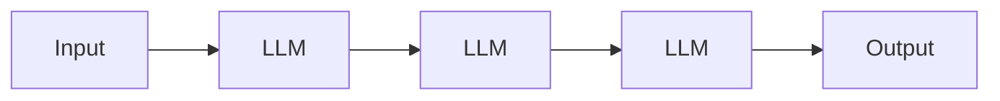
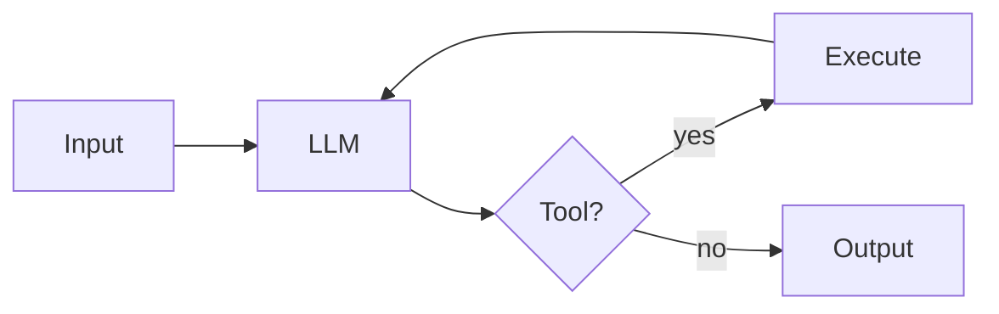
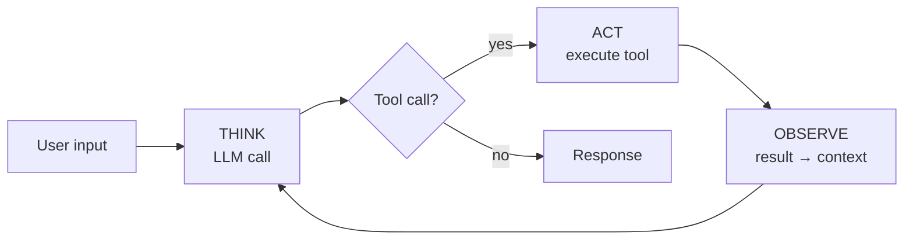
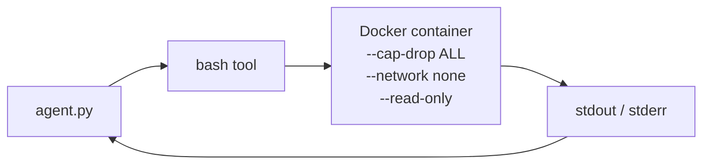

<div style="position: absolute; inset: 0; background: linear-gradient(135deg, #002D62 0%, #001638 100%); display: flex; flex-direction: column; padding: 3.5rem 4rem; text-align: left;">

<div>
<div style="height: 4px; width: 90px; background: #EB6E1F; margin-bottom: 1.25rem;"></div>
<div style="color: white; font-size: 4.5rem; font-weight: 700; line-height: 1; letter-spacing: -0.02em;">building-agents</div>
<div style="color: rgba(255,255,255,0.65); font-size: 1.35rem; margin-top: 0.875rem; font-weight: 400;">Build your own agent by building the harness around a model.</div>
</div>

<div style="flex: 1; display: flex; align-items: center; margin-top: 2rem;">
<div style="display: grid; grid-template-columns: repeat(3, 1fr); gap: 1.5rem; width: 100%;">

<div style="background: rgba(255,255,255,0.04); border: 1px solid rgba(235,110,31,0.3); border-top: 3px solid #EB6E1F; border-radius: 12px; padding: 1.75rem;">
<div style="color: #EB6E1F; font-size: 0.7rem; font-weight: 600; letter-spacing: 0.12em; text-transform: uppercase; margin-bottom: 0.6rem;">01 · Who I am</div>
<div style="color: white; font-size: 1.65rem; font-weight: 700; margin-bottom: 0.75rem; line-height: 1.1;">Chase Dovey</div>
<div style="color: rgba(255,255,255,0.75); font-size: 0.9rem; line-height: 1.55;">I research agentic systems. Most of my work is building harnesses around foundational models.</div>
</div>

<div style="background: rgba(255,255,255,0.04); border: 1px solid rgba(235,110,31,0.3); border-top: 3px solid #EB6E1F; border-radius: 12px; padding: 1.75rem;">
<div style="color: #EB6E1F; font-size: 0.7rem; font-weight: 600; letter-spacing: 0.12em; text-transform: uppercase; margin-bottom: 0.6rem;">02 · The lab</div>
<div style="color: white; font-size: 1.65rem; font-weight: 700; margin-bottom: 0.75rem; line-height: 1.1;">Average Joes Lab</div>
<div style="color: rgba(255,255,255,0.75); font-size: 0.9rem; line-height: 1.55;">A private citizen research lab. Independent research on agentic systems, published openly.</div>
</div>

<div style="background: rgba(255,255,255,0.04); border: 1px solid rgba(235,110,31,0.3); border-top: 3px solid #EB6E1F; border-radius: 12px; padding: 1.75rem;">
<div style="color: #EB6E1F; font-size: 0.7rem; font-weight: 600; letter-spacing: 0.12em; text-transform: uppercase; margin-bottom: 0.6rem;">03 · This talk</div>
<div style="color: white; font-size: 1.65rem; font-weight: 700; margin-bottom: 0.75rem; line-height: 1.1; font-family: ui-monospace, monospace;">Agent = Model + Harness</div>
<div style="color: rgba(255,255,255,0.75); font-size: 0.9rem; line-height: 1.55;">The 3 disciplines and the 10-module curriculum that builds a production-shaped harness from a single LLM call.</div>
</div>

</div>
</div>

<div style="margin-top: 1rem; text-align: center; color: rgba(255,255,255,0.4); font-size: 0.85rem; letter-spacing: 0.05em;">github.com/averagejoeslab/building-agents</div>

</div>

---
class: ''
---

<div style="position: absolute; inset: 0; padding: 2.5rem 3.5rem; display: flex; flex-direction: column; text-align: left;">

<div>
<div class="accent-bar"></div>
<div style="color: white; font-size: 2.75rem; font-weight: 700; line-height: 1.05; letter-spacing: -0.02em;">What are agentic systems?</div>
<div style="color: rgba(255,255,255,0.65); font-size: 1.05rem; margin-top: 0.5rem; max-width: 780px;">Systems that act on their own. The agency comes from an LLM coordinating calls to reach a goal without supervision.</div>
</div>

<div style="display: grid; grid-template-columns: 1.5fr 1fr; gap: 2.5rem; flex: 1; margin-top: 1.75rem; min-height: 0;">

<div style="display: flex; flex-direction: column; gap: 1rem;">

<div class="hero-card" style="padding: 1rem 1.5rem;">
<div class="eyebrow">Workflow · code decides the path</div>



</div>

<div class="hero-card" style="padding: 1rem 1.5rem;">
<div class="eyebrow">Agent · model decides the path</div>



</div>

</div>

<div>
<div style="color: white; font-size: 1.55rem; font-weight: 700; margin-bottom: 0.4rem;">I focus on agents.</div>
<div style="color: rgba(255,255,255,0.7); font-size: 0.95rem; margin-bottom: 1.75rem;">Systems with autonomy over their own control flow.</div>

<div class="eyebrow" style="margin-bottom: 0.85rem;">Examples in the wild</div>

<div style="display: flex; flex-direction: column; gap: 0.55rem; font-size: 1.05rem;">
<div style="display: flex; align-items: center; gap: 0.7rem;"><span style="color: #EB6E1F; font-weight: 700;">→</span><span>Claude Code</span></div>
<div style="display: flex; align-items: center; gap: 0.7rem;"><span style="color: #EB6E1F; font-weight: 700;">→</span><span>Cursor</span></div>
<div style="display: flex; align-items: center; gap: 0.7rem;"><span style="color: #EB6E1F; font-weight: 700;">→</span><span>Devin</span></div>
<div style="display: flex; align-items: center; gap: 0.7rem;"><span style="color: #EB6E1F; font-weight: 700;">→</span><span>Aider</span></div>
<div style="display: flex; align-items: center; gap: 0.7rem;"><span style="color: #EB6E1F; font-weight: 700;">→</span><span>openclaw</span></div>
</div>

</div>

</div>

</div>

---
class: ''
---

<div style="position: absolute; inset: 0; padding: 2.5rem 3.5rem; display: flex; flex-direction: column; text-align: left;">

<div>
<div class="accent-bar"></div>
<div style="color: white; font-size: 2.75rem; font-weight: 700; line-height: 1.05; letter-spacing: -0.02em;">The three disciplines</div>
<div style="color: rgba(255,255,255,0.65); font-size: 1.05rem; margin-top: 0.5rem;">Three layers stacked. You go through them in order — from nothing to agent-built software.</div>
</div>

<div style="display: grid; grid-template-columns: repeat(3, 1fr); gap: 1.5rem; flex: 1; margin-top: 2rem; align-items: stretch;">

<div class="hero-card" style="padding: 1.75rem;">
<div class="eyebrow">01 · output: callable model</div>
<div style="color: white; font-size: 1.45rem; font-weight: 700; margin-bottom: 0.7rem; line-height: 1.1;">Model development</div>
<div style="color: rgba(255,255,255,0.75); font-size: 0.92rem; line-height: 1.55;">A handful of labs train the foundational model.</div>
<div style="color: rgba(255,255,255,0.5); font-size: 0.82rem; margin-top: 0.9rem;">GPT · Claude · Gemini · Llama</div>
</div>

<div class="hero-card" style="padding: 1.75rem; background: rgba(235,110,31,0.12); border-color: #EB6E1F;">
<div class="eyebrow">02 · output: an agent</div>
<div style="color: white; font-size: 1.45rem; font-weight: 700; margin-bottom: 0.7rem; line-height: 1.1;">Harness engineering</div>
<div style="color: rgba(255,255,255,0.85); font-size: 0.92rem; line-height: 1.55;">Wrap the model in code, state, tools, loop.</div>
<div style="color: #EB6E1F; font-family: ui-monospace, monospace; font-size: 0.85rem; margin-top: 0.7rem;">Agent = Model + Harness</div>
<div style="color: rgba(255,255,255,0.5); font-size: 0.82rem; margin-top: 0.6rem;">Claude Code · Cursor · Codex</div>
<div style="color: #EB6E1F; font-size: 0.78rem; margin-top: 0.7rem; font-weight: 700;">← this talk's focus</div>
</div>

<div class="hero-card" style="padding: 1.75rem;">
<div class="eyebrow">03 · output: products built by agents</div>
<div style="color: white; font-size: 1.45rem; font-weight: 700; margin-bottom: 0.7rem; line-height: 1.1;">Agentic engineering</div>
<div style="color: rgba(255,255,255,0.75); font-size: 0.92rem; line-height: 1.55;">Use the agent to build other software, products, agents.</div>
<div style="color: rgba(255,255,255,0.5); font-size: 0.82rem; margin-top: 0.9rem;">openclaw · vibe coding's pro cousin</div>
</div>

</div>

</div>

---
class: ''
---

<div style="position: absolute; inset: 0; padding: 1.25rem 2.5rem; display: flex; flex-direction: column; text-align: left;">

<div>
<div class="accent-bar" style="width: 70px; height: 3px; margin-bottom: 0.5rem;"></div>
<div style="color: white; font-size: 1.85rem; font-weight: 700; line-height: 1; letter-spacing: -0.02em;">Discipline 1 · Model development</div>
<div style="color: rgba(255,255,255,0.6); font-size: 0.82rem; margin-top: 0.35rem;">A handful of labs (Anthropic, OpenAI, Google, Meta) train foundational models. The output is a service you call by API.</div>
</div>

<div style="display: grid; grid-template-columns: 1fr 1fr; gap: 1rem; margin-top: 0.85rem; flex: 1; min-height: 0;">

<div class="hero-card" style="padding: 0.7rem 1rem;">
<div class="eyebrow" style="font-size: 0.6rem; margin-bottom: 0.35rem;">Architecture · GPT-style transformer</div>

<div style="display: flex; flex-direction: column; gap: 0.1rem; align-items: stretch;">

<div style="background: rgba(255,255,255,0.04); border: 1px solid rgba(235,110,31,0.25); border-radius: 5px; padding: 0.18rem 0.55rem; text-align: center; font-size: 0.7rem;">Input text</div>
<div style="text-align: center; color: rgba(235,110,31,0.55); font-size: 0.55rem; line-height: 1;">↓</div>
<div style="background: rgba(255,255,255,0.04); border: 1px solid rgba(235,110,31,0.25); border-radius: 5px; padding: 0.18rem 0.55rem; text-align: center; font-size: 0.7rem;">Tokenizer (BPE) · token IDs</div>
<div style="text-align: center; color: rgba(235,110,31,0.55); font-size: 0.55rem; line-height: 1;">↓</div>
<div style="background: rgba(255,255,255,0.04); border: 1px solid rgba(235,110,31,0.25); border-radius: 5px; padding: 0.18rem 0.55rem; text-align: center; font-size: 0.7rem;">Token embeddings + RoPE</div>
<div style="text-align: center; color: rgba(235,110,31,0.55); font-size: 0.55rem; line-height: 1;">↓</div>
<div style="background: rgba(235,110,31,0.15); border: 2px solid #EB6E1F; border-radius: 5px; padding: 0.28rem 0.55rem; text-align: center;">
<div style="font-weight: 700; font-size: 0.78rem; line-height: 1.1;">Transformer block × 60–120</div>
<div style="font-size: 0.62rem; opacity: 0.85; margin-top: 0.1rem;">Self-Attention · MLP · RMSNorm · Residual</div>
</div>
<div style="text-align: center; color: rgba(235,110,31,0.55); font-size: 0.55rem; line-height: 1;">↓</div>
<div style="background: rgba(255,255,255,0.04); border: 1px solid rgba(235,110,31,0.25); border-radius: 5px; padding: 0.18rem 0.55rem; text-align: center; font-size: 0.7rem;">LM head → distribution over vocab</div>
<div style="text-align: center; color: rgba(235,110,31,0.55); font-size: 0.55rem; line-height: 1;">↓</div>
<div style="background: rgba(255,255,255,0.04); border: 1px solid rgba(235,110,31,0.25); border-radius: 5px; padding: 0.18rem 0.55rem; text-align: center; font-size: 0.7rem;">Sample next token</div>

</div>
</div>

<div class="hero-card" style="padding: 0.7rem 1rem;">
<div class="eyebrow" style="font-size: 0.6rem; margin-bottom: 0.35rem;">Training · modern pipeline</div>

<div style="display: flex; flex-direction: column; gap: 0.22rem;">

<div style="display: flex; gap: 0.45rem; align-items: stretch;">
<div style="background: #EB6E1F; color: white; width: 18px; min-width: 18px; display: flex; align-items: center; justify-content: center; border-radius: 50%; font-size: 0.62rem; font-weight: 700;">1</div>
<div style="flex: 1; background: rgba(255,255,255,0.04); border: 1px solid rgba(235,110,31,0.2); border-left: 3px solid #EB6E1F; border-radius: 5px; padding: 0.22rem 0.55rem;">
<div style="font-weight: 700; font-size: 0.74rem; line-height: 1.15;">Pretraining</div>
<div style="font-size: 0.62rem; opacity: 0.78; line-height: 1.25;">Next-token prediction · trillions of tokens of web-scale data</div>
</div>
</div>

<div style="display: flex; gap: 0.45rem; align-items: stretch;">
<div style="background: #EB6E1F; color: white; width: 18px; min-width: 18px; display: flex; align-items: center; justify-content: center; border-radius: 50%; font-size: 0.62rem; font-weight: 700;">2</div>
<div style="flex: 1; background: rgba(255,255,255,0.04); border: 1px solid rgba(235,110,31,0.2); border-left: 3px solid #EB6E1F; border-radius: 5px; padding: 0.22rem 0.55rem;">
<div style="font-weight: 700; font-size: 0.74rem; line-height: 1.15;">Mid-training</div>
<div style="font-size: 0.62rem; opacity: 0.78; line-height: 1.25;">Continued pretraining on curated data — code, math, reasoning</div>
</div>
</div>

<div style="display: flex; gap: 0.45rem; align-items: stretch;">
<div style="background: #EB6E1F; color: white; width: 18px; min-width: 18px; display: flex; align-items: center; justify-content: center; border-radius: 50%; font-size: 0.62rem; font-weight: 700;">3</div>
<div style="flex: 1; background: rgba(255,255,255,0.04); border: 1px solid rgba(235,110,31,0.2); border-left: 3px solid #EB6E1F; border-radius: 5px; padding: 0.22rem 0.55rem;">
<div style="font-weight: 700; font-size: 0.74rem; line-height: 1.15;">Supervised Fine-Tuning (SFT)</div>
<div style="font-size: 0.62rem; opacity: 0.78; line-height: 1.25;">Instruction/response pairs · learn to follow instructions</div>
</div>
</div>

<div style="display: flex; gap: 0.45rem; align-items: stretch;">
<div style="background: #EB6E1F; color: white; width: 18px; min-width: 18px; display: flex; align-items: center; justify-content: center; border-radius: 50%; font-size: 0.62rem; font-weight: 700;">4</div>
<div style="flex: 1; background: rgba(255,255,255,0.04); border: 1px solid rgba(235,110,31,0.2); border-left: 3px solid #EB6E1F; border-radius: 5px; padding: 0.22rem 0.55rem;">
<div style="font-weight: 700; font-size: 0.74rem; line-height: 1.15;">Preference tuning · RLHF / DPO</div>
<div style="font-size: 0.62rem; opacity: 0.78; line-height: 1.25;">Human-rated comparisons · helpfulness, honesty, safety</div>
</div>
</div>

<div style="display: flex; gap: 0.45rem; align-items: stretch;">
<div style="background: #EB6E1F; color: white; width: 18px; min-width: 18px; display: flex; align-items: center; justify-content: center; border-radius: 50%; font-size: 0.62rem; font-weight: 700;">5</div>
<div style="flex: 1; background: rgba(255,255,255,0.04); border: 1px solid rgba(235,110,31,0.2); border-left: 3px solid #EB6E1F; border-radius: 5px; padding: 0.22rem 0.55rem;">
<div style="font-weight: 700; font-size: 0.74rem; line-height: 1.15;">Constitutional AI / RLAIF</div>
<div style="font-size: 0.62rem; opacity: 0.78; line-height: 1.25;">AI feedback against a written constitution (Anthropic)</div>
</div>
</div>

<div style="display: flex; gap: 0.45rem; align-items: stretch;">
<div style="background: #EB6E1F; color: white; width: 18px; min-width: 18px; display: flex; align-items: center; justify-content: center; border-radius: 50%; font-size: 0.62rem; font-weight: 700;">6</div>
<div style="flex: 1; background: rgba(255,255,255,0.04); border: 1px solid rgba(235,110,31,0.2); border-left: 3px solid #EB6E1F; border-radius: 5px; padding: 0.22rem 0.55rem;">
<div style="font-weight: 700; font-size: 0.74rem; line-height: 1.15;">Reasoning training (RLVR)</div>
<div style="font-size: 0.62rem; opacity: 0.78; line-height: 1.25;">Verifiable rewards on math/code · chain-of-thought (o1, o3, Claude)</div>
</div>
</div>

</div>
</div>

</div>

<div style="margin-top: 0.6rem; padding: 0.4rem 1rem; background: rgba(235,110,31,0.08); border-left: 3px solid #EB6E1F; border-radius: 0 6px 6px 0;">
<div style="color: white; font-size: 0.78rem;">We don't teach this. The harness layer assumes it's already happened <strong style="color: #EB6E1F;">upstream</strong>.</div>
</div>

</div>

---
class: ''
---

<div style="position: absolute; inset: 0; padding: 2.5rem 3.5rem; display: flex; flex-direction: column; text-align: left;">

<div>
<div class="accent-bar"></div>
<div style="color: white; font-size: 2.5rem; font-weight: 700; line-height: 1.05; letter-spacing: -0.02em;">Discipline 2 · Harness engineering</div>
</div>

<div style="margin: 1.5rem 0 0; text-align: center;">
<div style="display: inline-block; padding: 0.85rem 2.25rem; background: rgba(235,110,31,0.1); border: 1px solid rgba(235,110,31,0.4); border-radius: 8px;">
<span style="color: #EB6E1F; font-family: ui-monospace, monospace; font-size: 1.55rem; font-weight: 600;">Agent = Model + Harness</span>
</div>
</div>

<div style="color: rgba(255,255,255,0.75); font-size: 1rem; text-align: center; margin: 1.25rem auto; max-width: 760px;">
The harness is every piece of code, configuration, and execution logic that isn't the model itself.
</div>

<div class="eyebrow" style="text-align: center; margin: 0.5rem 0 0.85rem;">The 9 components</div>

<div style="display: grid; grid-template-columns: repeat(3, 1fr); gap: 0.85rem; font-size: 0.98rem;">
<div class="hero-card" style="padding: 0.85rem 1rem; border-top-width: 2px;">Selecting the model</div>
<div class="hero-card" style="padding: 0.85rem 1rem; border-top-width: 2px;">Control flow</div>
<div class="hero-card" style="padding: 0.85rem 1rem; border-top-width: 2px;">Memory</div>
<div class="hero-card" style="padding: 0.85rem 1rem; border-top-width: 2px;">Context management</div>
<div class="hero-card" style="padding: 0.85rem 1rem; border-top-width: 2px;">Tools</div>
<div class="hero-card" style="padding: 0.85rem 1rem; border-top-width: 2px;">Safety / guardrails</div>
<div class="hero-card" style="padding: 0.85rem 1rem; border-top-width: 2px;">Observability</div>
<div class="hero-card" style="padding: 0.85rem 1rem; border-top-width: 2px;">Evaluation</div>
<div class="hero-card" style="padding: 0.85rem 1rem; border-top-width: 2px;">Optimization</div>
</div>

<div style="margin-top: 1.5rem; text-align: center; color: white; font-size: 1.1rem; font-weight: 600;">
10 modules cover all of it. <span style="color: #EB6E1F;">This is the talk's focus.</span>
</div>

</div>

---
class: ''
---

<div style="position: absolute; inset: 0; padding: 2.5rem 3.5rem; display: flex; flex-direction: column; text-align: left;">

<div>
<div class="accent-bar"></div>
<div style="color: white; font-size: 2.5rem; font-weight: 700; line-height: 1.05; letter-spacing: -0.02em;">Discipline 3 · Agentic engineering</div>
<div style="color: rgba(255,255,255,0.65); font-size: 1.05rem; margin-top: 0.5rem;">Once you have an agent — a model wrapped in a harness — what do you do with it?</div>
</div>

<div style="display: grid; grid-template-columns: 1fr 1fr; gap: 1.5rem; margin-top: 1.75rem; flex: 1;">

<div class="hero-card" style="padding: 1.75rem;">
<div class="eyebrow">A · outward</div>
<div style="color: white; font-size: 1.4rem; font-weight: 700; margin-bottom: 0.75rem; line-height: 1.1;">Develop other products</div>
<div style="color: rgba(255,255,255,0.8); font-size: 0.95rem; line-height: 1.5;">Point the agent at the next codebase. Ship features, build infrastructure, author tooling.</div>
<div style="color: rgba(255,255,255,0.6); font-size: 0.85rem; line-height: 1.5; margin-top: 0.85rem;">Example: Peter Steinberg built openclaw by directing existing coding agents, then embedded a harness inside it.</div>
</div>

<div class="hero-card" style="padding: 1.75rem;">
<div class="eyebrow">B · recursive</div>
<div style="color: white; font-size: 1.4rem; font-weight: 700; margin-bottom: 0.75rem; line-height: 1.1;">Develop the agent itself</div>
<div style="color: rgba(255,255,255,0.8); font-size: 0.95rem; line-height: 1.5;">Point the agent at its own curriculum. Write a new module, refactor a component, raise the evals.</div>
<div style="color: rgba(255,255,255,0.6); font-size: 0.85rem; line-height: 1.5; margin-top: 0.85rem;">This repo and deck are built that way: Claude Code (a harness) running on Claude, driven by me.</div>
</div>

</div>

<div style="margin-top: 1.25rem; padding: 1rem 1.5rem; background: rgba(235,110,31,0.08); border-left: 3px solid #EB6E1F; border-radius: 0 8px 8px 0;">
<div style="color: white; font-size: 1.02rem; font-weight: 600; margin-bottom: 0.3rem;">Vibe coding's disciplined cousin.</div>
<div style="color: rgba(255,255,255,0.75); font-size: 0.9rem;">Same fundamental move — have AI write the code — but with thought about what to ask, what tools to provide, how to verify, how to ship. <span style="color: #EB6E1F;">You're the human orchestrating agents to do the engineering.</span></div>
</div>

</div>

---
class: ''
---

<div style="position: absolute; inset: 0; padding: 2.5rem 3.5rem; display: flex; flex-direction: column; text-align: left;">

<div>
<div class="accent-bar"></div>
<div style="color: white; font-size: 2.5rem; font-weight: 700; line-height: 1.05; letter-spacing: -0.02em;">Module 1 · What is an agent?</div>
<div style="color: rgba(255,255,255,0.55); font-size: 0.85rem; margin-top: 0.5rem; font-family: ui-monospace, monospace;">concept only · modules/01-what-is-an-agent/</div>
</div>

<div style="margin: 1.5rem 0 0.5rem; text-align: center;">
<div style="display: inline-block; padding: 0.75rem 2rem; background: rgba(235,110,31,0.1); border: 1px solid rgba(235,110,31,0.4); border-radius: 8px;">
<span style="color: #EB6E1F; font-family: ui-monospace, monospace; font-size: 1.4rem; font-weight: 600;">Agent = Model + Harness</span>
</div>
</div>

<div style="display: grid; grid-template-columns: repeat(3, 1fr); gap: 1.5rem; flex: 1; margin-top: 1.25rem;">

<div class="hero-card" style="padding: 1.75rem;">
<div class="eyebrow">01 · reasoning engine</div>
<div style="color: white; font-size: 1.4rem; font-weight: 700; margin-bottom: 0.55rem;">An LLM call</div>
<div style="color: rgba(255,255,255,0.75); font-size: 0.95rem; line-height: 1.5;">The <strong>model</strong>. One HTTP POST in, one JSON response out.</div>
</div>

<div class="hero-card" style="padding: 1.75rem;">
<div class="eyebrow">02 · the body</div>
<div style="color: white; font-size: 1.4rem; font-weight: 700; margin-bottom: 0.55rem;">A loop</div>
<div style="color: rgba(255,255,255,0.75); font-size: 0.95rem; line-height: 1.5;">Think · Act · Observe. Drives the model continuously.</div>
</div>

<div class="hero-card" style="padding: 1.75rem;">
<div class="eyebrow">03 · interface to the world</div>
<div style="color: white; font-size: 1.4rem; font-weight: 700; margin-bottom: 0.55rem;">Tools</div>
<div style="color: rgba(255,255,255,0.75); font-size: 0.95rem; line-height: 1.5;">Functions the model can ask your code to run.</div>
</div>

</div>

<div style="margin-top: 1.25rem; text-align: center; color: rgba(255,255,255,0.85); font-size: 1.05rem;">
Three primitives. The harness is <strong style="color: #EB6E1F;">two of them</strong>.
</div>

</div>

---
class: ''
---

<div style="position: absolute; inset: 0; padding: 2.5rem 3.5rem; display: flex; flex-direction: column; text-align: left;">

<div>
<div class="accent-bar"></div>
<div style="color: white; font-size: 2.5rem; font-weight: 700; line-height: 1.05; letter-spacing: -0.02em;">Module 2 · An LLM call</div>
<div style="color: rgba(255,255,255,0.55); font-size: 0.85rem; margin-top: 0.5rem; font-family: ui-monospace, monospace;">harness component: model interface · modules/02-an-llm-call/ → llm_call_sync.py, llm_call_async.py</div>
</div>

<div style="margin-top: 1.5rem;">

```python {all|1-2|4-9|11}
from anthropic import Anthropic
client = Anthropic(api_key=os.environ["ANTHROPIC_API_KEY"])

response = client.messages.create(
    model="claude-sonnet-4-5",
    max_tokens=1024,
    system="You are a helpful assistant.",
    messages=[{"role": "user", "content": "..."}],
)
print(response.content[0].text)
```

</div>

<div style="margin-top: 1.25rem; padding: 1rem 1.5rem; background: rgba(255,255,255,0.04); border-left: 3px solid #EB6E1F; border-radius: 0 8px 8px 0;">
<div style="color: white; font-size: 0.98rem; line-height: 1.55;">One HTTP POST. One JSON response. <code>content</code> is a list of blocks (text + optional tool requests).</div>
</div>

<div style="margin-top: 0.85rem; padding: 1rem 1.5rem; background: rgba(255,255,255,0.03); border-left: 3px solid rgba(235,110,31,0.4); border-radius: 0 8px 8px 0;">
<div style="color: rgba(255,255,255,0.8); font-size: 0.9rem; line-height: 1.55;">Streaming version uses <code>messages.stream</code> + <code>await stream.get_final_message()</code> — text lands token-by-token, structured response captured at the end. <strong style="color: #EB6E1F;">Every example downstream uses async streaming.</strong></div>
</div>

</div>

---
class: ''
---

<div style="position: absolute; inset: 0; padding: 2.5rem 3.5rem; display: flex; flex-direction: column; text-align: left;">

<div>
<div class="accent-bar"></div>
<div style="color: white; font-size: 2.5rem; font-weight: 700; line-height: 1.05; letter-spacing: -0.02em;">Module 3 · Add a loop</div>
<div style="color: rgba(255,255,255,0.55); font-size: 0.85rem; margin-top: 0.5rem; font-family: ui-monospace, monospace;">harness component: control flow · modules/03-add-a-loop/ → stateless_chatbot.py</div>
</div>

<div style="margin-top: 1.25rem;">

```python {all|3-4|6|8-17}
async def main():
    messages = []
    while True:
        user_input = input("❯ ")
        if user_input.lower() in ("/q", "exit"): break
        messages.append({"role": "user", "content": user_input})
        async with client.messages.stream(
            model="claude-sonnet-4-5",
            max_tokens=1024,
            system="You are a helpful assistant.",
            messages=messages,
        ) as stream:
            async for text in stream.text_stream:
                print(text, end="", flush=True)
            response = await stream.get_final_message()
        messages.append({"role": "assistant", "content": response.content[0].text})
```

</div>

<div style="margin-top: 1.25rem; padding: 1rem 1.5rem; background: rgba(255,255,255,0.04); border-left: 3px solid #EB6E1F; border-radius: 0 8px 8px 0;">
<div style="color: white; font-size: 0.98rem; line-height: 1.55;">The Messages API is stateless. The program holds the state. <strong style="color: #EB6E1F;">Terminal as the simplest environment.</strong></div>
</div>

</div>

---
class: ''
---

<div style="position: absolute; inset: 0; padding: 2.5rem 3.5rem; display: flex; flex-direction: column; text-align: left;">

<div>
<div class="accent-bar"></div>
<div style="color: white; font-size: 2.5rem; font-weight: 700; line-height: 1.05; letter-spacing: -0.02em;">Module 4 · Add memory</div>
<div style="color: rgba(255,255,255,0.55); font-size: 0.85rem; margin-top: 0.5rem; font-family: ui-monospace, monospace;">harness component: memory + context management · modules/04-add-memory/ → stateful_chatbot.py</div>
</div>

<div style="display: grid; grid-template-columns: repeat(3, 1fr); gap: 1.25rem; margin-top: 1.5rem;">

<div class="hero-card" style="padding: 1.5rem;">
<div class="eyebrow">01 · survive a restart</div>
<div style="color: white; font-size: 1.3rem; font-weight: 700; margin-bottom: 0.55rem;">Persistence</div>
<div style="color: rgba(255,255,255,0.75); font-size: 0.92rem; line-height: 1.5;">Save <code>messages.json</code> to disk. Load at startup.</div>
</div>

<div class="hero-card" style="padding: 1.5rem;">
<div class="eyebrow">02 · fit the window</div>
<div style="color: white; font-size: 1.3rem; font-weight: 700; margin-bottom: 0.55rem;">Token budget</div>
<div style="color: rgba(255,255,255,0.75); font-size: 0.92rem; line-height: 1.5;">Compute upfront. Walk past turns newest-first until full.</div>
</div>

<div class="hero-card" style="padding: 1.5rem;">
<div class="eyebrow">03 · don't lose context</div>
<div style="color: white; font-size: 1.3rem; font-weight: 700; margin-bottom: 0.55rem;">Semantic recall</div>
<div style="color: rgba(255,255,255,0.75); font-size: 0.92rem; line-height: 1.5;">Summarize each turn, embed, retrieve by similarity.</div>
</div>

</div>

<div style="margin-top: 1.5rem; padding: 1.25rem 1.5rem; background: rgba(0,0,0,0.3); border: 1px solid rgba(235,110,31,0.3); border-radius: 8px; font-family: ui-monospace, monospace; font-size: 0.9rem; color: rgba(255,255,255,0.95); line-height: 1.6;">
past_turn_budget = CONTEXT_BUDGET - MAX_RESPONSE_TOKENS<br/>
&nbsp;&nbsp;&nbsp;&nbsp;&nbsp;&nbsp;&nbsp;&nbsp;&nbsp;&nbsp;&nbsp;&nbsp;&nbsp;&nbsp;&nbsp;- tokens(system) - tokens(tools) - tokens(user_input)
</div>

<div style="margin-top: 1rem; text-align: center; color: rgba(255,255,255,0.6); font-size: 0.85rem;">
<code>tiktoken cl100k_base</code> · <code>sentence-transformers all-MiniLM-L6-v2</code> · normalized vectors → dot product = cosine
</div>

</div>

---
class: ''
---

<div style="position: absolute; inset: 0; padding: 2.5rem 3.5rem; display: flex; flex-direction: column; text-align: left;">

<div>
<div class="accent-bar"></div>
<div style="color: white; font-size: 2.5rem; font-weight: 700; line-height: 1.05; letter-spacing: -0.02em;">Module 5 · Add tools <span style="color: #EB6E1F;">·</span> the agent moment</div>
<div style="color: rgba(255,255,255,0.55); font-size: 0.85rem; margin-top: 0.5rem; font-family: ui-monospace, monospace;">harness component: tool / action layer · modules/05-add-tools/ → agent.py</div>
</div>

<div class="hero-card" style="padding: 0.75rem 1.25rem; margin-top: 1rem;">
<div class="eyebrow">The TAO loop</div>



</div>

<div style="margin-top: 0.75rem; padding: 0.6rem 1.25rem; background: rgba(235,110,31,0.12); border: 1px solid #EB6E1F; border-radius: 8px; text-align: center;">
<div style="color: white; font-size: 0.95rem; font-weight: 700;">The model — not your code — decides what comes next.</div>
</div>

<div style="display: grid; grid-template-columns: 1fr 1fr; gap: 1rem; margin-top: 0.75rem;">

<div class="hero-card" style="padding: 0.9rem 1.25rem;">
<div class="eyebrow">Toolkit · 6 tools</div>
<div style="color: white; font-size: 0.9rem; font-family: ui-monospace, monospace; line-height: 1.55; margin-top: 0.3rem;">read · grep · glob<br/>write · edit · bash</div>
</div>

<div class="hero-card" style="padding: 0.9rem 1.25rem;">
<div class="eyebrow">How they scale</div>
<div style="color: white; font-size: 0.82rem; line-height: 1.45; margin-top: 0.3rem;">
<strong>Registry</strong> collapses repeat plumbing.<br/>
<strong>Central executor</strong> catches all errors.<br/>
<strong style="color: #EB6E1F;">asyncio.gather</strong> dispatches in parallel.
</div>
</div>

</div>

</div>

---
class: ''
---

<div style="position: absolute; inset: 0; padding: 2.5rem 3.5rem; display: flex; flex-direction: column; text-align: left;">

<div>
<div class="accent-bar"></div>
<div style="color: white; font-size: 2.5rem; font-weight: 700; line-height: 1.05; letter-spacing: -0.02em;">Module 6 · Add sandboxing</div>
<div style="color: rgba(255,255,255,0.55); font-size: 0.85rem; margin-top: 0.5rem; font-family: ui-monospace, monospace;">harness component: execution environment · modules/06-add-sandboxing/ → sandbox_agent.py + Dockerfile.sandbox</div>
</div>

<div style="margin-top: 1.5rem; padding: 1.1rem 1.5rem; background: rgba(255,255,255,0.04); border-left: 3px solid #EB6E1F; border-radius: 0 8px 8px 0;">
<div style="color: white; font-size: 1rem; line-height: 1.55;">The agent has a <code>bash</code> tool that runs <strong style="color: #EB6E1F;">directly on the host</strong>. The model can write your filesystem, install packages, exfiltrate data — by mistake or by prompt injection.</div>
</div>

<div class="hero-card" style="padding: 1.5rem 1.75rem; margin-top: 1.25rem; flex: 1; display: flex; flex-direction: column; justify-content: center;">
<div class="eyebrow" style="text-align: center;">The fix · contain bash in Docker</div>



</div>

<div style="margin-top: 0.85rem; text-align: center; color: rgba(255,255,255,0.6); font-size: 0.85rem;">
Only <code>bash</code> is sandboxed. <code>read</code> / <code>write</code> / <code>edit</code> still touch the host — file editing has to be visible.
</div>

</div>

---
class: ''
---

<div style="position: absolute; inset: 0; padding: 2.5rem 3.5rem; display: flex; flex-direction: column; text-align: left;">

<div>
<div class="accent-bar"></div>
<div style="color: white; font-size: 2.5rem; font-weight: 700; line-height: 1.05; letter-spacing: -0.02em;">Module 7 · Add guardrails</div>
<div style="color: rgba(255,255,255,0.55); font-size: 0.85rem; margin-top: 0.5rem; font-family: ui-monospace, monospace;">harness component: safety constraints · modules/07-add-guardrails/ → safe_agent.py</div>
</div>

<div style="display: grid; grid-template-columns: repeat(3, 1fr); gap: 1.5rem; flex: 1; margin-top: 1.75rem;">

<div class="hero-card" style="padding: 1.75rem;">
<div class="eyebrow">01 · before the action</div>
<div style="color: white; font-size: 1.3rem; font-weight: 700; margin-bottom: 0.6rem;">Approval gates</div>
<div style="color: rgba(255,255,255,0.75); font-size: 0.92rem; line-height: 1.55;">Before running a dangerous tool (<code>write</code> / <code>edit</code> / <code>bash</code>), prompt the human y/N.</div>
</div>

<div class="hero-card" style="padding: 1.75rem;">
<div class="eyebrow">02 · cap the runtime</div>
<div style="color: white; font-size: 1.3rem; font-weight: 700; margin-bottom: 0.6rem;">Loop bounds</div>
<div style="color: rgba(255,255,255,0.75); font-size: 0.92rem; line-height: 1.55;"><code>MAX_ITERATIONS</code> cap on the inner TAO loop. Stop before the agent burns budget.</div>
</div>

<div class="hero-card" style="padding: 1.75rem;">
<div class="eyebrow">03 · survive transients</div>
<div style="color: white; font-size: 1.3rem; font-weight: 700; margin-bottom: 0.6rem;">Retry / backoff</div>
<div style="color: rgba(255,255,255,0.75); font-size: 0.92rem; line-height: 1.55;">Exponential backoff on transient API errors. Tool errors handled by the model.</div>
</div>

</div>

<div style="margin-top: 1.25rem; padding: 1rem 1.5rem; background: rgba(235,110,31,0.08); border-left: 3px solid #EB6E1F; border-radius: 0 8px 8px 0;">
<div style="color: white; font-size: 1rem; line-height: 1.5;">
Sandbox constrains <strong style="color: #EB6E1F;">where</strong> the agent can act. Guardrails constrain <strong style="color: #EB6E1F;">whether</strong> it gets to act at all.
</div>
</div>

</div>

---
class: ''
---

<div style="position: absolute; inset: 0; padding: 2.5rem 3.5rem; display: flex; flex-direction: column; text-align: left;">

<div>
<div class="accent-bar"></div>
<div style="color: white; font-size: 2.5rem; font-weight: 700; line-height: 1.05; letter-spacing: -0.02em;">Module 8 · Add observability</div>
<div style="color: rgba(255,255,255,0.55); font-size: 0.85rem; margin-top: 0.5rem; font-family: ui-monospace, monospace;">harness component: structured tracing · modules/08-add-observability/ → traced_agent.py</div>
</div>

<div style="margin-top: 1.5rem; padding: 1rem 1.5rem; background: rgba(255,255,255,0.04); border-left: 3px solid #EB6E1F; border-radius: 0 8px 8px 0;">
<div style="color: white; font-size: 1rem; line-height: 1.55;">Every LLM call and tool call becomes a <strong style="color: #EB6E1F;">structured span</strong>. JSONL — one span per line.</div>
</div>

<div style="margin-top: 1.25rem;">

```json {all|1|2-3|4}
{"type":"llm_call","span_id":"abc","start":1714,"end":1716,"tokens_in":1842,"tokens_out":187,"model":"claude-sonnet-4-5"}
{"type":"tool_call","span_id":"def","parent":"abc","name":"read","input":{"path":"foo.py"},"latency_ms":12}
{"type":"tool_call","span_id":"ghi","parent":"abc","name":"grep","input":{"pattern":"TODO","path":"."},"latency_ms":340}
{"type":"llm_call","span_id":"jkl","start":1718,"end":1720,"tokens_in":2104,"tokens_out":94}
```

</div>

<div style="margin-top: 1.25rem; text-align: center; color: rgba(255,255,255,0.75); font-size: 0.95rem;">
Search · replay · feed to evals.
</div>

<div style="margin-top: 0.4rem; text-align: center; color: rgba(255,255,255,0.55); font-size: 0.85rem; font-family: ui-monospace, monospace;">
tail -f ~/.traced-agent/traces.jsonl | jq
</div>

</div>

---
class: ''
---

<div style="position: absolute; inset: 0; padding: 2.5rem 3.5rem; display: flex; flex-direction: column; text-align: left;">

<div>
<div class="accent-bar"></div>
<div style="color: white; font-size: 2.5rem; font-weight: 700; line-height: 1.05; letter-spacing: -0.02em;">Module 9 · Add evaluation</div>
<div style="color: rgba(255,255,255,0.55); font-size: 0.85rem; margin-top: 0.5rem; font-family: ui-monospace, monospace;">harness component: test infrastructure · modules/09-add-evaluation/ → evals/</div>
</div>

<div style="display: grid; grid-template-columns: 1.1fr 1fr; gap: 1.75rem; margin-top: 1.5rem; flex: 1; min-height: 0;">

<div class="hero-card" style="padding: 1.25rem 1.5rem;">
<div class="eyebrow">A YAML case</div>

```yaml
id: find-imports
input: |
  list functions in foo.py
  that import requests
checks:
  - type: contains
    value: "fetch_user"
  - type: llm_judge
    rubric: |
      answer lists exactly the
      functions, no extras
```

</div>

<div class="hero-card" style="padding: 1.25rem 1.5rem;">
<div class="eyebrow">The runner</div>
<div style="display: flex; flex-direction: column; gap: 0.55rem; font-size: 0.92rem; margin-top: 0.5rem;">
<div style="display: flex; gap: 0.6rem;"><span style="color: #EB6E1F; font-weight: 700;">→</span><span>Subprocess per case (fresh state)</span></div>
<div style="display: flex; gap: 0.6rem;"><span style="color: #EB6E1F; font-weight: 700;">→</span><span>N runs per case (default 3)</span></div>
<div style="display: flex; gap: 0.6rem;"><span style="color: #EB6E1F; font-weight: 700;">→</span><span>Stochastic pass rate</span></div>
<div style="display: flex; gap: 0.6rem;"><span style="color: #EB6E1F; font-weight: 700;">→</span><span>LLM-as-judge with Haiku</span></div>
<div style="display: flex; gap: 0.6rem;"><span style="color: #EB6E1F; font-weight: 700;">→</span><span>Result file per timestamp</span></div>
<div style="display: flex; gap: 0.6rem;"><span style="color: #EB6E1F; font-weight: 700;">→</span><span><code>diff.py</code> flags &gt;10% regression</span></div>
</div>
</div>

</div>

<div style="margin-top: 1rem; text-align: center; color: rgba(255,255,255,0.6); font-size: 0.85rem; font-family: ui-monospace, monospace;">
uv run --project examples evals/run.py examples/production_agent.py
</div>

</div>

---
class: ''
---

<div style="position: absolute; inset: 0; padding: 2.5rem 3.5rem; display: flex; flex-direction: column; text-align: left;">

<div>
<div class="accent-bar"></div>
<div style="color: white; font-size: 2.5rem; font-weight: 700; line-height: 1.05; letter-spacing: -0.02em;">Module 10 · Add performance</div>
<div style="color: rgba(255,255,255,0.55); font-size: 0.85rem; margin-top: 0.5rem; font-family: ui-monospace, monospace;">harness component: production hardening · modules/10-add-performance/ → production_agent.py</div>
</div>

<div style="display: grid; grid-template-columns: repeat(2, 1fr); gap: 1.25rem; margin-top: 1.5rem; flex: 1;">

<div class="hero-card" style="padding: 1.5rem;">
<div class="eyebrow">01 · amortize input cost</div>
<div style="color: white; font-size: 1.2rem; font-weight: 700; margin-bottom: 0.5rem;">Prompt caching</div>
<div style="color: rgba(255,255,255,0.75); font-size: 0.92rem; line-height: 1.5;">Mark system + tool schemas <code>cache_control</code>. Amortize input cost across many turns.</div>
</div>

<div class="hero-card" style="padding: 1.5rem;">
<div class="eyebrow">02 · don't pay twice</div>
<div style="color: white; font-size: 1.2rem; font-weight: 700; margin-bottom: 0.5rem;">Tool output caching</div>
<div style="color: rgba(255,255,255,0.75); font-size: 0.92rem; line-height: 1.5;">Two reads of the same file in one turn shouldn't pay twice. Content-addressed cache around <code>read</code> / <code>grep</code> / <code>glob</code>.</div>
</div>

<div class="hero-card" style="padding: 1.5rem;">
<div class="eyebrow">03 · off the event loop</div>
<div style="color: white; font-size: 1.2rem; font-weight: 700; margin-bottom: 0.5rem;">Threading</div>
<div style="color: rgba(255,255,255,0.75); font-size: 0.92rem; line-height: 1.5;">CPU work (big regex trees, embedding inference) runs on a thread so concurrent tools aren't serialized behind it.</div>
</div>

<div class="hero-card" style="padding: 1.5rem;">
<div class="eyebrow">04 · one named call site</div>
<div style="color: white; font-size: 1.2rem; font-weight: 700; margin-bottom: 0.5rem;">Structured prompts · <code>assemble()</code></div>
<div style="color: rgba(255,255,255,0.75); font-size: 0.92rem; line-height: 1.5;">One function brings together system, recalled memory, tool schemas, trimmed messages. One named call site.</div>
</div>

</div>

<div style="margin-top: 1.25rem; padding: 1rem 1.5rem; background: rgba(235,110,31,0.1); border: 1px solid rgba(235,110,31,0.4); border-radius: 8px; text-align: center;">
<div style="color: white; font-size: 1rem;">The curriculum's destination: <strong style="color: #EB6E1F; font-family: ui-monospace, monospace;">examples/production_agent.py</strong></div>
</div>

</div>
