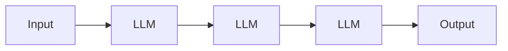
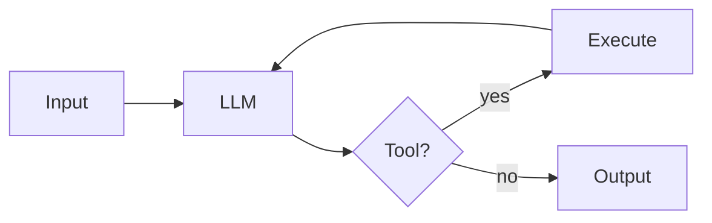
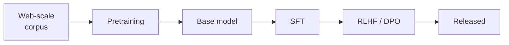
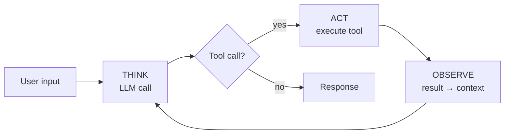
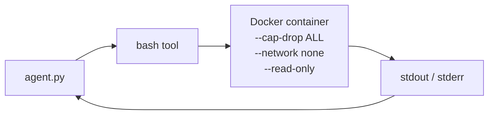

# building-agents

**Build your own agent by building the harness around a model.**

I'm <span style="color:#3fb950"><strong>Chase Dovey</strong></span>. I research agentic systems and most of my work is building harnesses.

<div class="mt-12 text-2xl">

`Agent = Model + Harness`

</div>

<div class="mt-8 text-base opacity-75">

This repo teaches you to build the harness yourself.

</div>

<div class="mt-16 text-sm opacity-60">

github.com/averagejoeslab/building-agents

</div>

---
layout: two-cols
---

# What are agentic systems?

Systems that act on their own. The agency comes from an LLM coordinating calls to reach a goal without supervision.

<div class="mt-8">

**Two shapes** — based on what shape the control flow takes:

</div>



<div class="text-sm opacity-70 -mt-2">

*Workflow — code decides the path*

</div>



<div class="text-sm opacity-70 -mt-2">

*Agent — model decides the path*

</div>

::right::

<div class="ml-8 mt-16">

## I focus on agents.

Systems with autonomy over their own control flow.

<div class="mt-8 text-base">

**Examples in the wild:**

- Claude Code
- Cursor
- Devin
- Aider
- openclaw

</div>

</div>

---

# The three disciplines

<div class="mt-8 grid grid-cols-3 gap-6">

<div class="border-2 border-gray-500 rounded p-5">
<div class="text-lg font-bold mb-2">1. Model development</div>
<div class="text-sm">Trains the foundational model.</div>
<div class="mt-3 text-xs opacity-70">Output: a callable model API.</div>
<div class="mt-3 text-xs opacity-60">Examples: GPT, Claude, Gemini, Llama</div>
</div>

<div class="border-2 border-green-500 rounded p-5 bg-green-900 bg-opacity-20">
<div class="text-lg font-bold mb-2 text-green-400">2. Harness engineering</div>
<div class="text-sm">Wraps the model in code, state, tools, loop.</div>
<div class="mt-3 text-xs opacity-90"><code>Agent = Model + Harness</code></div>
<div class="mt-3 text-xs opacity-70">Output: an agent.</div>
<div class="mt-3 text-xs opacity-60">Examples: Claude Code, Cursor, Codex</div>
</div>

<div class="border-2 border-gray-500 rounded p-5">
<div class="text-lg font-bold mb-2">3. Agentic engineering</div>
<div class="text-sm">Uses an agent to build other software.</div>
<div class="mt-3 text-xs opacity-70">Output: products built by agents orchestrated by humans.</div>
<div class="mt-3 text-xs opacity-60">Example: openclaw</div>
</div>

</div>

<div class="mt-10 text-center text-lg">

This repo teaches the <span class="text-green-400 font-bold">middle one</span>.

</div>

---

# Discipline 1 · Model development

<div class="mt-6 text-base">

A handful of labs (Anthropic, OpenAI, Google, Meta) train foundational models. The output is a service you call by API.

</div>

<div class="mt-8 grid grid-cols-2 gap-12">

<div>

**What's inside:**

- Tokenizer (BPE, 30k–200k vocab)
- Token embeddings (2,048–16,384 dim)
- Positional info (RoPE / ALiBi)
- Transformer blocks (60–120 stacked)
- Output head (→ distribution → sample)

</div>

<div>

**How it's trained:**



Thousands of GPUs. Months. Multi-billion dollar capital.

</div>

</div>

<div class="mt-10 text-center text-base opacity-80">

We don't teach this. The harness layer assumes it's already happened upstream.

</div>

---

# Discipline 2 · Harness engineering

<div class="mt-4 text-2xl text-center text-green-400">

`Agent = Model + Harness`

</div>

<div class="mt-6 text-base text-center opacity-90">

The harness is every piece of code, configuration, and execution logic that isn't the model itself.

</div>

<div class="mt-8 grid grid-cols-3 gap-4 text-sm">

<div>
• Selecting the model<br/>
• Control flow<br/>
• Memory
</div>

<div>
• Context management<br/>
• Tools<br/>
• Safety / guardrails
</div>

<div>
• Observability<br/>
• Evaluation<br/>
• Optimization
</div>

</div>

<div class="mt-10 text-center text-lg">

10 modules cover all of it. <strong class="text-green-400">This is the talk's focus.</strong>

</div>

<div class="mt-4 text-center text-sm opacity-60">

The next 10 slides walk the curriculum module by module.

</div>

---

# Discipline 3 · Agentic engineering

<div class="mt-6 text-base">

Once you have an agent — a model wrapped in a harness — what do you do with it?

</div>

<div class="mt-8 grid grid-cols-2 gap-8">

<div class="border-l-4 border-blue-500 pl-4">
<div class="text-lg font-bold mb-2 text-blue-400">Develop other products</div>
<div class="text-sm">Point the agent at the next codebase. Ship features, build infrastructure, author tooling.</div>
<div class="mt-3 text-xs opacity-70">Example: Peter Steinberg built openclaw by directing existing coding agents, then embedded a harness inside it.</div>
</div>

<div class="border-l-4 border-purple-500 pl-4">
<div class="text-lg font-bold mb-2 text-purple-400">Develop the agent itself</div>
<div class="text-sm">Point the agent at its own curriculum. Write a new module, refactor a component, raise the evals.</div>
<div class="mt-3 text-xs opacity-70">This repo and deck are built that way: Claude Code (a harness) running on Claude, driven by me.</div>
</div>

</div>

<div class="mt-10 text-center text-base">

<strong>Vibe coding's disciplined cousin.</strong> Same fundamental move — have AI write the code — but with thought about what to ask, what tools to provide, how to verify, how to ship.

</div>

<div class="mt-4 text-center text-sm text-green-400">

You're the human orchestrating agents to do the engineering.

</div>

---

# Module 1 · What is an agent?

<div class="text-sm opacity-70 mb-6">

Concept only. No code. (`modules/01-what-is-an-agent/`)

</div>

<div class="mt-2 text-xl text-center text-green-400">

`Agent = Model + Harness`

</div>

<div class="mt-8 grid grid-cols-3 gap-6">

<div class="border-l-4 border-green-500 pl-4">
<div class="text-3xl font-bold mb-2 text-green-400">1</div>
<div class="text-lg font-bold mb-2">An LLM call</div>
<div class="text-sm opacity-80">The reasoning engine. The <strong>model</strong>.</div>
</div>

<div class="border-l-4 border-blue-500 pl-4">
<div class="text-3xl font-bold mb-2 text-blue-400">2</div>
<div class="text-lg font-bold mb-2">A loop</div>
<div class="text-sm opacity-80">Think · Act · Observe. The harness's body.</div>
</div>

<div class="border-l-4 border-orange-500 pl-4">
<div class="text-3xl font-bold mb-2 text-orange-400">3</div>
<div class="text-lg font-bold mb-2">Tools</div>
<div class="text-sm opacity-80">The harness's interface to the environment.</div>
</div>

</div>

<div class="mt-10 text-center text-base">

Three primitives. The harness is two of them.

</div>

---

# Module 2 · An LLM call

<div class="text-sm opacity-70 mb-4">

Harness component: <strong>model interface</strong>. (`modules/02-an-llm-call/` → <code>llm_call_sync.py</code>, <code>llm_call_async.py</code>)

</div>

```python {all|1-2|4-9|11}
from anthropic import Anthropic
client = Anthropic(api_key=os.environ["ANTHROPIC_API_KEY"])

response = client.messages.create(
    model="claude-sonnet-4-5",
    max_tokens=1024,
    system="You are a helpful assistant.",
    messages=[{"role": "user", "content": "..."}],
)
print(response.content[0].text)
```

<div class="mt-6 text-sm opacity-80 text-center">

One HTTP POST. One JSON response. <code>content</code> is a list of blocks (text + optional tool requests).

</div>

<div class="mt-4 text-sm opacity-70 text-center">

Streaming version uses <code>messages.stream</code> + <code>await stream.get_final_message()</code> — text lands token-by-token, structured response captured at the end. Every example downstream uses async streaming.

</div>

---

# Module 3 · Add a loop

<div class="text-sm opacity-70 mb-4">

Harness component: <strong>control flow</strong>. (`modules/03-add-a-loop/` → <code>stateless_chatbot.py</code>)

</div>

```python {all|3-4|6|8-17}
async def main():
    messages = []
    while True:
        user_input = input("❯ ")
        if user_input.lower() in ("/q", "exit"): break
        messages.append({"role": "user", "content": user_input})
        async with client.messages.stream(
            model="claude-sonnet-4-5",
            max_tokens=1024,
            system="You are a helpful assistant.",
            messages=messages,
        ) as stream:
            async for text in stream.text_stream:
                print(text, end="", flush=True)
            response = await stream.get_final_message()
        messages.append({"role": "assistant", "content": response.content[0].text})
```

<div class="mt-6 text-sm opacity-80 text-center">

The Messages API is stateless. The program holds the state. Terminal as the simplest environment.

</div>

---

# Module 4 · Add memory

<div class="text-sm opacity-70 mb-4">

Harness component: <strong>memory + context management</strong>. (`modules/04-add-memory/` → <code>stateful_chatbot.py</code>)

</div>

<div class="mt-4 grid grid-cols-3 gap-4">

<div class="border-l-4 border-blue-500 pl-3">
<div class="text-base font-bold mb-2 text-blue-400">Persistence</div>
<div class="text-sm">Save <code>messages.json</code> to disk. Survive a restart.</div>
</div>

<div class="border-l-4 border-orange-500 pl-3">
<div class="text-base font-bold mb-2 text-orange-400">Token budget</div>
<div class="text-sm">Compute upfront. Walk past turns newest-first until full.</div>
</div>

<div class="border-l-4 border-purple-500 pl-3">
<div class="text-base font-bold mb-2 text-purple-400">Semantic recall</div>
<div class="text-sm">Summarize each turn, embed, retrieve by similarity.</div>
</div>

</div>

<div class="mt-6 text-center text-sm font-mono">

```
past_turn_budget = CONTEXT_BUDGET - MAX_RESPONSE_TOKENS
                 - tokens(system) - tokens(tools) - tokens(user_input)
```

</div>

<div class="mt-6 text-center text-sm opacity-70">

<code>tiktoken cl100k_base</code> · <code>sentence-transformers all-MiniLM-L6-v2</code> · normalized vectors → dot product = cosine

</div>

---

# Module 5 · Add tools  ·  the agent moment

<div class="text-sm opacity-70 mb-4">

Harness component: <strong>tool / action layer</strong>. (`modules/05-add-tools/` → <code>agent.py</code>)

</div>



<div class="mt-4 text-center text-lg text-green-400">

The model — not your code — decides what comes next.

</div>

<div class="mt-6 grid grid-cols-2 gap-6 text-sm">

<div>

**The toolkit (6 tools):**<br/>
`read` · `grep` · `glob`<br/>
`write` · `edit` · `bash`

</div>

<div>

**Registry collapses repeat plumbing.**<br/>
**Central executor catches all errors.**<br/>
**`asyncio.gather` dispatches in parallel.**

</div>

</div>

---

# Module 6 · Add sandboxing

<div class="text-sm opacity-70 mb-4">

Harness component: <strong>execution environment</strong>. (`modules/06-add-sandboxing/` → <code>sandbox_agent.py</code> + <code>Dockerfile.sandbox</code>)

</div>

<div class="mt-6 text-base opacity-90">

The agent has a <code>bash</code> tool that runs commands directly on the host. The model can write your filesystem, install packages, exfiltrate data — by mistake or by prompt injection.

</div>

<div class="mt-8 flex justify-center">



</div>

<div class="mt-6 text-sm opacity-70 text-center">

Only <code>bash</code> is sandboxed. <code>read</code> / <code>write</code> / <code>edit</code> still touch the host — file editing has to be visible.

</div>

---

# Module 7 · Add guardrails

<div class="text-sm opacity-70 mb-4">

Harness component: <strong>safety constraints</strong>. (`modules/07-add-guardrails/` → <code>safe_agent.py</code>)

</div>

<div class="mt-6 grid grid-cols-3 gap-6">

<div class="border rounded p-5">
<div class="text-lg font-bold mb-3 text-yellow-400">Approval gates</div>
<div class="text-sm opacity-80">Before running a dangerous tool (<code>write</code> / <code>edit</code> / <code>bash</code>), prompt the human y/N.</div>
</div>

<div class="border rounded p-5">
<div class="text-lg font-bold mb-3 text-yellow-400">Loop bounds</div>
<div class="text-sm opacity-80"><code>MAX_ITERATIONS</code> cap on the inner TAO loop. Stop before the agent burns budget.</div>
</div>

<div class="border rounded p-5">
<div class="text-lg font-bold mb-3 text-yellow-400">Retry / backoff</div>
<div class="text-sm opacity-80">Exponential backoff on transient API errors. Tool errors handled by the model.</div>
</div>

</div>

<div class="mt-10 text-center text-base">

Sandbox constrains <strong>where</strong> the agent can act.<br/>
Guardrails constrain <strong>whether</strong> it gets to act at all.

</div>

---

# Module 8 · Add observability

<div class="text-sm opacity-70 mb-4">

Harness component: <strong>structured tracing</strong>. (`modules/08-add-observability/` → <code>traced_agent.py</code>)

</div>

<div class="mt-4 text-base opacity-90">

Every LLM call and tool call becomes a structured span. JSONL — one span per line.

</div>

```json {all|1|2-3|4}
{"type":"llm_call","span_id":"abc","start":1714,"end":1716,"tokens_in":1842,"tokens_out":187,"model":"claude-sonnet-4-5"}
{"type":"tool_call","span_id":"def","parent":"abc","name":"read","input":{"path":"foo.py"},"latency_ms":12}
{"type":"tool_call","span_id":"ghi","parent":"abc","name":"grep","input":{"pattern":"TODO","path":"."},"latency_ms":340}
{"type":"llm_call","span_id":"jkl","start":1718,"end":1720,"tokens_in":2104,"tokens_out":94}
```

<div class="mt-6 text-sm opacity-70 text-center">

Search · replay · feed to evals.<br/>
<code>tail -f ~/.traced-agent/traces.jsonl | jq</code> — live debugging.

</div>

---

# Module 9 · Add evaluation

<div class="text-sm opacity-70 mb-4">

Harness component: <strong>test infrastructure</strong>. (`modules/09-add-evaluation/` → <code>evals/</code> at the repo root)

</div>

<div class="mt-4 grid grid-cols-2 gap-8">

<div>

**A YAML case:**

```yaml
id: find-imports
input: |
  list functions in foo.py
  that import requests
checks:
  - type: contains
    value: "fetch_user"
  - type: llm_judge
    rubric: |
      answer lists exactly the
      functions, no extras
```

</div>

<div>

**The runner:**

- Subprocess per case (fresh state)
- N runs per case (default 3)
- Stochastic pass rate
- LLM-as-judge with Haiku
- Result file per timestamp
- <code>diff.py</code> flags >10% regression

</div>

</div>

<div class="mt-4 text-center text-sm opacity-70">

<code>uv run --project examples evals/run.py examples/production_agent.py</code>

</div>

---

# Module 10 · Add performance

<div class="text-sm opacity-70 mb-4">

Harness component: <strong>production hardening</strong>. (`modules/10-add-performance/` → <code>production_agent.py</code>)

</div>

<div class="mt-6 grid grid-cols-2 gap-x-12 gap-y-6">

<div>
<div class="text-base font-bold mb-2 text-cyan-400">Prompt caching</div>
<div class="text-sm opacity-80">Mark system + tool schemas <code>cache_control</code>. Amortize input cost across many turns.</div>
</div>

<div>
<div class="text-base font-bold mb-2 text-cyan-400">Tool output caching</div>
<div class="text-sm opacity-80">Two reads of the same file in one turn shouldn't pay twice. Content-addressed cache around <code>read</code> / <code>grep</code> / <code>glob</code>.</div>
</div>

<div>
<div class="text-base font-bold mb-2 text-cyan-400">Threading</div>
<div class="text-sm opacity-80">CPU work (big regex trees, embedding inference) runs on a thread so concurrent tools aren't serialized behind it.</div>
</div>

<div>
<div class="text-base font-bold mb-2 text-cyan-400">Structured prompts · <code>assemble()</code></div>
<div class="text-sm opacity-80">One function brings together system, recalled memory, tool schemas, trimmed messages. One named call site.</div>
</div>

</div>

<div class="mt-8 text-center text-lg text-green-400">

The curriculum's destination: <code>examples/production_agent.py</code>

</div>
