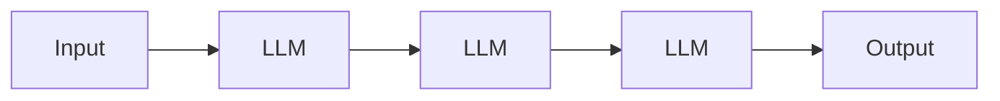
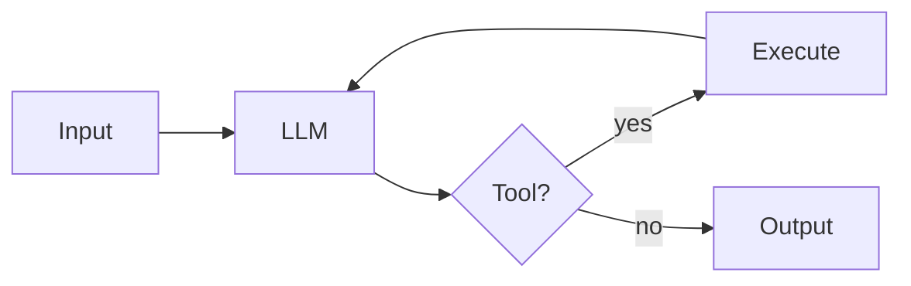
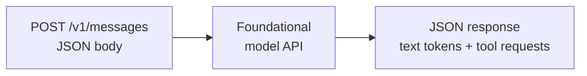
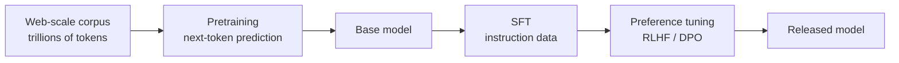
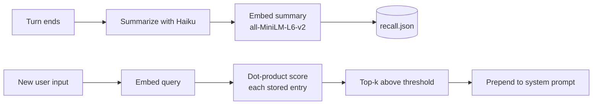
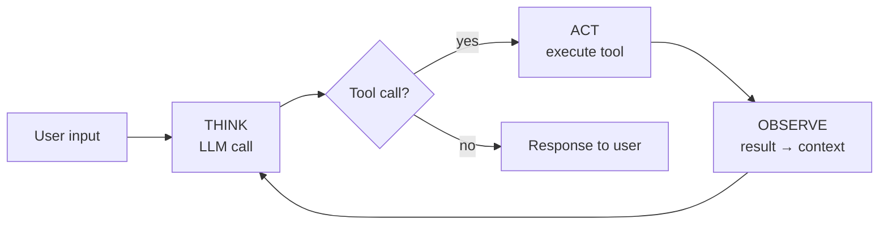
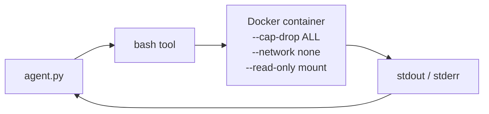
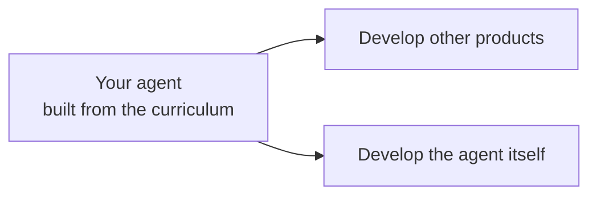

# building-agents

**Build your own agent by building the harness around a model.**

I'm <span style="color:#3fb950"><strong>Chase Dovey</strong></span>. I research agentic systems and most of my work is building harnesses.

<div class="mt-12 text-2xl">

`Agent = Model + Harness`

</div>

<div class="mt-8 text-base opacity-75">

This repo teaches you to build the harness yourself.

</div>

<div class="mt-16 text-sm opacity-60">

github.com/averagejoeslab/building-agents

</div>

<!--
Opening slide — combines "who I am" and "what this repo is" in one frame.
The formula carries the whole talk.
-->

---
layout: two-cols
---

# What are agentic systems?

Systems that act on their own. The agency comes from an LLM coordinating calls to reach a goal without supervision.

<div class="mt-8">

**Two shapes** — what shape the control flow takes:

</div>



<div class="text-sm opacity-70 -mt-2">

*Workflow — code decides the path*

</div>



<div class="text-sm opacity-70 -mt-2">

*Agent — model decides the path*

</div>

::right::

<div class="ml-8 mt-16">

## I focus on agents.

Systems with human-level autonomy over their own control flow.

<div class="mt-8 text-base">

**Examples in the wild:**

- Claude Code
- Cursor
- Devin
- Aider
- openclaw

</div>

<div class="mt-8 text-sm opacity-60">

Most "agents" shipping in 2026 are actually workflows. That's often the right answer. This talk is about the case when it isn't.

</div>

</div>

---
layout: default
---

# Three disciplines · the journey to an agent

<div class="mt-8 grid grid-cols-3 gap-6">

<div class="border-2 border-gray-500 rounded p-4 opacity-60">
<div class="text-lg font-bold mb-2">1. Model development</div>
<div class="text-sm">Trains the foundational model. Produces a callable API.</div>
<div class="mt-4 text-xs opacity-60">(orientation only)</div>
</div>

<div class="border-2 border-green-500 rounded p-4 bg-green-900 bg-opacity-20">
<div class="text-lg font-bold mb-2 text-green-400">2. Harness engineering</div>
<div class="text-sm">Wraps the model in state, tools, loop. Gives rise to an agent.</div>
<div class="mt-4 text-xs text-green-400 font-bold">← this talk's focus</div>
</div>

<div class="border-2 border-gray-500 rounded p-4 opacity-60">
<div class="text-lg font-bold mb-2">3. Agentic engineering</div>
<div class="text-sm">Uses the agent to build other software, products, agents.</div>
<div class="mt-4 text-xs opacity-60">(capstone)</div>
</div>

</div>

<div class="mt-12 text-center text-lg opacity-80">

We walk all three. In order.

</div>

<!--
Bridge slide. The three cards = the three acts of the rest of the deck.
Middle card emphasized; others muted.
-->

---
layout: section
---

# Act 1
## Model development → a callable model

---

# What model development produces

<div class="mt-12 flex justify-center">



</div>

<div class="mt-16 text-center text-xl">

To the harness, the model is just a function call.

</div>

<div class="mt-4 text-center text-sm opacity-60">

One HTTP POST. One JSON response. That's the contract.

</div>

---

# Inside the model

<div class="grid grid-cols-2 gap-8 mt-8">

<div>

**Architectural primitives**

- **Tokenizer** — chops text into 30k–200k sub-word tokens (BPE)
- **Token embeddings** — each ID → learned vector, 2,048–16,384 dims
- **Positional information** — RoPE / ALiBi / learned
- **Transformer block** — multi-head self-attention + FFN (SwiGLU) + residual + RMSNorm. Stacked 60–120 deep.
- **Output head** — final hidden state → distribution over vocab → sample

</div>

<div>

**Per token, every call:**

```
input tokens
  ↓
tokenizer  →  IDs
  ↓
embedding lookup
  ↓
+ positional encoding
  ↓
[Transformer × N]
  ↓
output head
  ↓
prob distribution
  ↓
sample → next token
```

</div>

</div>

---

# How it's trained



<div class="mt-8 text-sm">

1. **Pretraining.** Predict the next token over trillions of tokens. Thousands of GPUs, months. Acquires syntax, facts, reasoning patterns.
2. **SFT.** Curated instruction/response pairs — learn to follow instructions.
3. **Preference tuning.** Human-rated comparisons — helpfulness, honesty, safety.
4. **(Optional) Specialty fine-tuning.** Domain-specific data: code, math, tool use.

</div>

---
layout: center
---

# Why we don't teach this

<div class="text-2xl mt-12 opacity-90">

Multi-billion-dollar capital · thousands of GPUs · proprietary data

</div>

<div class="mt-12 text-lg opacity-70">

The harness layer assumes this has happened upstream.<br/>
The model is now a callable service.

</div>

<div class="mt-16 text-xl text-green-400">

A callable model can complete text.<br/>
It can't read files, run commands, remember, or stop.<br/>
To get any of that — wrap it in a harness.

</div>

---
layout: section
---

# Act 2
## Harness engineering → an agent

The core of this talk.

---

# Harness engineering · the discipline

<div class="text-3xl mt-8 text-center text-green-400">

`Agent = Model + Harness`

</div>

<div class="mt-12 text-lg">

The harness is every piece of code, configuration, and execution logic that isn't the model itself:

</div>

<div class="mt-4 grid grid-cols-3 gap-4 text-base">

<div>
• Selecting the model<br/>
• Control flow<br/>
• Memory
</div>

<div>
• Context management<br/>
• Tools<br/>
• Safety / guardrails
</div>

<div>
• Observability<br/>
• Evaluation<br/>
• Optimization
</div>

</div>

<div class="mt-12 text-center opacity-70">

One module per component. The whole curriculum is below.

</div>

---

# The curriculum at a glance

<div class="text-sm">

| # | Module | Component added | Checkpoint |
|---|---|---|---|
| 1 | What is an agent? | (concept) | — |
| 2 | An LLM call | Model interface | `llm_call_*.py` |
| 3 | Add a loop | Control flow | `stateless_chatbot.py` |
| 4 | Add memory | Memory + context | `stateful_chatbot.py` |
| 5 | Add tools | Tool/action layer | `agent.py` ← **becomes agent** |
| 6 | Add sandboxing | Execution environment | `sandbox_agent.py` |
| 7 | Add guardrails | Safety constraints | `safe_agent.py` |
| 8 | Add observability | Structured tracing | `traced_agent.py` |
| 9 | Add evaluation | Test harness | `evals/` |
| 10 | Add performance | Production hardening | `production_agent.py` |

</div>

<div class="mt-6 text-center opacity-70 text-sm">

Each script is a strict superset of the previous one.

</div>

---

# Module 1 · what an agent looks like in code

<div class="mt-8 grid grid-cols-3 gap-6">

<div class="border-l-4 border-green-500 pl-4">
<div class="text-2xl font-bold mb-3 text-green-400">1</div>
<div class="text-lg font-bold mb-2">An LLM call</div>
<div class="text-sm opacity-80">The reasoning engine. The <strong>model</strong>.</div>
</div>

<div class="border-l-4 border-blue-500 pl-4">
<div class="text-2xl font-bold mb-3 text-blue-400">2</div>
<div class="text-lg font-bold mb-2">A loop</div>
<div class="text-sm opacity-80">Think · Act · Observe. The harness's body.</div>
</div>

<div class="border-l-4 border-orange-500 pl-4">
<div class="text-2xl font-bold mb-3 text-orange-400">3</div>
<div class="text-lg font-bold mb-2">Tools</div>
<div class="text-sm opacity-80">The harness's interface to the environment.</div>
</div>

</div>

<div class="mt-12 text-center text-lg">

Three primitives. The harness is two of them.

</div>

<div class="mt-8 text-center text-sm opacity-60">

Modules 2 through 5 build each one out.

</div>

---

# M2 · an LLM call

```python {all|2-7|9}
from anthropic import Anthropic
client = Anthropic(api_key=os.environ["ANTHROPIC_API_KEY"])

response = client.messages.create(
    model="claude-sonnet-4-5",
    max_tokens=1024,
    system="You are a helpful assistant.",
    messages=[{"role": "user", "content": "Write three sentences about agents."}],
)
print(response.content[0].text)
```

<div class="mt-6 text-sm opacity-70">

One HTTP POST to `/v1/messages`. One JSON response. `content` is a list of blocks.

</div>

---
layout: two-cols
---

# Streaming changes how it feels

`messages.create`:

<div class="mt-4 mb-8 font-mono text-sm opacity-60">

[waiting............]
<br/>
[waiting............]
<br/>
[full response appears at once]

</div>

Total latency: same.<br/>
Time-to-first-token: full wait.

::right::

# &nbsp;

`messages.stream`:

<div class="mt-4 mb-8 font-mono text-sm">

Three<br/>
Three sentences<br/>
Three sentences about<br/>
Three sentences about agents...

</div>

Total latency: same.<br/>
Time-to-first-token: <strong class="text-green-400">~instant</strong>.

<div class="absolute bottom-12 left-12 right-12 text-center text-base opacity-80">

Every example downstream of M2 uses async streaming.<br/>
`get_final_message()` returns the same structured response when the stream finishes — so tool calls work too.

</div>

---

# M3 · add a loop

```python {all|3|5-6|10-19|21}
import asyncio
from anthropic import AsyncAnthropic
client = AsyncAnthropic(api_key=os.environ["ANTHROPIC_API_KEY"])

async def main():
    messages = []
    while True:
        user_input = input("❯ ")
        if user_input.lower() in ("/q", "exit"): break
        messages.append({"role": "user", "content": user_input})
        async with client.messages.stream(
            model="claude-sonnet-4-5",
            max_tokens=1024,
            system="You are a helpful assistant.",
            messages=messages,
        ) as stream:
            async for text in stream.text_stream:
                print(text, end="", flush=True)
            response = await stream.get_final_message()
        messages.append({"role": "assistant", "content": response.content[0].text})

asyncio.run(main())
```

---

# The loop is environment-agnostic

We bind to the terminal. The same `while True` could bind to:

<div class="mt-8 grid grid-cols-5 gap-4">

<div class="border rounded p-4 text-center text-sm">
<div class="text-2xl mb-2">⌨</div>
Terminal<br/>
<span class="opacity-60">stdin / stdout</span>
</div>

<div class="border rounded p-4 text-center text-sm">
<div class="text-2xl mb-2">🌐</div>
WebSocket<br/>
<span class="opacity-60">browser SSE</span>
</div>

<div class="border rounded p-4 text-center text-sm">
<div class="text-2xl mb-2">💬</div>
Slack<br/>
<span class="opacity-60">slash command</span>
</div>

<div class="border rounded p-4 text-center text-sm">
<div class="text-2xl mb-2">🎮</div>
Gameboy<br/>
<span class="opacity-60">emulator I/O</span>
</div>

<div class="border rounded p-4 text-center text-sm">
<div class="text-2xl mb-2">📊</div>
Spreadsheet<br/>
<span class="opacity-60">cell formula</span>
</div>

</div>

<div class="mt-12 text-center text-lg opacity-80">

The terminal is just our pick — chosen for the least ceremony.

</div>

<div class="mt-4 text-center text-sm opacity-60">

Once the loop is wired to bytes in / bytes out, the rest of the curriculum is the same.

</div>

---
layout: center
---

# State of the build · **stateless chatbot**

<div class="mt-8 grid grid-cols-2 gap-12 text-left max-w-3xl mx-auto">

<div>

**Built so far:**

- ✓ Model interface (M2)
- ✓ Control flow / loop (M3)
- ✓ Async streaming

</div>

<div class="opacity-60">

**Still missing:**

- ☐ Memory
- ☐ Tools
- ☐ Sandbox
- ☐ Guardrails
- ☐ Observability
- ☐ Evaluation
- ☐ Performance

</div>

</div>

<div class="mt-12 text-base opacity-60">

`examples/stateless_chatbot.py` — runnable.

</div>

---

# M4 · "memory" is three problems

<div class="mt-8 grid grid-cols-3 gap-6">

<div class="border-l-4 border-blue-500 pl-4">
<div class="text-lg font-bold mb-2 text-blue-400">Persistence</div>
<div class="text-sm">Save messages to disk. Survive a restart.</div>
<div class="mt-3 text-xs opacity-60 font-mono">~/.stateful-chatbot/messages.json</div>
</div>

<div class="border-l-4 border-orange-500 pl-4">
<div class="text-lg font-bold mb-2 text-orange-400">Token budget</div>
<div class="text-sm">Context window is a token budget. Trim to fit.</div>
<div class="mt-3 text-xs opacity-60 font-mono">tiktoken · cl100k_base</div>
</div>

<div class="border-l-4 border-purple-500 pl-4">
<div class="text-lg font-bold mb-2 text-purple-400">Semantic recall</div>
<div class="text-sm">Pull trimmed-out context back by similarity.</div>
<div class="mt-3 text-xs opacity-60 font-mono">sentence-transformers</div>
</div>

</div>

<div class="mt-12 text-center text-lg opacity-80">

Different problems. Different solutions. One word.

</div>

---

# Token budget · upfront formula

<div class="mt-12 text-center">

```
past_turn_budget = CONTEXT_BUDGET
                 - MAX_RESPONSE_TOKENS
                 - tokens(system)
                 - tokens(tools)
                 - tokens(user_input)
```

</div>

<div class="mt-12 grid grid-cols-2 gap-12 text-sm">

<div>

**Compute once at turn start.**<br/>
Walk past turns newest-first until the next one wouldn't fit.

</div>

<div>

**Why local tokenizer (tiktoken):**<br/>
~5% off vs Claude on English. Budget runs at ~75% of hard limit anyway. No network round-trip.

</div>

</div>

<div class="mt-12 text-center text-sm opacity-60">

Anthropic's `count_tokens` endpoint is exact — use it when you bill on tokens.

</div>

---

# Semantic recall



<div class="mt-8 text-sm opacity-70 text-center">

Normalized vectors → dot product = cosine similarity.<br/>
Threshold prevents irrelevant entries from leaking in when nothing matches well.

</div>

---
layout: center
---

# State of the build · **stateful chatbot**

<div class="mt-8 grid grid-cols-2 gap-12 text-left max-w-3xl mx-auto">

<div>

**Built so far:**

- ✓ Model interface (M2)
- ✓ Control flow / loop (M3)
- ✓ Persistence (M4)
- ✓ Token budget (M4)
- ✓ Semantic recall (M4)

</div>

<div class="opacity-60">

**Still missing:**

- ☐ **Tools** ← next
- ☐ Sandbox
- ☐ Guardrails
- ☐ Observability
- ☐ Evaluation
- ☐ Performance

</div>

</div>

<div class="mt-12 text-center text-base opacity-80">

Remembers across sessions. Still <strong>cannot act</strong>.

</div>

---

# M5 · a tool is three things

<div class="mt-12 grid grid-cols-3 gap-8">

<div class="text-center">
<div class="text-5xl mb-4 text-green-400">fn</div>
<div class="text-lg font-bold mb-2">Function</div>
<div class="text-sm opacity-80">Your code, your language.</div>
</div>

<div class="text-center">
<div class="text-5xl mb-4 text-blue-400">{ }</div>
<div class="text-lg font-bold mb-2">Schema</div>
<div class="text-sm opacity-80">JSON Schema — the model reads it.</div>
</div>

<div class="text-center">
<div class="text-5xl mb-4 text-orange-400">→</div>
<div class="text-lg font-bold mb-2">Dispatch</div>
<div class="text-sm opacity-80">Spot <code>tool_use</code>, run fn, return <code>tool_result</code>.</div>
</div>

</div>

<div class="mt-12 text-sm opacity-70 text-center">

JSON Schema is the cross-language standard the LLM industry settled on.<br/>
Same schema in Python / TS / Go / Rust — only the function changes.

</div>

---
layout: default
---

# The TAO loop · the agent moment



<div class="mt-8 text-center text-2xl text-green-400">

The model — not your code — decides what comes next.

</div>

<div class="mt-8 text-center text-base opacity-80">

This is the moment chatbot becomes agent.<br/>
The change is ~four lines around the existing chatbot loop.

</div>

---

# Tool design

<div class="mt-8 grid grid-cols-2 gap-8 text-base">

<div>

**Right granularity**<br/>
<span class="text-sm opacity-70">Match a human's sub-step. `search_and_summarize` beats `list → read → read → read`.</span>

<div class="mt-6"></div>

**Name and describe like docs**<br/>
<span class="text-sm opacity-70">`edit` beats `modify_file_contents`. Constraints in the description save the model from mistakes.</span>

</div>

<div>

**Return strings**<br/>
<span class="text-sm opacity-70">The model consumes text. Compute internally, return a string.</span>

<div class="mt-6"></div>

**Errors as strings, never raise**<br/>
<span class="text-sm opacity-70">The model reads the error and self-corrects. Exceptions kill the loop.</span>

</div>

</div>

<div class="mt-12 text-sm opacity-60 text-center">

From Anthropic's <em>Writing Tools for Agents</em>.

</div>

---
layout: two-cols
---

# The 6-tool toolkit

**Read tools** (introspection)

- `read` — file contents (+ offset/limit pagination)
- `grep` — regex search inside files
- `glob` — list paths matching pattern

::right::

# &nbsp;

**Write/exec tools** (mutation)

- `write` — create or overwrite a file
- `edit` — replace exact text (must match once)
- `bash` — single shell escape hatch

<div class="absolute bottom-16 left-12 right-12 text-sm opacity-70 text-center">

Six tools cover most coding work.<br/>
`bash` is the single escape hatch — fewer specialized tools to maintain, more flexibility for the model.

</div>

---

# Registry + central executor

<div class="grid grid-cols-2 gap-6 text-sm mt-4">

<div>

**Define once:**

```python
TOOLS = {
  "read": {
    "fn": read,
    "description": "Read a file (paginatable)",
    "params": {
      "path":   {"type": "string", "description": "..."},
      "offset": {"type": "integer", "required": False},
      "limit":  {"type": "integer", "required": False},
    },
  },
  # edit, write, grep, glob, bash...
}
```

</div>

<div>

**One executor:**

```python
async def execute_tool(name, input):
    tool = TOOLS.get(name)
    if tool is None:
        return f"error: unknown tool {name}"
    try:
        result = await tool["fn"](**input)
        return result if isinstance(result, str) else str(result)
    except Exception as e:
        return f"error: {e}"
```

</div>

</div>

<div class="mt-8 text-center text-base">

One place to add a tool. One place errors funnel through.

</div>

---
layout: center
---

# Parallel dispatch · one line

```python
outputs = await asyncio.gather(
    *(execute_tool(c.name, c.input) for c in tool_calls)
)
```

<div class="mt-12 text-xl">

Turn finishes in the time of the <strong>slowest tool</strong>,<br/>
not the <strong>sum</strong> of all of them.

</div>

<div class="mt-8 text-sm opacity-60">

Same primitive everywhere: Python's `asyncio.gather`, JS's `Promise.all`, Go's goroutines, Rust's `join!`.

</div>

---
layout: center
---

# State of the build · **AGENT**

<div class="mt-8 grid grid-cols-2 gap-12 text-left max-w-3xl mx-auto">

<div>

**Built so far:**

- ✓ Model interface (M2)
- ✓ Control flow / loop (M3)
- ✓ Memory (M4)
- ✓ **Tools + TAO loop (M5)**
- ✓ Parallel dispatch

</div>

<div class="opacity-60">

**Still missing:**

- ☐ Sandbox
- ☐ Guardrails
- ☐ Observability
- ☐ Evaluation
- ☐ Performance

</div>

</div>

<div class="mt-12 text-2xl text-green-400">

`examples/agent.py` — a real, runnable agent.

</div>

---

# M6 · sandbox the dangerous tools

<div class="mt-8 text-base opacity-80">

The agent has a `bash` tool that runs commands directly on the host. The model can write your filesystem, install packages, exfiltrate data — by mistake or by prompt injection.

</div>

<div class="mt-8 flex justify-center">



</div>

<div class="mt-8 text-sm opacity-70 text-center">

Only `bash` is sandboxed. `read` / `write` / `edit` / `grep` / `glob` still touch the host filesystem.<br/>
The trade-off: filesystem editing needs to be visible to the user; arbitrary commands need to be contained.

</div>

---

# M7 · guardrails

<div class="mt-8 grid grid-cols-3 gap-6">

<div class="border rounded p-5">
<div class="text-lg font-bold mb-3 text-yellow-400">Approval gates</div>
<div class="text-sm opacity-80">Before running a dangerous tool (`write` / `edit` / `bash`), prompt the human for y/N.</div>
</div>

<div class="border rounded p-5">
<div class="text-lg font-bold mb-3 text-yellow-400">Loop bounds</div>
<div class="text-sm opacity-80">`MAX_ITERATIONS` cap on the inner TAO loop. Stop before the agent burns the budget.</div>
</div>

<div class="border rounded p-5">
<div class="text-lg font-bold mb-3 text-yellow-400">Retry / backoff</div>
<div class="text-sm opacity-80">Exponential backoff on transient API errors. Tool errors handled by the model.</div>
</div>

</div>

<div class="mt-12 text-center text-base opacity-80">

Sandbox constrains <strong>where</strong> the agent can act.<br/>
Guardrails constrain <strong>whether</strong> it gets to act.

</div>

---

# M8 · observability

<div class="mt-6 text-base opacity-80">

Every LLM call and tool call becomes a structured span. JSONL one line per span.

</div>

```json {all|1|2-4}
{"type":"llm_call","span_id":"abc","start":1714,"end":1716,"tokens_in":1842,"tokens_out":187,"model":"claude-sonnet-4-5"}
{"type":"tool_call","span_id":"def","parent":"abc","name":"read","input":{"path":"foo.py"},"latency_ms":12}
{"type":"tool_call","span_id":"ghi","parent":"abc","name":"grep","input":{"pattern":"TODO","path":"."},"latency_ms":340}
{"type":"llm_call","span_id":"jkl","start":1718,"end":1720,"tokens_in":2104,"tokens_out":94}
```

<div class="mt-8 text-sm opacity-70 text-center">

Search, replay, feed to evals.<br/>
`tail -f ~/.traced-agent/traces.jsonl | jq` — live debugging.

</div>

---

# M9 · evaluation

<div class="grid grid-cols-2 gap-8 mt-4">

<div>

**A YAML case:**

```yaml
id: find-imports
input: |
  list functions in foo.py
  that import requests
checks:
  - type: contains
    value: "fetch_user"
  - type: llm_judge
    rubric: |
      answer lists exactly the
      functions, no extras
```

</div>

<div>

**The runner:**

- Subprocess per case (fresh state)
- N runs per case (default 3)
- Stochastic pass rate
- LLM-as-judge with Haiku
- Result file per timestamp
- `diff.py` flags >10% regression

</div>

</div>

<div class="mt-6 text-center text-sm opacity-70">

`uv run --project examples evals/run.py examples/production_agent.py`

</div>

---

# M10 · performance

<div class="mt-8 grid grid-cols-2 gap-x-12 gap-y-8">

<div>
<div class="text-lg font-bold mb-2 text-cyan-400">Prompt caching</div>
<div class="text-sm opacity-80">Mark system + tool schemas <code>cache_control</code>. Amortize input cost across many turns.</div>
</div>

<div>
<div class="text-lg font-bold mb-2 text-cyan-400">Tool output caching</div>
<div class="text-sm opacity-80">Two reads of the same file in one turn shouldn't pay twice. Content-addressed cache around `read` / `grep` / `glob`.</div>
</div>

<div>
<div class="text-lg font-bold mb-2 text-cyan-400">Threading</div>
<div class="text-sm opacity-80">CPU work (regex over a big tree, embedding inference) runs on a thread so concurrent tools aren't serialized behind it.</div>
</div>

<div>
<div class="text-lg font-bold mb-2 text-cyan-400">Structured prompts · <code>assemble()</code></div>
<div class="text-sm opacity-80">One function brings together system, recalled memory, tool schemas, trimmed messages. One named call site.</div>
</div>

</div>

---
layout: center
---

# State of the build · **PRODUCTION HARNESS**

<div class="mt-8 max-w-2xl mx-auto text-left">

- ✓ Model interface
- ✓ Control flow / loop
- ✓ Memory (persistence + budget + recall)
- ✓ Tools (registry, toolkit, parallel dispatch)
- ✓ Sandbox (Docker `bash`)
- ✓ Guardrails (approval + bounds + retry)
- ✓ Observability (JSONL spans)
- ✓ Evaluation (YAML cases + judge + regression)
- ✓ Performance (caching + threading + assemble)

</div>

<div class="mt-12 text-xl text-green-400">

`examples/production_agent.py` — the curriculum's destination.

</div>

---
layout: section
---

# Act 3
## Agentic engineering — what you do next

---

# Now you have an agent. What do you do with it?

<div class="mt-12 flex justify-center">



</div>

<div class="mt-12 grid grid-cols-2 gap-8 text-base">

<div>
<div class="text-lg font-bold mb-2 text-blue-400">Develop other products</div>
<div class="opacity-80">Point the agent at the next codebase. Ship features. Build infrastructure. Author tooling. Example: Peter Steinberg built openclaw by directing existing coding agents, then embedded a harness inside it.</div>
</div>

<div>
<div class="text-lg font-bold mb-2 text-purple-400">Develop the agent itself</div>
<div class="opacity-80">Point the agent at its own curriculum. Have it write a module, refactor a component, raise its evals. The harness becomes its own development tool.</div>
</div>

</div>

---
layout: center
---

# The recursive proof

<div class="mt-8 text-left max-w-2xl mx-auto">

This repo and this deck are built that way.<br/>
Claude Code (a harness) running on Claude, driven by me.

</div>

<div class="mt-10 text-left max-w-2xl mx-auto text-lg">

1. Anthropic does **model development** → Claude<br/>
2. The Claude Code team does **harness engineering** → Claude Code<br/>
3. I do **agentic engineering** → this curriculum

</div>

<div class="mt-16 text-xl">

What this curriculum teaches you is <strong class="text-green-400">step 2</strong> —<br/>
so you can do <strong>1</strong> and <strong>3</strong> with intent, knowing what each layer contains.

</div>

---
layout: two-cols
---

# Vibe coding's disciplined cousin

**Vibe coding** (Karpathy)

<div class="mt-2 opacity-80 text-base">

*Give in to the vibes. Accept what the model produces.*

</div>

<div class="mt-8 text-sm opacity-60">

Move fast. No thought to verification. No grasp of what the agent has done. Code lands; you ship it.

</div>

::right::

# &nbsp;

**Agentic engineering**

<div class="mt-2 opacity-80 text-base">

*Same fundamental move. Disciplined.*

</div>

<div class="mt-8 text-sm">

Thought about:
- what to ask the agent
- what tools and context it gets
- how to verify the result
- how to fit it into a delivery process you trust

</div>

<div class="absolute bottom-16 left-12 right-12 text-center text-xl text-green-400">

You're the human orchestrating agents to do the engineering.

</div>

---
layout: center
class: text-center
---

# Build the harness.

<div class="mt-12 text-2xl">

github.com/averagejoeslab/building-agents

</div>

<div class="mt-12 text-base opacity-70">

A model is intelligence.<br/>
A harness is the runtime that turns intelligence into an agent.<br/>
Agentic engineering is what you do with that agent.

</div>

<div class="mt-16 text-sm opacity-50">

Chase Dovey · Average Joes Lab

</div>
