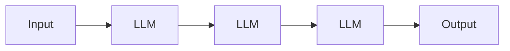
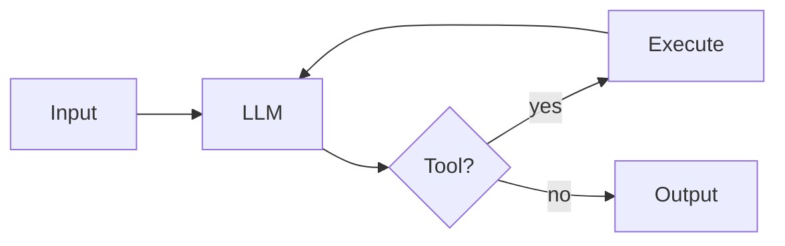

<div style="position: absolute; inset: 0; background: linear-gradient(135deg, #002D62 0%, #001638 100%); display: flex; flex-direction: column; padding: 3.5rem 4rem; text-align: left;">

<div>
<div style="height: 4px; width: 90px; background: #EB6E1F; margin-bottom: 1.25rem;"></div>
<div style="color: white; font-size: 4.5rem; font-weight: 700; line-height: 1; letter-spacing: -0.02em;">building-agents</div>
<div style="color: rgba(255,255,255,0.65); font-size: 1.35rem; margin-top: 0.875rem; font-weight: 400;">Build your own agent by building the harness around a model.</div>
</div>

<div style="flex: 1; display: flex; align-items: center; margin-top: 2rem;">
<div style="display: grid; grid-template-columns: repeat(3, 1fr); gap: 1.5rem; width: 100%;">

<div style="background: rgba(255,255,255,0.04); border: 1px solid rgba(235,110,31,0.3); border-top: 3px solid #EB6E1F; border-radius: 12px; padding: 1.75rem;">
<div style="color: #EB6E1F; font-size: 0.7rem; font-weight: 600; letter-spacing: 0.12em; text-transform: uppercase; margin-bottom: 0.6rem;">01 · Who I am</div>
<div style="color: white; font-size: 1.65rem; font-weight: 700; margin-bottom: 0.75rem; line-height: 1.1;">Chase Dovey</div>
<div style="color: rgba(255,255,255,0.75); font-size: 0.9rem; line-height: 1.55;">I research agentic systems. Most of my work is building harnesses around foundational models.</div>
</div>

<div style="background: rgba(255,255,255,0.04); border: 1px solid rgba(235,110,31,0.3); border-top: 3px solid #EB6E1F; border-radius: 12px; padding: 1.75rem;">
<div style="color: #EB6E1F; font-size: 0.7rem; font-weight: 600; letter-spacing: 0.12em; text-transform: uppercase; margin-bottom: 0.6rem;">02 · The lab</div>
<div style="color: white; font-size: 1.65rem; font-weight: 700; margin-bottom: 0.75rem; line-height: 1.1;">Average Joes Lab</div>
<div style="color: rgba(255,255,255,0.75); font-size: 0.9rem; line-height: 1.55;">A private citizen research lab. Independent research on agentic systems, published openly.</div>
</div>

<div style="background: rgba(255,255,255,0.04); border: 1px solid rgba(235,110,31,0.3); border-top: 3px solid #EB6E1F; border-radius: 12px; padding: 1.75rem;">
<div style="color: #EB6E1F; font-size: 0.7rem; font-weight: 600; letter-spacing: 0.12em; text-transform: uppercase; margin-bottom: 0.6rem;">03 · This talk</div>
<div style="color: white; font-size: 1.65rem; font-weight: 700; margin-bottom: 0.75rem; line-height: 1.1; font-family: ui-monospace, monospace;">Agent = Model + Harness</div>
<div style="color: rgba(255,255,255,0.75); font-size: 0.9rem; line-height: 1.55;">The 3 disciplines, and a 10-module curriculum that builds quark — a complete agent harness — from a single LLM call.</div>
</div>

</div>
</div>

<div style="margin-top: 1rem; text-align: center; color: rgba(255,255,255,0.4); font-size: 0.85rem; letter-spacing: 0.05em;">github.com/averagejoeslab/building-agents</div>

</div>

---
class: ''
---

<div style="position: absolute; inset: 0; padding: 2.5rem 3.5rem; display: flex; flex-direction: column; text-align: left;">

<div>
<div class="accent-bar"></div>
<div style="color: white; font-size: 2.75rem; font-weight: 700; line-height: 1.05; letter-spacing: -0.02em;">What are agentic systems?</div>
<div style="color: rgba(255,255,255,0.65); font-size: 1.05rem; margin-top: 0.5rem; max-width: 780px;">Systems that act on their own. The agency comes from an LLM coordinating calls to reach a goal without supervision.</div>
</div>

<div style="display: grid; grid-template-columns: 1.5fr 1fr; gap: 2.5rem; flex: 1; margin-top: 1.75rem; min-height: 0;">

<div style="display: flex; flex-direction: column; gap: 1rem;">

<div class="hero-card" style="padding: 1rem 1.5rem;">
<div class="eyebrow">Workflow · code decides the path</div>


```mermaid {scale: 0.55}
flowchart LR
    In[Input] --> W1[LLM] --> W2[LLM] --> W3[LLM] --> Out[Output]
```

</div>

<div class="hero-card" style="padding: 1rem 1.5rem;">
<div class="eyebrow">Agent · model decides the path</div>


```mermaid {scale: 0.55}
flowchart LR
    In[Input] --> A1[LLM]
    A1 --> A2{Tool?}
    A2 -->|yes| A3[Execute] --> A1
    A2 -->|no| Out[Output]
```

</div>

</div>

<div>
<div style="color: white; font-size: 1.55rem; font-weight: 700; margin-bottom: 0.4rem;">I focus on agents.</div>
<div style="color: rgba(255,255,255,0.7); font-size: 0.95rem; margin-bottom: 1.75rem;">Systems with autonomy over their own control flow.</div>

<div class="eyebrow" style="margin-bottom: 0.85rem;">Examples in the wild</div>

<div style="display: flex; flex-direction: column; gap: 0.55rem; font-size: 1.05rem;">
<div style="display: flex; align-items: center; gap: 0.7rem;"><span style="color: #EB6E1F; font-weight: 700;">→</span><span>Claude Code</span></div>
<div style="display: flex; align-items: center; gap: 0.7rem;"><span style="color: #EB6E1F; font-weight: 700;">→</span><span>Cursor</span></div>
<div style="display: flex; align-items: center; gap: 0.7rem;"><span style="color: #EB6E1F; font-weight: 700;">→</span><span>Devin</span></div>
<div style="display: flex; align-items: center; gap: 0.7rem;"><span style="color: #EB6E1F; font-weight: 700;">→</span><span>Aider</span></div>
<div style="display: flex; align-items: center; gap: 0.7rem;"><span style="color: #EB6E1F; font-weight: 700;">→</span><span>openclaw</span></div>
</div>

</div>

</div>

</div>

---
class: ''
---

<div style="position: absolute; inset: 0; padding: 2.5rem 3.5rem; display: flex; flex-direction: column; text-align: left;">

<div>
<div class="accent-bar"></div>
<div style="color: white; font-size: 2.75rem; font-weight: 700; line-height: 1.05; letter-spacing: -0.02em;">The three disciplines</div>
<div style="color: rgba(255,255,255,0.65); font-size: 1.05rem; margin-top: 0.5rem;">Three layers stacked. You go through them in order — from nothing to agent-built software.</div>
</div>

<div style="display: grid; grid-template-columns: repeat(3, 1fr); gap: 1.5rem; flex: 1; margin-top: 2rem; align-items: stretch;">

<div class="hero-card" style="padding: 1.75rem;">
<div class="eyebrow">01 · output: callable model</div>
<div style="color: white; font-size: 1.45rem; font-weight: 700; margin-bottom: 0.7rem; line-height: 1.1;">Model development</div>
<div style="color: rgba(255,255,255,0.75); font-size: 0.92rem; line-height: 1.55;">A handful of labs train the foundational model.</div>
<div style="color: rgba(255,255,255,0.5); font-size: 0.82rem; margin-top: 0.9rem;">GPT · Claude · Gemini · Llama</div>
</div>

<div class="hero-card" style="padding: 1.75rem; background: rgba(235,110,31,0.12); border-color: #EB6E1F;">
<div class="eyebrow">02 · output: an agent</div>
<div style="color: white; font-size: 1.45rem; font-weight: 700; margin-bottom: 0.7rem; line-height: 1.1;">Harness engineering</div>
<div style="color: rgba(255,255,255,0.85); font-size: 0.92rem; line-height: 1.55;">Wrap the model in code, state, tools, loop.</div>
<div style="color: #EB6E1F; font-family: ui-monospace, monospace; font-size: 0.85rem; margin-top: 0.7rem;">Agent = Model + Harness</div>
<div style="color: rgba(255,255,255,0.5); font-size: 0.82rem; margin-top: 0.6rem;">Claude Code · Cursor · Codex</div>
<div style="color: #EB6E1F; font-size: 0.78rem; margin-top: 0.7rem; font-weight: 700;">← this talk's focus</div>
</div>

<div class="hero-card" style="padding: 1.75rem;">
<div class="eyebrow">03 · output: products built by agents</div>
<div style="color: white; font-size: 1.45rem; font-weight: 700; margin-bottom: 0.7rem; line-height: 1.1;">Agentic engineering</div>
<div style="color: rgba(255,255,255,0.75); font-size: 0.92rem; line-height: 1.55;">Use the agent to build other software, products, agents.</div>
<div style="color: rgba(255,255,255,0.5); font-size: 0.82rem; margin-top: 0.9rem;">openclaw · vibe coding's pro cousin</div>
</div>

</div>

</div>

---
class: ''
---

<div style="position: absolute; inset: 0; padding: 1.25rem 2.5rem; display: flex; flex-direction: column; text-align: left;">

<div>
<div class="accent-bar" style="width: 70px; height: 3px; margin-bottom: 0.5rem;"></div>
<div style="color: white; font-size: 1.85rem; font-weight: 700; line-height: 1; letter-spacing: -0.02em;">Discipline 1 · Model development</div>
<div style="color: rgba(255,255,255,0.6); font-size: 0.82rem; margin-top: 0.35rem;">A handful of labs (Anthropic, OpenAI, Google, Meta) train foundational models. The output is a service you call by API.</div>
</div>

<div style="display: grid; grid-template-columns: 1fr 1fr; gap: 1rem; margin-top: 0.85rem; flex: 1; min-height: 0;">

<div class="hero-card" style="padding: 0.7rem 1rem;">
<div class="eyebrow" style="font-size: 0.6rem; margin-bottom: 0.35rem;">Architecture · how it answers</div>

<div style="display: flex; flex-direction: column; gap: 0.16rem;">

<div style="font-size: 0.5rem; color: rgba(255,255,255,0.5); font-weight: 700; letter-spacing: 0.15em; text-transform: uppercase;">Pre · not learned</div>

<div style="background: rgba(255,255,255,0.02); border: 1px dashed rgba(255,255,255,0.22); border-radius: 5px; padding: 0.18rem 0.55rem;">
<div style="font-size: 0.7rem;"><strong>Input layer</strong> &nbsp;·&nbsp; <span style="opacity: 0.75;">your prompt arrives</span></div>
</div>

<div style="text-align: center; color: rgba(235,110,31,0.5); font-size: 0.55rem; line-height: 1;">↓</div>

<div style="background: rgba(255,255,255,0.02); border: 1px dashed rgba(255,255,255,0.22); border-radius: 5px; padding: 0.18rem 0.55rem;">
<div style="font-size: 0.7rem;"><strong>Tokenizer</strong> &nbsp;·&nbsp; <span style="opacity: 0.75;">text → number IDs (BPE)</span></div>
</div>

<div style="text-align: center; color: rgba(235,110,31,0.5); font-size: 0.55rem; line-height: 1;">↓</div>

<div style="border: 1px solid rgba(235,110,31,0.4); border-radius: 8px; padding: 0.35rem 0.45rem; background: rgba(235,110,31,0.05);">
<div style="font-size: 0.5rem; color: #EB6E1F; font-weight: 700; letter-spacing: 0.15em; text-transform: uppercase; text-align: center; margin-bottom: 0.25rem;">Neural network · learned during training</div>
<div style="display: flex; flex-direction: column; gap: 0.13rem;">

<div style="background: rgba(255,255,255,0.04); border: 1px solid rgba(235,110,31,0.25); border-radius: 5px; padding: 0.18rem 0.55rem;">
<div style="font-size: 0.7rem;"><strong>Embedding</strong> &nbsp;·&nbsp; <span style="opacity: 0.78;">IDs → "meaning vectors"</span></div>
</div>

<div style="text-align: center; color: rgba(235,110,31,0.55); font-size: 0.55rem; line-height: 1;">↓</div>

<div style="background: rgba(255,255,255,0.04); border: 1px solid rgba(235,110,31,0.25); border-radius: 5px; padding: 0.18rem 0.55rem;">
<div style="font-size: 0.7rem;"><strong>Positional encoding</strong> &nbsp;·&nbsp; <span style="opacity: 0.78;">adds word-order info (RoPE)</span></div>
</div>

<div style="text-align: center; color: rgba(235,110,31,0.55); font-size: 0.55rem; line-height: 1;">↓</div>

<div style="background: rgba(235,110,31,0.22); border: 2px solid #EB6E1F; border-radius: 5px; padding: 0.3rem 0.55rem;">
<div style="font-size: 0.74rem; font-weight: 700; line-height: 1.15;">Transformer block × 30–100</div>
<div style="font-size: 0.6rem; opacity: 0.9; margin-top: 0.08rem;">the "thinking" — every word looks at every other, refining meaning over and over</div>
</div>

<div style="text-align: center; color: rgba(235,110,31,0.55); font-size: 0.55rem; line-height: 1;">↓</div>

<div style="background: rgba(255,255,255,0.04); border: 1px solid rgba(235,110,31,0.25); border-radius: 5px; padding: 0.18rem 0.55rem;">
<div style="font-size: 0.7rem;"><strong>LM head</strong> &nbsp;·&nbsp; <span style="opacity: 0.78;">score every possible next word</span></div>
</div>

</div>
</div>

<div style="text-align: center; color: rgba(235,110,31,0.5); font-size: 0.55rem; line-height: 1;">↓</div>

<div style="font-size: 0.5rem; color: rgba(255,255,255,0.5); font-weight: 700; letter-spacing: 0.15em; text-transform: uppercase;">Post · not learned</div>
<div style="background: rgba(255,255,255,0.02); border: 1px dashed rgba(255,255,255,0.22); border-radius: 5px; padding: 0.18rem 0.55rem;">
<div style="font-size: 0.7rem;"><strong>Output layer</strong> &nbsp;·&nbsp; <span style="opacity: 0.75;">sample one word, return text → loop</span></div>
</div>

</div>
</div>

<div class="hero-card" style="padding: 0.7rem 1rem;">
<div class="eyebrow" style="font-size: 0.6rem; margin-bottom: 0.35rem;">Training · how it learned (shapes the neural network)</div>

<div style="display: flex; flex-direction: column; gap: 0.22rem;">

<div style="display: flex; gap: 0.45rem; align-items: flex-start;">
<div style="background: #EB6E1F; color: white; width: 18px; min-width: 18px; height: 18px; display: flex; align-items: center; justify-content: center; border-radius: 50%; font-size: 0.62rem; font-weight: 700; margin-top: 0.2rem;">1</div>
<div style="flex: 1; background: rgba(255,255,255,0.04); border: 1px solid rgba(235,110,31,0.2); border-left: 3px solid #EB6E1F; border-radius: 5px; padding: 0.22rem 0.55rem;">
<div style="font-weight: 700; font-size: 0.74rem; line-height: 1.15;">Pretraining</div>
<div style="font-size: 0.62rem; opacity: 0.78; line-height: 1.25;">Next-token prediction over trillions of web tokens — produces the base model.</div>
</div>
</div>

<div style="display: flex; gap: 0.45rem; align-items: flex-start;">
<div style="background: #EB6E1F; color: white; width: 18px; min-width: 18px; height: 18px; display: flex; align-items: center; justify-content: center; border-radius: 50%; font-size: 0.62rem; font-weight: 700; margin-top: 0.2rem;">2</div>
<div style="flex: 1; background: rgba(255,255,255,0.04); border: 1px solid rgba(235,110,31,0.2); border-left: 3px solid #EB6E1F; border-radius: 5px; padding: 0.22rem 0.55rem;">
<div style="font-weight: 700; font-size: 0.74rem; line-height: 1.15;">Mid-training</div>
<div style="font-size: 0.62rem; opacity: 0.78; line-height: 1.25;">Continued pretraining on curated data — sharpens code, math, reasoning.</div>
</div>
</div>

<div style="display: flex; gap: 0.45rem; align-items: flex-start;">
<div style="background: #EB6E1F; color: white; width: 18px; min-width: 18px; height: 18px; display: flex; align-items: center; justify-content: center; border-radius: 50%; font-size: 0.62rem; font-weight: 700; margin-top: 0.2rem;">3</div>
<div style="flex: 1; background: rgba(255,255,255,0.04); border: 1px solid rgba(235,110,31,0.2); border-left: 3px solid #EB6E1F; border-radius: 5px; padding: 0.22rem 0.55rem;">
<div style="font-weight: 700; font-size: 0.74rem; line-height: 1.15;">Supervised Fine-Tuning (SFT)</div>
<div style="font-size: 0.62rem; opacity: 0.78; line-height: 1.25;">Instruction/response pairs — teach the model to follow instructions.</div>
</div>
</div>

<div style="display: flex; gap: 0.45rem; align-items: flex-start;">
<div style="background: #EB6E1F; color: white; width: 18px; min-width: 18px; height: 18px; display: flex; align-items: center; justify-content: center; border-radius: 50%; font-size: 0.62rem; font-weight: 700; margin-top: 0.2rem;">4</div>
<div style="flex: 1; background: rgba(255,255,255,0.04); border: 1px solid rgba(235,110,31,0.2); border-left: 3px solid #EB6E1F; border-radius: 5px; padding: 0.22rem 0.55rem;">
<div style="font-weight: 700; font-size: 0.74rem; line-height: 1.15;">Preference tuning · RLHF / DPO / GRPO</div>
<div style="font-size: 0.62rem; opacity: 0.78; line-height: 1.25;">Human-rated comparisons — align outputs to be helpful, honest, harmless.</div>
</div>
</div>

<div style="display: flex; gap: 0.45rem; align-items: flex-start;">
<div style="background: #EB6E1F; color: white; width: 18px; min-width: 18px; height: 18px; display: flex; align-items: center; justify-content: center; border-radius: 50%; font-size: 0.62rem; font-weight: 700; margin-top: 0.2rem;">5</div>
<div style="flex: 1; background: rgba(255,255,255,0.04); border: 1px solid rgba(235,110,31,0.2); border-left: 3px solid #EB6E1F; border-radius: 5px; padding: 0.22rem 0.55rem;">
<div style="font-weight: 700; font-size: 0.74rem; line-height: 1.15;">Constitutional AI / RLAIF</div>
<div style="font-size: 0.62rem; opacity: 0.78; line-height: 1.25;">AI feedback against written principles — scales alignment past human-only labeling.</div>
</div>
</div>

<div style="display: flex; gap: 0.45rem; align-items: flex-start;">
<div style="background: #EB6E1F; color: white; width: 18px; min-width: 18px; height: 18px; display: flex; align-items: center; justify-content: center; border-radius: 50%; font-size: 0.62rem; font-weight: 700; margin-top: 0.2rem;">6</div>
<div style="flex: 1; background: rgba(255,255,255,0.04); border: 1px solid rgba(235,110,31,0.2); border-left: 3px solid #EB6E1F; border-radius: 5px; padding: 0.22rem 0.55rem;">
<div style="font-weight: 700; font-size: 0.74rem; line-height: 1.15;">Reasoning RL · GRPO + verifiable rewards</div>
<div style="font-size: 0.62rem; opacity: 0.78; line-height: 1.25;">Math/code with rule-based rewards — trains explicit chain-of-thought (R1, o-series).</div>
</div>
</div>

</div>
</div>

</div>

<div style="margin-top: 0.6rem; padding: 0.4rem 1rem; background: rgba(235,110,31,0.08); border-left: 3px solid #EB6E1F; border-radius: 0 6px 6px 0;">
<div style="color: white; font-size: 0.78rem;">We don't teach this. The harness layer assumes it's already happened <strong style="color: #EB6E1F;">upstream</strong>.</div>
</div>

</div>

---
class: ''
---

<div style="position: absolute; inset: 0; padding: 1.5rem 2.75rem; display: flex; flex-direction: column; text-align: left;">

<div>
<div class="accent-bar" style="width: 70px; height: 3px; margin-bottom: 0.6rem;"></div>
<div style="color: white; font-size: 2rem; font-weight: 700; line-height: 1; letter-spacing: -0.02em;">Discipline 2 · Harness engineering</div>
</div>

<div style="margin: 0.85rem 0 0; text-align: center;">
<div style="display: inline-block; padding: 0.5rem 1.5rem; background: rgba(235,110,31,0.1); border: 1px solid rgba(235,110,31,0.4); border-radius: 8px;">
<span style="color: #EB6E1F; font-family: ui-monospace, monospace; font-size: 1.15rem; font-weight: 600;">Agent = Model + Harness</span>
</div>
</div>

<div style="color: rgba(255,255,255,0.7); font-size: 0.82rem; text-align: center; margin: 0.6rem auto; max-width: 720px;">
The harness is every piece of code, configuration, and execution logic that isn't the model itself.
</div>

<div class="eyebrow" style="text-align: center; font-size: 0.62rem; margin: 0.3rem 0 0.55rem;">The harness we build: quark's 9 components</div>

<div style="display: grid; grid-template-columns: repeat(3, 1fr); gap: 0.55rem;">

<div class="hero-card" style="padding: 0.55rem 0.75rem; border-top-width: 2px;">
<div style="color: white; font-size: 0.82rem; font-weight: 700;">Model interface</div>
<div style="color: rgba(255,255,255,0.65); font-size: 0.65rem; margin-top: 0.15rem; line-height: 1.3;">A streamed call, read event by event — so the harness can act between events.</div>
</div>

<div class="hero-card" style="padding: 0.55rem 0.75rem; border-top-width: 2px;">
<div style="color: white; font-size: 0.82rem; font-weight: 700;">Control flow</div>
<div style="color: rgba(255,255,255,0.65); font-size: 0.65rem; margin-top: 0.15rem; line-height: 1.3;">One <code>while True</code> loop, bound to an environment (the terminal).</div>
</div>

<div class="hero-card" style="padding: 0.55rem 0.75rem; border-top-width: 2px;">
<div style="color: white; font-size: 0.82rem; font-weight: 700;">Body · tools</div>
<div style="color: rgba(255,255,255,0.65); font-size: 0.65rem; margin-top: 0.15rem; line-height: 1.3;">One bash tool. Its reach is the whole system; know-how lives in the prompt.</div>
</div>

<div class="hero-card" style="padding: 0.55rem 0.75rem; border-top-width: 2px;">
<div style="color: white; font-size: 0.82rem; font-weight: 700;">Self model</div>
<div style="color: rgba(255,255,255,0.65); font-size: 0.65rem; margin-top: 0.15rem; line-height: 1.3;">The system prompt: self, world, other selves, and how to use the body.</div>
</div>

<div class="hero-card" style="padding: 0.55rem 0.75rem; border-top-width: 2px;">
<div style="color: white; font-size: 0.82rem; font-weight: 700;">Working memory</div>
<div style="color: rgba(255,255,255,0.65); font-size: 0.65rem; margin-top: 0.15rem; line-height: 1.3;">When the context window overflows: drop the oldest turns, summarize the rest.</div>
</div>

<div class="hero-card" style="padding: 0.55rem 0.75rem; border-top-width: 2px;">
<div style="color: white; font-size: 0.82rem; font-weight: 700;">Long-term memory</div>
<div style="color: rgba(255,255,255,0.65); font-size: 0.65rem; margin-top: 0.15rem; line-height: 1.3;">A markdown file the model writes and greps with its own body.</div>
</div>

<div class="hero-card" style="padding: 0.55rem 0.75rem; border-top-width: 2px;">
<div style="color: white; font-size: 0.82rem; font-weight: 700;">Interrupts</div>
<div style="color: rgba(255,255,255,0.65); font-size: 0.65rem; margin-top: 0.15rem; line-height: 1.3;">ESC stops speech or kills a command — and the conversation stays valid.</div>
</div>

<div class="hero-card" style="padding: 0.55rem 0.75rem; border-top-width: 2px;">
<div style="color: white; font-size: 0.82rem; font-weight: 700;">Self-knowledge</div>
<div style="color: rgba(255,255,255,0.65); font-size: 0.65rem; margin-top: 0.15rem; line-height: 1.3;">The harness embeds its own source code in the prompt.</div>
</div>

<div class="hero-card" style="padding: 0.55rem 0.75rem; border-top-width: 2px;">
<div style="color: white; font-size: 0.82rem; font-weight: 700;">Caching</div>
<div style="color: rgba(255,255,255,0.65); font-size: 0.65rem; margin-top: 0.15rem; line-height: 1.3;">A byte-stable system prompt, cached — the big prefix is paid for once.</div>
</div>

</div>

<div style="margin-top: 0.85rem; text-align: center; color: white; font-size: 0.82rem; font-weight: 600;">
10 modules build them one at a time — ending at quark, byte for byte. <span style="color: #EB6E1F;">This is the talk's focus.</span>
</div>

</div>

---
class: ''
---

<div style="position: absolute; inset: 0; padding: 2.5rem 3.5rem; display: flex; flex-direction: column; text-align: left;">

<div>
<div class="accent-bar"></div>
<div style="color: white; font-size: 2.5rem; font-weight: 700; line-height: 1.05; letter-spacing: -0.02em;">Discipline 3 · Agentic engineering</div>
<div style="color: rgba(255,255,255,0.65); font-size: 1.05rem; margin-top: 0.5rem;">Once you have an agent — a model wrapped in a harness — what do you do with it?</div>
</div>

<div style="display: grid; grid-template-columns: 1fr 1fr; gap: 1.5rem; margin-top: 1.75rem; flex: 1;">

<div class="hero-card" style="padding: 1.75rem;">
<div class="eyebrow">A · outward</div>
<div style="color: white; font-size: 1.4rem; font-weight: 700; margin-bottom: 0.75rem; line-height: 1.1;">Develop other products</div>
<div style="color: rgba(255,255,255,0.8); font-size: 0.95rem; line-height: 1.5;">Point the agent at the next codebase. Ship features, build infrastructure, author tooling.</div>
<div style="color: rgba(255,255,255,0.6); font-size: 0.85rem; line-height: 1.5; margin-top: 0.85rem;">Example: Peter Steinberger built openclaw by directing existing coding agents, then embedded a harness inside it.</div>
</div>

<div class="hero-card" style="padding: 1.75rem;">
<div class="eyebrow">B · recursive</div>
<div style="color: white; font-size: 1.4rem; font-weight: 700; margin-bottom: 0.75rem; line-height: 1.1;">Develop the agent itself</div>
<div style="color: rgba(255,255,255,0.8); font-size: 0.95rem; line-height: 1.5;">Point the agent at its own curriculum. Write a new module, refactor a component, raise the evals.</div>
<div style="color: rgba(255,255,255,0.6); font-size: 0.85rem; line-height: 1.5; margin-top: 0.85rem;">This repo and deck are built that way: Claude Code (a harness) running on Claude, driven by me.</div>
</div>

</div>

<div style="margin-top: 1.25rem; padding: 1rem 1.5rem; background: rgba(235,110,31,0.08); border-left: 3px solid #EB6E1F; border-radius: 0 8px 8px 0;">
<div style="color: white; font-size: 1.02rem; font-weight: 600; margin-bottom: 0.3rem;">Vibe coding's disciplined cousin.</div>
<div style="color: rgba(255,255,255,0.75); font-size: 0.9rem;">Same fundamental move — have AI write the code — but with thought about what to ask, what tools to provide, how to verify, how to ship. <span style="color: #EB6E1F;">You're the human orchestrating agents to do the engineering.</span></div>
</div>

</div>

---
class: ''
---

<div style="position: absolute; inset: 0; padding: 2.5rem 3.5rem; display: flex; flex-direction: column; text-align: left;">

<div>
<div class="accent-bar"></div>
<div style="color: white; font-size: 2.5rem; font-weight: 700; line-height: 1.05; letter-spacing: -0.02em;">Module 1 · What is an agent?</div>
<div style="color: rgba(255,255,255,0.55); font-size: 0.85rem; margin-top: 0.5rem; font-family: ui-monospace, monospace;">concept · modules/01-what-is-an-agent/ → 01_toy.py</div>
</div>

<div style="margin-top: 0.85rem; flex: 1; display: flex; flex-direction: column; align-items: center; justify-content: center;">
<div style="color: #EB6E1F; font-size: 0.62rem; font-weight: 700; letter-spacing: 0.15em; text-transform: uppercase; margin-bottom: 0.35rem;">observe → think → act</div>


```mermaid {scale: 0.7}
flowchart LR
    Input --> LLM
    LLM --> Tool{Tool?}
    Tool -- yes --> Execute
    Execute --> LLM
    Tool -- no --> Output
```

</div>

<div style="margin-top: 1.1rem; padding: 0.9rem 1.5rem; background: rgba(235,110,31,0.08); border-left: 3px solid #EB6E1F; border-radius: 0 8px 8px 0;">
<div style="color: white; font-size: 0.98rem; line-height: 1.5;">Three primitives: an <strong>LLM call</strong> (the model), a <strong>tool</strong> and a <strong>loop</strong> (the harness). The toy uses one tool — bash — which quark keeps as its whole <strong style="color: #EB6E1F;">body</strong>.</div>
</div>

</div>

---
class: ''
---

<div style="position: absolute; inset: 0; padding: 2.5rem 3.5rem; display: flex; flex-direction: column; text-align: left;">

<div>
<div class="accent-bar"></div>
<div style="color: white; font-size: 2.5rem; font-weight: 700; line-height: 1.05; letter-spacing: -0.02em;">Module 2 · An LLM call</div>
<div style="color: rgba(255,255,255,0.55); font-size: 0.85rem; margin-top: 0.5rem; font-family: ui-monospace, monospace;">harness component: model interface · → 02_stream.py</div>
</div>

<div style="margin-top: 1.2rem;">

```python {all|1|2-4|5}
with client.messages.stream(model=MODEL, max_tokens=4096, messages=working_memory) as stream:
    for ev in stream:
        if ev.type == "content_block_delta" and hasattr(ev.delta, "text"):
            sys.stdout.write(ev.delta.text); sys.stdout.flush()
    saying = stream.current_message_snapshot
```

</div>

<div style="margin-top: 1.1rem; padding: 0.9rem 1.5rem; background: rgba(235,110,31,0.08); border-left: 3px solid #EB6E1F; border-radius: 0 8px 8px 0;">
<div style="color: white; font-size: 0.98rem; line-height: 1.5;">Stream every call and read it <strong>event by event</strong>: the event loop is where the harness gets control — later, to check for ESC. <code>current_message_snapshot</code> is exactly what arrived, even if we stop early.</div>
</div>

</div>

---
class: ''
---

<div style="position: absolute; inset: 0; padding: 2.5rem 3.5rem; display: flex; flex-direction: column; text-align: left;">

<div>
<div class="accent-bar"></div>
<div style="color: white; font-size: 2.5rem; font-weight: 700; line-height: 1.05; letter-spacing: -0.02em;">Module 3 · Add a loop</div>
<div style="color: rgba(255,255,255,0.55); font-size: 0.85rem; margin-top: 0.5rem; font-family: ui-monospace, monospace;">harness component: control flow · → 03_loop.py</div>
</div>

<div style="margin-top: 1.2rem;">

```python {all|1|3-4|5-8}
while True:
    with client.messages.stream(...) as stream: ...       # Module 2
    print()
    working_memory.append({"role": "assistant", "content": saying.content})
    if not chat: break                                              # one-shot: done
    u = next(filter(str.strip, iter(lambda: input("\n> "), None)))   # re-prompt on blank input
    if u == "/q": break
    working_memory.append({"role": "user", "content": u})
```

</div>

<div style="margin-top: 1.1rem; padding: 0.9rem 1.5rem; background: rgba(235,110,31,0.08); border-left: 3px solid #EB6E1F; border-radius: 0 8px 8px 0;">
<div style="color: white; font-size: 0.98rem; line-height: 1.5;">The API is stateless; <code>working_memory</code> is the agent's mind. The terminal is just quark's environment — <strong style="color: #EB6E1F;">the same loop binds to a web socket, a chat app, or a robot.</strong></div>
</div>

</div>

---
class: ''
---

<div style="position: absolute; inset: 0; padding: 2.5rem 3.5rem; display: flex; flex-direction: column; text-align: left;">

<div>
<div class="accent-bar"></div>
<div style="color: white; font-size: 2.5rem; font-weight: 700; line-height: 1.05; letter-spacing: -0.02em;">Module 4 · Add a body</div>
<div style="color: rgba(255,255,255,0.55); font-size: 0.85rem; margin-top: 0.5rem; font-family: ui-monospace, monospace;">harness component: tools · → 04_body.py</div>
</div>

<div style="display: grid; grid-template-columns: repeat(3, 1fr); gap: 1.1rem; margin-top: 1.4rem;">

<div class="hero-card" style="padding: 1.25rem;">
<div class="eyebrow">01 · one tool</div>
<div style="color: white; font-size: 1.15rem; font-weight: 700; margin-bottom: 0.5rem;">bash is the body</div>
<div style="color: rgba(255,255,255,0.75); font-size: 0.88rem; line-height: 1.5;">Its reach is the whole system. Know-how lives in the prompt, not in more tools.</div>
</div>

<div class="hero-card" style="padding: 1.25rem;">
<div class="eyebrow">02 · one loop</div>
<div style="color: white; font-size: 1.15rem; font-weight: 700; margin-bottom: 0.5rem;">No inner loop</div>
<div style="color: rgba(255,255,255,0.75); font-size: 0.88rem; line-height: 1.5;">If the reply has tool calls, act and go round again. No calls → the turn is over → ask the human.</div>
</div>

<div class="hero-card" style="padding: 1.25rem;">
<div class="eyebrow">03 · invariants</div>
<div style="color: white; font-size: 1.15rem; font-weight: 700; margin-bottom: 0.5rem;">Never wedge, never misfire</div>
<div style="color: rgba(255,255,255,0.75); font-size: 0.88rem; line-height: 1.5;">Drain the pipe as it fills (no 64KB deadlock). Bounded final drain. Never run a command cut off by <code>max_tokens</code>.</div>
</div>

</div>

<div style="margin-top: 1.1rem; padding: 0.9rem 1.5rem; background: rgba(255,255,255,0.04); border-left: 3px solid #EB6E1F; border-radius: 0 8px 8px 0;">
<div style="color: white; font-size: 0.98rem; line-height: 1.5;">Every <code>tool_use</code> gets its <code>tool_result</code> — even the ones that never ran: <code>[your doing … never reached the world]</code>.</div>
</div>

</div>

---
class: ''
---

<div style="position: absolute; inset: 0; padding: 2.5rem 3.5rem; display: flex; flex-direction: column; text-align: left;">

<div>
<div class="accent-bar"></div>
<div style="color: white; font-size: 2.5rem; font-weight: 700; line-height: 1.05; letter-spacing: -0.02em;">Module 5 · Add a self model</div>
<div style="color: rgba(255,255,255,0.55); font-size: 0.85rem; margin-top: 0.5rem; font-family: ui-monospace, monospace;">harness component: system prompt · → 05_self_model.py</div>
</div>

<div style="display: grid; grid-template-columns: repeat(3, 1fr); gap: 1.1rem; margin-top: 1.4rem;">

<div class="hero-card" style="padding: 1.25rem;">
<div class="eyebrow">self model</div>
<div style="color: white; font-size: 1.15rem; font-weight: 700; margin-bottom: 0.5rem;">What it is</div>
<div style="color: rgba(255,255,255,0.75); font-size: 0.88rem; line-height: 1.5;">Identity, mind (the context window), body (bash), loop (observe → think → act).</div>
</div>

<div class="hero-card" style="padding: 1.25rem;">
<div class="eyebrow">world model</div>
<div style="color: white; font-size: 1.15rem; font-weight: 700; margin-bottom: 0.5rem;">Where and when</div>
<div style="color: rgba(255,255,255,0.75); font-size: 0.88rem; line-height: 1.5;">Environment, working directory, time — things only the harness can tell it.</div>
</div>

<div class="hero-card" style="padding: 1.25rem;">
<div class="eyebrow">other selves</div>
<div style="color: white; font-size: 1.15rem; font-weight: 700; margin-bottom: 0.5rem;">Who it's with</div>
<div style="color: rgba(255,255,255,0.75); font-size: 0.88rem; line-height: 1.5;">Humans reach it with text; it reaches them by speaking through its body.</div>
</div>

</div>

<div style="margin-top: 1.1rem; padding: 0.9rem 1.5rem; background: rgba(235,110,31,0.08); border-left: 3px solid #EB6E1F; border-radius: 0 8px 8px 0;">
<div style="color: white; font-size: 0.98rem; line-height: 1.5;"><strong>Body Operations</strong> teaches what a toolkit would hard-code: one focused act per response, an escalation gradient (pipes → <code>python -c</code> → scripts → installs), and a grounding gradient (mind → world → ask).</div>
</div>

</div>

---
class: ''
---

<div style="position: absolute; inset: 0; padding: 2.5rem 3.5rem; display: flex; flex-direction: column; text-align: left;">

<div>
<div class="accent-bar"></div>
<div style="color: white; font-size: 2.5rem; font-weight: 700; line-height: 1.05; letter-spacing: -0.02em;">Module 6 · Add working memory</div>
<div style="color: rgba(255,255,255,0.55); font-size: 0.85rem; margin-top: 0.5rem; font-family: ui-monospace, monospace;">harness component: context management · → 06_working_memory.py</div>
</div>

<div style="display: grid; grid-template-columns: repeat(3, 1fr); gap: 1.1rem; margin-top: 1.4rem;">

<div class="hero-card" style="padding: 1.25rem;">
<div class="eyebrow">01 · overflow</div>
<div style="color: white; font-size: 1.15rem; font-weight: 700; margin-bottom: 0.5rem;">Wait for the 400</div>
<div style="color: rgba(255,255,255,0.75); font-size: 0.88rem; line-height: 1.5;">Reactive: no tokenizer, no budget. <code>prompt is too long</code> → <code>drop += 1</code>.</div>
</div>

<div class="hero-card" style="padding: 1.25rem;">
<div class="eyebrow">02 · slice</div>
<div style="color: white; font-size: 1.15rem; font-weight: 700; margin-bottom: 0.5rem;">Cut at turn boundaries</div>
<div style="color: rgba(255,255,255,0.75); font-size: 0.88rem; line-height: 1.5;">Drop the oldest <code>drop</code> turns. Slicing at a user-text message never orphans a tool result.</div>
</div>

<div class="hero-card" style="padding: 1.25rem;">
<div class="eyebrow">03 · summarize</div>
<div style="color: white; font-size: 1.15rem; font-weight: 700; margin-bottom: 0.5rem;">Replace the mind</div>
<div style="color: rgba(255,255,255,0.75); font-size: 0.88rem; line-height: 1.5;">The model writes a gist; <code>working_memory = [summary]</code>. Retry until it's non-empty.</div>
</div>

</div>

</div>

---
class: ''
---

<div style="position: absolute; inset: 0; padding: 2.5rem 3.5rem; display: flex; flex-direction: column; text-align: left;">

<div>
<div class="accent-bar"></div>
<div style="color: white; font-size: 2.5rem; font-weight: 700; line-height: 1.05; letter-spacing: -0.02em;">Module 7 · Add long-term memory</div>
<div style="color: rgba(255,255,255,0.55); font-size: 0.85rem; margin-top: 0.5rem; font-family: ui-monospace, monospace;">harness component: persistence · → 07_long_term_memory.py</div>
</div>

<div style="margin-top: 1.2rem; padding: 1.1rem 1.5rem; background: rgba(0,0,0,0.3); border: 1px solid rgba(235,110,31,0.3); border-radius: 8px; font-family: ui-monospace, monospace; font-size: 0.82rem; color: rgba(255,255,255,0.95); line-height: 1.6;">
## 2026-10-01 14:02:11<br/>
- Chase prefers short answers<br/>
- project tests run with: uv run pytest -q
</div>

<div style="margin-top: 1.1rem; padding: 0.9rem 1.5rem; background: rgba(235,110,31,0.08); border-left: 3px solid #EB6E1F; border-radius: 0 8px 8px 0;">
<div style="color: white; font-size: 0.98rem; line-height: 1.5;"><strong style="color: #EB6E1F;">Zero lines of code.</strong> A format contract, a write recipe, and read "moves" in the prompt — the model keeps <code>.quark/memory/memory.md</code> with its own body. This is system prompt learning: the model is frozen; the harness gets smarter.</div>
</div>

</div>

---
class: ''
---

<div style="position: absolute; inset: 0; padding: 2.5rem 3.5rem; display: flex; flex-direction: column; text-align: left;">

<div>
<div class="accent-bar"></div>
<div style="color: white; font-size: 2.5rem; font-weight: 700; line-height: 1.05; letter-spacing: -0.02em;">Module 8 · Add interrupts</div>
<div style="color: rgba(255,255,255,0.55); font-size: 0.85rem; margin-top: 0.5rem; font-family: ui-monospace, monospace;">harness component: human control · → 08_interrupts.py</div>
</div>

<div style="display: grid; grid-template-columns: repeat(3, 1fr); gap: 1.1rem; margin-top: 1.4rem;">

<div class="hero-card" style="padding: 1.25rem;">
<div class="eyebrow">notice</div>
<div style="color: white; font-size: 1.15rem; font-weight: 700; margin-bottom: 0.5rem;">An observer thread</div>
<div style="color: rgba(255,255,255,0.75); font-size: 0.88rem; line-height: 1.5;">cbreak mode, raw byte reads. A lone <code>\x1b</code> sets <code>interrupt</code>; arrow-key sequences are ignored.</div>
</div>

<div class="hero-card" style="padding: 1.25rem;">
<div class="eyebrow">stop</div>
<div style="color: white; font-size: 1.15rem; font-weight: 700; margin-bottom: 0.5rem;">At every yield point</div>
<div style="color: rgba(255,255,255,0.75); font-size: 0.88rem; line-height: 1.5;">Break the stream (closes the connection). <code>killpg</code> the command's whole process group.</div>
</div>

<div class="hero-card" style="padding: 1.25rem;">
<div class="eyebrow">close out</div>
<div style="color: white; font-size: 1.15rem; font-weight: 700; margin-bottom: 0.5rem;">Keep history valid</div>
<div style="color: rgba(255,255,255,0.75); font-size: 0.88rem; line-height: 1.5;">Pair every tool call, keep what was said, then <code>[other self interrupted what you were …]</code>.</div>
</div>

</div>

</div>

---
class: ''
---

<div style="position: absolute; inset: 0; padding: 2.5rem 3.5rem; display: flex; flex-direction: column; text-align: left;">

<div>
<div class="accent-bar"></div>
<div style="color: white; font-size: 2.5rem; font-weight: 700; line-height: 1.05; letter-spacing: -0.02em;">Module 9 · Add self-knowledge</div>
<div style="color: rgba(255,255,255,0.55); font-size: 0.85rem; margin-top: 0.5rem; font-family: ui-monospace, monospace;">harness component: self-knowledge · → 09_self_knowledge.py</div>
</div>

<div style="margin-top: 1.2rem;">

```python
def mechanics(): return "\n".join('def system(): return "<system prompt redacted …>"'
                             if l.startswith("def system():") else l
                             for l in open(__file__).read().split("\n"))
```

</div>

<div style="margin-top: 1.1rem; padding: 0.9rem 1.5rem; background: rgba(235,110,31,0.08); border-left: 3px solid #EB6E1F; border-radius: 0 8px 8px 0;">
<div style="color: white; font-size: 0.98rem; line-height: 1.5;">The harness embeds its own source in the prompt. The model can explain its own behavior — and it can never be out of date. Same vocabulary in prompt and code: <em>mind</em>, <em>body</em>, <em>doing</em>.</div>
</div>

</div>

---
class: ''
---

<div style="position: absolute; inset: 0; padding: 2.5rem 3.5rem; display: flex; flex-direction: column; text-align: left;">

<div>
<div class="accent-bar"></div>
<div style="color: white; font-size: 2.5rem; font-weight: 700; line-height: 1.05; letter-spacing: -0.02em;">Module 10 · Add caching</div>
<div style="color: rgba(255,255,255,0.55); font-size: 0.85rem; margin-top: 0.5rem; font-family: ui-monospace, monospace;">harness component: performance · → quark.py</div>
</div>

<div style="display: grid; grid-template-columns: repeat(2, 1fr); gap: 1.1rem; margin-top: 1.4rem;">

<div class="hero-card" style="padding: 1.25rem;">
<div class="eyebrow">01 · mark it</div>
<div style="color: white; font-size: 1.15rem; font-weight: 700; margin-bottom: 0.5rem;">cache_control</div>
<div style="color: rgba(255,255,255,0.75); font-size: 0.88rem; line-height: 1.5;">System prompt becomes one block marked <code>ephemeral</code>: tools + system cached, read back at ~0.1×.</div>
</div>

<div class="hero-card" style="padding: 1.25rem;">
<div class="eyebrow">02 · keep it stable</div>
<div style="color: white; font-size: 1.15rem; font-weight: 700; margin-bottom: 0.5rem;">Date, not time</div>
<div style="color: rgba(255,255,255,0.75); font-size: 0.88rem; line-height: 1.5;">A timestamp would change every second and silently miss. The model gets the date — and <code>date</code> via its body.</div>
</div>

</div>

<div style="margin-top: 1.25rem; padding: 1rem 1.5rem; background: rgba(235,110,31,0.1); border: 1px solid rgba(235,110,31,0.4); border-radius: 8px; text-align: center;">
<div style="color: white; font-size: 1rem;">The curriculum's destination: <strong style="color: #EB6E1F; font-family: ui-monospace, monospace;">examples/quark.py</strong> — 81 lines, byte for byte.</div>
</div>

</div>

---
class: ''
---

<div style="position: absolute; inset: 0; padding: 2.5rem 3.5rem; display: flex; flex-direction: column; text-align: left;">

<div>
<div class="accent-bar"></div>
<div style="color: white; font-size: 2.5rem; font-weight: 700; line-height: 1.05; letter-spacing: -0.02em;">Module 11 · Add a sandbox</div>
<div style="color: rgba(255,255,255,0.55); font-size: 0.85rem; margin-top: 0.5rem; font-family: ui-monospace, monospace;">harness component: execution environment · beyond quark · → 11_sandbox.py + Dockerfile.sandbox</div>
</div>

<div style="display: grid; grid-template-columns: repeat(3, 1fr); gap: 1.1rem; margin-top: 1.4rem;">

<div class="hero-card" style="padding: 1.25rem;">
<div class="eyebrow">01 · contain</div>
<div style="color: white; font-size: 1.15rem; font-weight: 700; margin-bottom: 0.5rem;">One body, one box</div>
<div style="color: rgba(255,255,255,0.75); font-size: 0.88rem; line-height: 1.5;"><code>docker exec</code> instead of a host shell. No network, read-only system, caps dropped, one shared directory.</div>
</div>

<div class="hero-card" style="padding: 1.25rem;">
<div class="eyebrow">02 · interrupt</div>
<div style="color: white; font-size: 1.15rem; font-weight: 700; margin-bottom: 0.5rem;">Kill where it lives</div>
<div style="color: rgba(255,255,255,0.75); font-size: 0.88rem; line-height: 1.5;">Killing the host-side client leaves the command running. Record the group ID, <code style="white-space: nowrap;">kill -9 -- -pgid</code> inside.</div>
</div>

<div class="hero-card" style="padding: 1.25rem;">
<div class="eyebrow">03 · align</div>
<div style="color: white; font-size: 1.15rem; font-weight: 700; margin-bottom: 0.5rem;">Tell the truth</div>
<div style="color: rgba(255,255,255,0.75); font-size: 0.88rem; line-height: 1.5;">New body, new self model: <code>/workspace</code>, no network, nothing to install — "say so" instead of failing.</div>
</div>

</div>

<div style="margin-top: 1.1rem; padding: 0.9rem 1.5rem; background: rgba(235,110,31,0.08); border-left: 3px solid #EB6E1F; border-radius: 0 8px 8px 0;">
<div style="color: white; font-size: 0.98rem; line-height: 1.5;">A toolkit leaks around a sandbox. <strong style="color: #EB6E1F;">One body means sandboxing one tool contains everything the agent can do.</strong></div>
</div>

</div>
